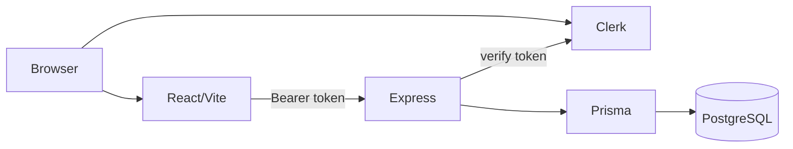

# Pravaah Interview Guide

## Document Control

| Field               | Value                                                                                               |
| ------------------- | --------------------------------------------------------------------------------------------------- |
| Purpose             | Authoritative interview and screen-share guide for explaining Pravaah accurately.                   |
| Verification status | Verified against repository implementation on 2026-08-04.                                           |
| Product scope       | Current repository state for root package version `0.2.0`; release/deployment verification pending. |
| Authority           | Read [Product Requirements](PRD.md) and [High-Level Design](HLD.md) first.                          |

Use this guide to explain the real repository. Do not invent personal contribution claims; use "Owner input required" when repository evidence cannot prove who did what.

## Project Explanation Levels

One sentence:

```txt
Pravaah is a clinic-side flow management app that connects appointments, patient/doctor records, daily queues, and explainable no-show risk assistance for Admin and Staff users.
```

30 seconds:

```txt
Pravaah helps small and medium clinics manage the clinic day. Admin and Staff users sign in with Clerk, work inside one active clinic context, create doctors and patients, book appointments, manage the queue, and review deterministic no-show risk reasons. It is not a hospital ERP or trained ML system; the goal is practical clinic flow with human decisions remaining final.
```

2 minutes:

```txt
The product solves the problem where clinics use disconnected notebooks, calls, and messages for appointments and arrivals. Pravaah makes those parts connected: a doctor and patient belong to a clinic through join records, an appointment creates a queue entry and a stored risk score, and dashboard data summarizes the day. The backend is Express with Prisma/PostgreSQL; the frontend is React/Vite; Clerk handles identity, while Pravaah owns authorization through internal User role, status, and clinic access. The current release candidate includes public sign-up and self-service clinic onboarding, but live deployment status requires owner verification.
```

5-minute technical walkthrough:

```txt
Start with the product spine: Auth -> Clinic -> Doctor/Patient -> Appointment -> Queue -> Risk.
Show the React routes in App.tsx and dashboardRoutes.tsx.
Explain Clerk identity versus Pravaah internal authorization.
Open schema.prisma and point to User, Clinic, DoctorClinic, PatientClinic, Appointment, QueueEntry, and NoShowPrediction.
Walk through appointment.service.ts and appointment.repository.ts to show validation, active links, advisory lock, conflict check, transaction, queue entry, and risk storage.
Then show queue.service.ts and queue.repository.ts for status sync and reorder.
End with prediction.service.ts and explain deterministic risk, not trained ML.
```

10-minute detailed walkthrough:

```txt
1. Public route and Clerk sign-up: apps/web/src/App.tsx, main.tsx, auth/public features.
2. Onboarding exception: auth.routes.ts allows Clerk identity without internal User only for onboarding APIs.
3. Clinic/Admin provisioning: auth.service.ts and auth.repository.ts create both records transactionally.
4. Protected app: ProtectedAppShell and ActiveClinicProvider resolve onboarding and clinic context.
5. Data model: schema.prisma shows single User.clinicId plus DoctorClinic and PatientClinic join tables.
6. Appointment booking: appointment validation, service checks, repository transaction, queue position, prediction.
7. Queue operations: queue routes, status sync transaction, manual reorder, final-state checks.
8. Dashboard: dashboard service aggregates and backfills missing predictions.
9. Tests: module tests and frontend tests cover critical behavior, but browser E2E is deferred.
10. Limitations: no patient/doctor login, no trained ML, no notifications, no full multi-clinic SaaS, deployment owner verification required.
```

## Product Questions

| Question                          | Accurate answer                                                                                                                                                     |
| --------------------------------- | ------------------------------------------------------------------------------------------------------------------------------------------------------------------- |
| What problem does Pravaah solve?  | Clinic-day flow: disconnected appointments, unclear arrivals, waiting order confusion, no-shows, and limited visibility.                                            |
| Who uses it?                      | Authenticated clinic-side Admin and Staff users. Doctors and patients are records only.                                                                             |
| Why not only an appointment app?  | Booking creates connected queue and risk context, and dashboard/queue workflows depend on appointment state.                                                        |
| Why does queue management matter? | Clinics need a clear, staff-controlled waiting order as patients arrive, are called, complete, cancel, or no-show.                                                  |
| Why include no-show risk?         | It helps staff identify appointments that may need attention while keeping final decisions human-controlled.                                                        |
| What is currently implemented?    | Public routes, Clerk auth, onboarding, clinic settings, doctor/patient management, appointment booking/status, queue status/reorder, dashboard, deterministic risk. |
| What is planned?                  | Multi-clinic membership, notifications, audit logs, stricter state transitions, doctor scheduling, monitoring, future portals.                                      |
| What is out of scope?             | Hospital ERP, full medical records, trained ML, automatic queue/cancellation decisions, patient/doctor portals, billing, prescriptions, mobile app.                 |

## Personal Contribution

Repository evidence can prove files, commits only if Git history is inspected by the owner, and current implementation shape. It cannot prove percentages, sole ownership, production responsibilities, or interview biography.

Use:

```txt
Owner input required.
```

for personal contribution claims that are not directly supported by repository evidence.

## Technology Questions

| Question                     | Answer                                                                                                                                |
| ---------------------------- | ------------------------------------------------------------------------------------------------------------------------------------- |
| Why React?                   | The app is an interactive clinic operations UI with forms, filters, lists, route guards, and panels; React fits that component model. |
| Why TypeScript?              | It keeps frontend/backend contracts and refactors safer while Zod handles runtime validation.                                         |
| Why Express?                 | The backend API is REST-style and feature-module oriented; Express is simple and explicit for this scope.                             |
| Why PostgreSQL?              | The domain is relational: clinics, users, doctors, patients, join tables, appointments, queues, predictions.                          |
| Why Neon?                    | Neon is a hosted PostgreSQL option, but the repository only requires `DATABASE_URL`; live provider requires owner verification.       |
| Why Prisma?                  | Prisma centralizes schema, migrations, typed queries, and generated client access.                                                    |
| Why Clerk?                   | Clerk handles identity and sessions so Pravaah can focus on internal roles and clinic authorization.                                  |
| Why monorepo/npm workspaces? | Frontend and backend evolve together with simple root commands.                                                                       |
| Why not MongoDB?             | Current relational constraints and joins are first-class product needs.                                                               |
| Why not Supabase?            | The current app already uses Clerk, Express, Prisma, and PostgreSQL; Supabase would change more than the current scope requires.      |
| Why not Next.js?             | The current frontend is a static SPA and does not need SSR today.                                                                     |
| Why not microservices?       | The product is one cohesive MVP; splitting services would add operational complexity before the domain needs it.                      |

## Architecture Walkthrough



Explain it plainly:

```txt
Clerk answers who is signed in.
Pravaah answers whether that person is an active Admin or Staff user, and which clinic they may access.
PostgreSQL stores the clinic workflow.
```

## Request-Flow Explanations

Normal authenticated request:

```txt
React page -> apiClient -> Bearer token -> Express route -> authenticateRequest -> role/clinic access -> Zod validation -> controller -> service -> repository -> Prisma -> PostgreSQL -> JSON response
```

Doctor creation:

```txt
POST /api/clinics/:clinicId/doctors -> Admin/Staff and clinic access -> validate profile -> transaction creates Doctor and DoctorClinic
```

Patient creation:

```txt
POST /api/clinics/:clinicId/patients -> Admin/Staff and clinic access -> validate profile/history -> transaction creates Patient and PatientClinic
```

Appointment booking:

```txt
Request -> authentication -> authorization -> Zod validation -> relationship and active-link checks -> advisory lock -> exact-slot conflict check -> transaction creates Appointment, QueueEntry, NoShowPrediction -> response
```

Arrival and queue:

```txt
Appointment already has QueueEntry from booking -> staff updates appointment or queue status -> backend checks non-final state -> transaction synchronizes Appointment and QueueEntry
```

Queue reorder:

```txt
Queue page sends date and all active queue IDs -> backend validates clinic/date active set and final-state exclusion -> two-phase transaction updates positions
```

Appointment completion/no-show:

```txt
Status update endpoint -> verify appointment clinic access -> final-state guard -> synchronize queue where applicable -> final status prevents later changes
```

Risk generation:

```txt
Appointment booking or dashboard backfill -> load history/timing inputs -> deterministic scoring -> LOW/MEDIUM/HIGH -> store NoShowPrediction -> display reasons and suggested actions
```

## Authentication And Authorization

Authentication means proving identity. Clerk handles sign-in, sessions, and tokens.

Authorization means deciding what that identity may do inside Pravaah. The backend resolves `User.clerkUserId`, checks `User.status`, checks `User.role`, and checks `User.clinicId` against clinic-scoped routes. Frontend route protection and navigation hiding are not security.

401 versus 403 in simple language:

- 401: identity is missing or cannot be authenticated.
- 403: identity exists, but role, status, or clinic access does not allow the action.

Role values must never come from request bodies. Clinic ownership must never come from frontend state alone.

## Database Explanation

Main entities:

- `Clinic`: clinic boundary and operating settings
- `User`: internal Admin/Staff user mapped to Clerk
- `Doctor`: doctor profile record
- `DoctorClinic`: doctor-clinic join and link status
- `Patient`: patient profile record
- `PatientClinic`: clinic-specific patient history and link status
- `Appointment`: scheduled visit
- `QueueEntry`: queue state and position for an appointment
- `NoShowPrediction`: stored deterministic risk score and reasons

Why join tables matter:

```txt
Doctor and Patient records can theoretically be known to multiple clinics later.
DoctorClinic and PatientClinic keep clinic-specific relationship and history separate.
```

Important constraints: unique clinic slug, unique Clerk user ID, unique doctor-clinic and patient-clinic pairs, unique queue/prediction per appointment, and partial unique active appointment slot index.

## Transaction Explanation

Atomicity means related writes either all succeed or all roll back. Pravaah uses transactions for:

- clinic plus first Admin
- sample demo data
- doctor plus DoctorClinic
- patient plus PatientClinic
- appointment plus queue entry plus prediction
- appointment and queue status synchronization
- queue reorder

If one write in a transaction fails, the related workflow should not leave half-created operational data.

## Concurrency Explanation

A race condition occurs when two requests read the same old state and both try to write conflicting new state. Current protections:

- appointment exact-slot booking uses an advisory lock and partial unique index
- queue position assignment uses an advisory lock scoped to clinic, doctor, and date
- queue reorder uses a two-phase transaction
- onboarding uses unique constraints and conflict re-read

Honest limitations:

- appointment conflict is exact same start time, not duration overlap
- current appointment/queue transition rules are broad
- queue reorder validation is clinic/date scoped, not doctor/date scoped

## Appointment Workflow

```txt
Request
  -> Authentication
  -> Authorization
  -> Zod validation
  -> Controller
  -> Service
  -> Clinic, DoctorClinic, PatientClinic, and conflict checks
  -> Repository
  -> Prisma transaction
  -> Database
  -> Response with appointment, queue entry, and risk
```

Do not claim backend clinic-hours or past-date rejection unless implementation is added; current backend shape validation accepts valid ISO datetimes and business checks focus on relationships and conflicts.

## Queue Workflow

```txt
Appointment is booked
  -> QueueEntry is created with position
  -> Patient waits or arrives
  -> Staff calls patient
  -> Consultation completes, cancels, or no-shows
  -> Appointment and QueueEntry reach synchronized final state
```

Manual queue reorder is implemented, but the current backend reorder completeness check is clinic/date scoped. Doctor-scoped reorder correctness is a known follow-up.

## No-Show Risk Explanation

The risk feature is deterministic and explainable. It uses previous no-show history, completed appointment history, late-arrival history, distance, booking timing, new-patient signal, and strong-attendance signal. It returns a score, level, reasons, suggested actions, and `starter-rule-v1`.

What to say:

```txt
It is AI-assisted in the sense that it provides decision support, but the current implementation is a transparent rule-based scorer, not trained machine learning.
```

What not to say:

```txt
It predicts with medical certainty.
It was trained on a dataset.
It automatically cancels or deprioritizes patients.
```

## Technical Challenges

- Authentication before internal user provisioning.
- Keeping Clerk identity separate from internal authorization.
- Preventing orphan clinics during onboarding.
- Enforcing clinic-scoped access across route shapes.
- Modeling doctor/patient relationships with future-ready join tables.
- Preventing appointment exact-slot races.
- Assigning queue positions safely.
- Synchronizing appointment and queue statuses.
- Handling clinic-local dates and dashboard backfill.
- Keeping documentation aligned with implementation.

## Trade-Offs

| Trade-off                                   | Why it is acceptable now            | Future direction                             |
| ------------------------------------------- | ----------------------------------- | -------------------------------------------- |
| `User.clinicId` instead of membership table | Simple MVP authorization.           | `UserClinic` or `ClinicMember`.              |
| Rule-based risk                             | Explainable without dataset.        | Train only after safe, relevant data exists. |
| No patient/doctor portal                    | Keeps clinic-side scope focused.    | Add portals after role model expands.        |
| No notifications                            | Avoids provider/privacy complexity. | Reminder logs and provider integrations.     |
| Feature-module monolith                     | Easier to explain and maintain.     | Split only with real scale/team need.        |
| Soft deactivation                           | Preserves history.                  | Add retention/audit policy.                  |
| Manual browser checks                       | Lower test complexity today.        | Add focused E2E suite later.                 |

## Known Limitations

- `v0.2.0` is a release candidate; deployment and screenshots require owner verification.
- No patient login, doctor login, patient portal, or doctor portal.
- No billing, prescriptions, inventory, full medical records, or hospital ERP.
- No notifications or reminder automation.
- No trained ML.
- No full multi-clinic SaaS membership.
- No audit log or production monitoring integration.
- No browser E2E suite.
- Appointment transitions are broad except final-state protection.
- Queue reorder has a doctor-scope gap.
- Patient availability filtering must account for inactive clinic links.
- Appointment duration-overlap and clinic-hours rules are not enforced by backend business logic.

## Demo Script

1. Sign in through Clerk.
2. Show onboarding or active clinic setup depending on account state.
3. Open clinic settings as Admin and explain Staff restriction.
4. Add or inspect a doctor.
5. Add or inspect a patient.
6. Book an appointment.
7. Explain the risk score and reasons.
8. Update appointment or queue status to arrival/waiting.
9. Open queue and call the patient.
10. Complete consultation.
11. Show dashboard summaries and activity changes.

Only use fictional data.

## Screen-Sharing File Map

| Workflow            | Frontend route/component            | API call                       | Backend route           | Controller                  | Service                  | Repository                             | Model                                           | Test evidence        |
| ------------------- | ----------------------------------- | ------------------------------ | ----------------------- | --------------------------- | ------------------------ | -------------------------------------- | ----------------------------------------------- | -------------------- |
| Public/auth         | `/`, `/login/*`, `/sign-up/*`       | Clerk/auth APIs                | `auth.routes.ts`        | `auth.controller.ts`        | `auth.service.ts`        | `auth.repository.ts`                   | `User`, `Clinic`                                | App/auth tests       |
| Onboarding          | `/onboarding/clinic`                | onboarding status/create       | `auth.routes.ts`        | `auth.controller.ts`        | `auth.service.ts`        | `auth.repository.ts`                   | `Clinic`, `User`                                | onboarding tests     |
| Clinic settings     | `/clinic-settings`                  | clinic GET/PATCH               | `clinic.routes.ts`      | `clinic.controller.ts`      | `clinic.service.ts`      | `clinic.repository.ts`                 | `Clinic`                                        | clinic tests         |
| Doctor create/edit  | `/doctors`, `/doctors/new`          | doctor APIs                    | `doctor.routes.ts`      | `doctor.controller.ts`      | `doctor.service.ts`      | `doctor.repository.ts`                 | `Doctor`, `DoctorClinic`                        | doctor tests         |
| Patient create/edit | `/patients`, `/patients/new`        | patient APIs                   | `patient.routes.ts`     | `patient.controller.ts`     | `patient.service.ts`     | `patient.repository.ts`                | `Patient`, `PatientClinic`                      | patient UI/API tests |
| Appointment booking | `/appointments`                     | appointment APIs               | `appointment.routes.ts` | `appointment.controller.ts` | `appointment.service.ts` | `appointment.repository.ts`            | `Appointment`, `QueueEntry`, `NoShowPrediction` | appointment tests    |
| Queue operations    | `/queue`                            | queue APIs                     | `queue.routes.ts`       | `queue.controller.ts`       | `queue.service.ts`       | `queue.repository.ts`                  | `QueueEntry`, `Appointment`                     | queue tests          |
| Dashboard           | `/dashboard`                        | dashboard APIs                 | `dashboard.routes.ts`   | `dashboard.controller.ts`   | `dashboard.service.ts`   | `dashboard.repository.ts`              | `Appointment`, `QueueEntry`, `NoShowPrediction` | dashboard tests      |
| Risk                | appointments/queue/dashboard panels | included in workflow responses | no standalone route     | N/A                         | `prediction.service.ts`  | prediction persistence through callers | `NoShowPrediction`                              | prediction tests     |

## Common Interview Questions

| Question                                       | Answer                                                                                                                                    |
| ---------------------------------------------- | ----------------------------------------------------------------------------------------------------------------------------------------- |
| What was technically difficult?                | Separating Clerk identity from internal authorization, especially onboarding before an internal user exists.                              |
| What would you improve?                        | Add strict transition tables, doctor-scoped queue reorder, audit logs, monitoring, pagination, and eventually multi-clinic membership.    |
| How do you prevent unauthorized clinic access? | Backend compares authenticated `User.clinicId` with route/resource clinic and checks role/status.                                         |
| Why use transactions?                          | To keep related writes such as clinic/admin, doctor/link, patient/link, appointment/queue/prediction, and status sync atomic.             |
| What if queue requests happen simultaneously?  | Position assignment uses an advisory lock; reorder uses a transaction, but doctor-scoped reorder validation is still a gap.               |
| How is appointment conflict prevented?         | Active exact doctor/time conflicts are checked under an advisory lock and backed by a partial unique index.                               |
| Is no-show risk machine learning?              | No. It is deterministic rule-based scoring with reasons and suggested actions.                                                            |
| Why separate Doctor and Patient from clinic?   | Join tables support clinic-specific links/history and future multi-clinic growth.                                                         |
| How would you scale to multiple clinics?       | Add membership model such as `UserClinic`/`ClinicMember`, role per clinic, and update access checks.                                      |
| How would you add doctor login later?          | Add an authenticated doctor role/user model, portal routes, resource scoping, and careful permission rules.                               |
| How would you add notifications?               | Add reminder logs, provider integration, templates, opt-in rules, and auditability.                                                       |
| What if prediction generation fails?           | During booking it is part of the transaction path; failure should block the related creation. Dashboard can backfill missing predictions. |
| What if one transaction step fails?            | The transaction rolls back so partial records are not committed.                                                                          |
| Why not hard-delete records?                   | Operational history must remain explainable; active flags support soft deactivation.                                                      |
| How are invalid transitions handled?           | Final states are protected now; stricter sequence validation is planned.                                                                  |

## Honest Do-Not-Claim List

Do not claim:

- trained ML
- production-scale customers
- revenue or active-user metrics
- medical-record management
- doctor portal
- patient portal
- automatic queue decisions
- automatic cancellation
- notification automation
- full multi-clinic SaaS
- deployment behavior not verified by owner
- tests that were not run
- browser E2E coverage
- personal contribution details not proven by repository evidence

## Existing Interview Pack

The existing interview pack remains useful for deeper preparation:

- [Interview Pack Index](interview/README.md)
- [Project Overview](interview/PROJECT_OVERVIEW.md)
- [Architecture And Decisions](interview/ARCHITECTURE_AND_DECISIONS.md)
- [Authorization And Security](interview/AUTHORIZATION_AND_SECURITY.md)
- [Database And Transactions](interview/DATABASE_AND_TRANSACTIONS.md)
- [Testing And Deployment](interview/TESTING_AND_DEPLOYMENT.md)
- [Tradeoffs And Improvements](interview/TRADEOFFS_AND_IMPROVEMENTS.md)
- [Questions And Simulations](interview/QUESTIONS_AND_SIMULATIONS.md)
- [Screen Share Guide](interview/SCREEN_SHARE_GUIDE.md)
- [Revision Cheatsheet](interview/REVISION_CHEATSHEET.md)
