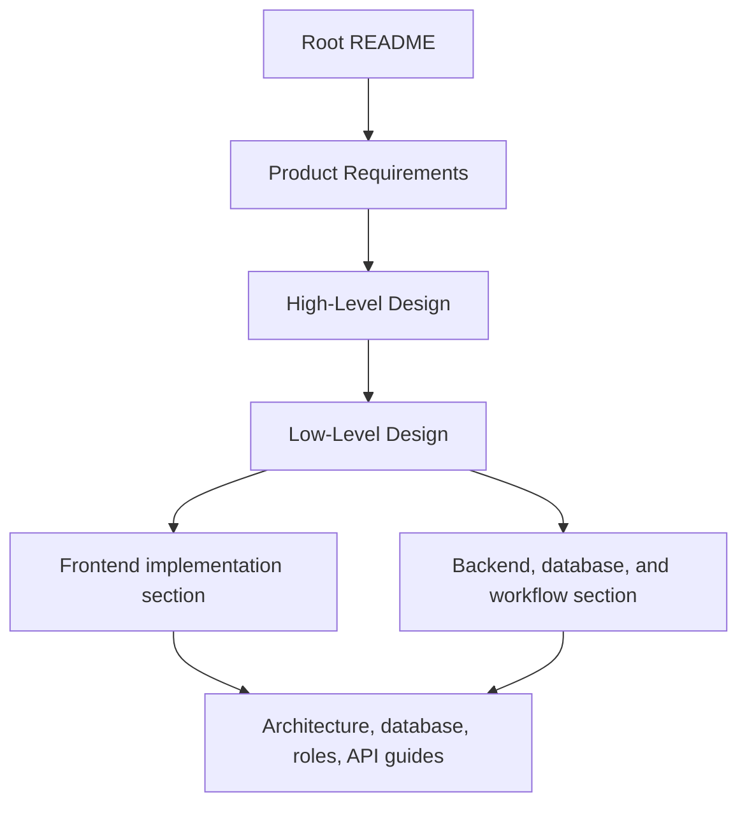
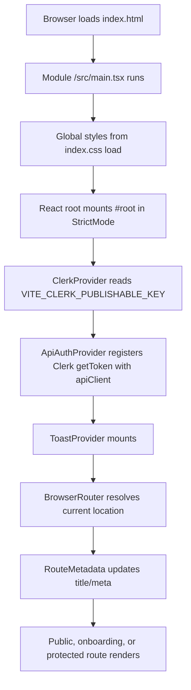
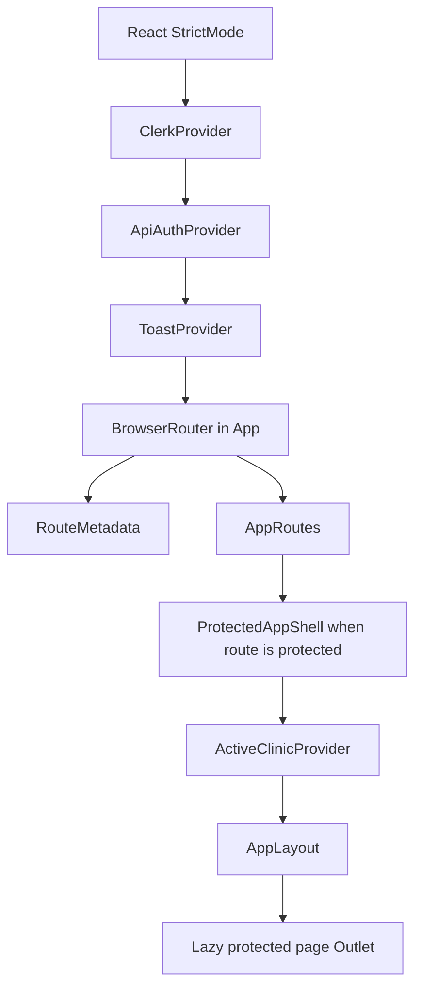
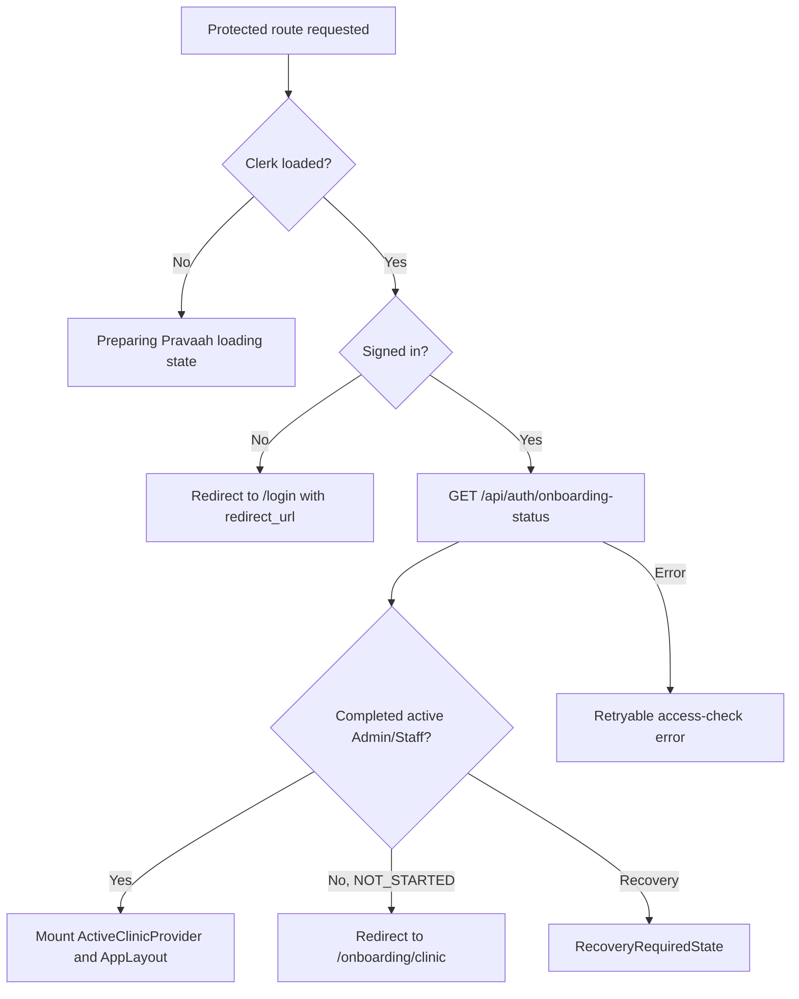
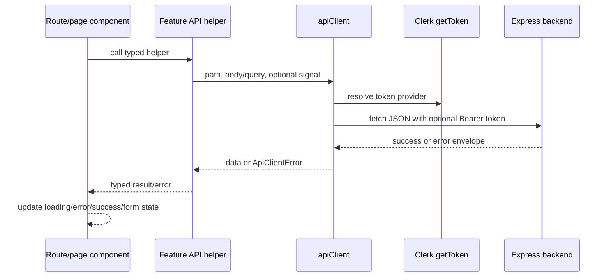
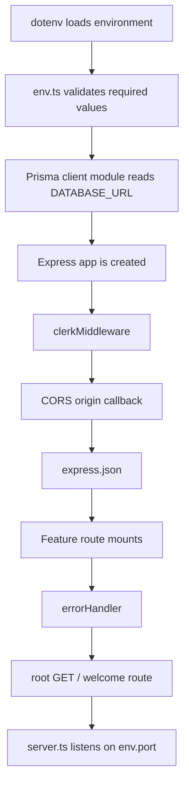
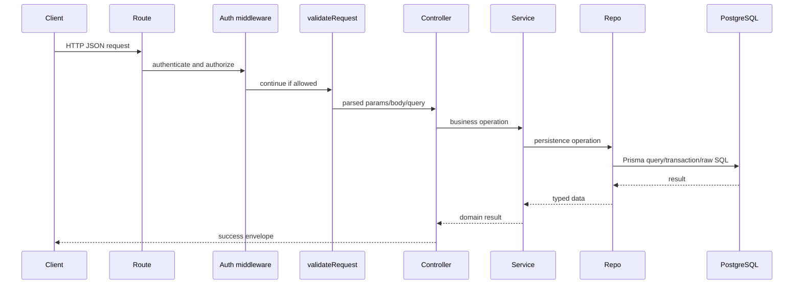
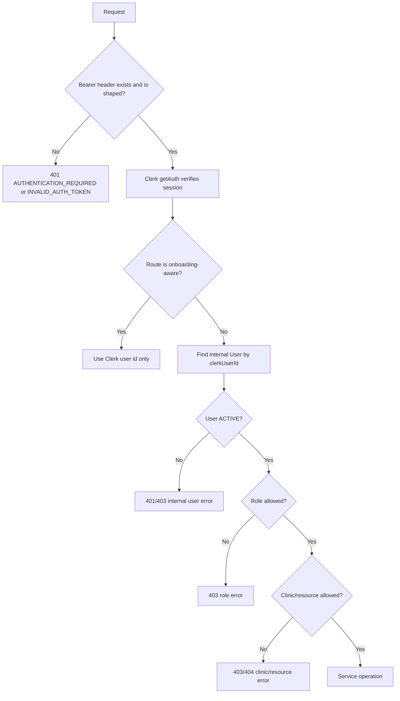
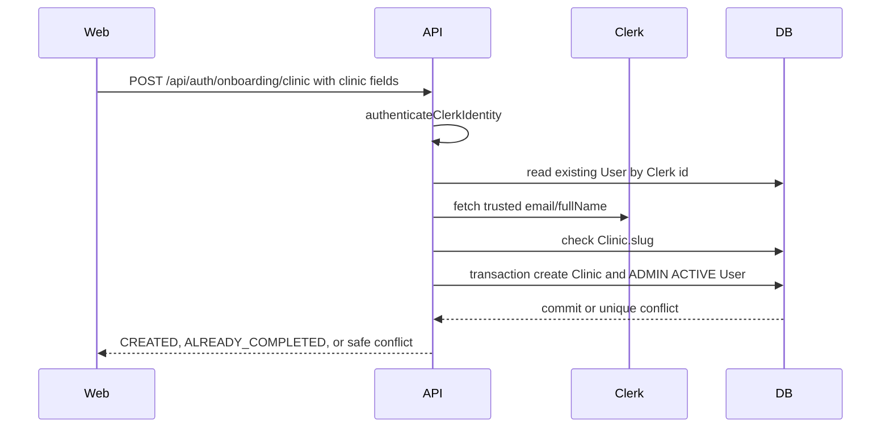
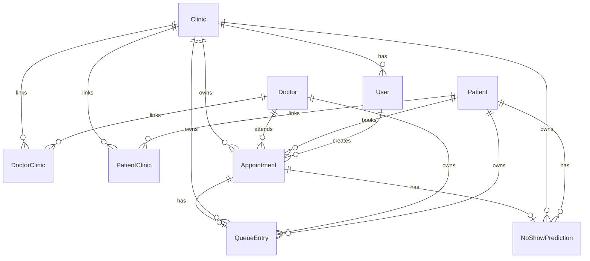

# Pravaah Low-Level Design

## Document Control

| Field                      | Value                                                                                                                        |
| -------------------------- | ---------------------------------------------------------------------------------------------------------------------------- |
| Product                    | Pravaah                                                                                                                      |
| Purpose                    | Single-file implementation-level design for frontend, backend, database, and workflows.                                      |
| Audience                   | Project owner, contributors, reviewers, interviewers, maintainers, and AI coding assistants.                                 |
| Last reviewed              | 2026-08-07                                                                                                                   |
| Implementation baseline    | Repository source inspected in root package version `0.2.0`.                                                                 |
| Current document status    | Implemented documentation; owner verification still required for commands, deployed URLs, screenshots, and release evidence. |
| Branch or commit reference | Not recorded by Codex because this docs-only issue disallows Git operations.                                                 |

This LLD explains the current implementation. It does not propose a replacement
architecture and does not prove production deployment. Former Part I and Part II
files have been folded into this single document.

## Contents

- [Frontend, Routing, State, And Interface Architecture](#frontend-routing-state-and-interface-architecture)
- [Backend, Database, And Workflow Implementation](#backend-database-and-workflow-implementation)

## Related Source-Of-Truth Docs

- [Product Requirements](PRD.md)
- [High-Level Design](HLD.md)
- [Workflow Atlas](workflows/README.md)
- [Workflow Implementation Audit](workflows/implementation-audit.md)
- [Architecture Overview](architecture/ARCHITECTURE.md)
- [Database Design](architecture/DATABASE_DESIGN.md)
- [User Roles](product/USER_ROLES.md)
- [API Structure](architecture/API_STRUCTURE.md)
- [API Reference](architecture/API_REFERENCE.md)
- [Documentation Index](README.md)
- [Documentation Discrepancy Register](audits/DOCUMENTATION_DISCREPANCY_REGISTER.md)

## Reading Order



Use the PRD for what Pravaah is supposed to do, the HLD for major system
structure, this LLD for implementation architecture, and the [Workflow Atlas](workflows/README.md)
for product-action traces with exact frontend, API, backend, Prisma, database, and UI evidence.

## Status Labels

Use these labels when documenting capability state:

| Status                           | Meaning                                                                                          |
| -------------------------------- | ------------------------------------------------------------------------------------------------ |
| Implemented and deployed         | Code, supporting layers, and production or release evidence prove the capability is available.   |
| Implemented but not yet released | Code exists, but tests/builds/deployment/release evidence are still pending.                     |
| In development                   | Work exists, but acceptance criteria are incomplete or a known implementation gap remains.       |
| Planned                          | Requirements or roadmap mention the capability, but no complete implementation exists.           |
| Deprecated or superseded         | Older behavior or documentation remains for history and has been replaced by newer source truth. |
| Unknown or unverified            | Evidence is incomplete and the documentation must not guess.                                     |

Repository code can prove implementation. Deployment evidence, release notes with
verified commands, deployed commit SHAs, and owner-provided production checks prove
release/deployment state.

## Baseline Summary

Pravaah is a clinic-side appointment and queue-management system for small and
medium clinics. Current implemented source covers public product entry, Clerk
authentication, authenticated onboarding, clinic provisioning, Admin and Staff
operations, doctor and patient records, appointments, queue operations, manual
doctor-scoped queue reordering, deterministic explainable no-show assistance,
public SEO foundations, and responsive route behavior.

The stack is locked to React, TypeScript, Vite, Express, Clerk, Prisma, Zod, and
PostgreSQL. Neon is the documented hosted PostgreSQL option. Vercel configuration
exists for the frontend SPA. Backend deployment is documented for a Node host such
as Render, but live deployment URLs and deployed SHAs are not present in the repo.

## Known Documentation Limitations

- This issue did not run tests, builds, lint, Prisma commands, deployment checks,
  browser workflow verification, Lighthouse, or link checkers.
- Some historical audit files intentionally preserve older findings. When a later
  implementation supersedes an audit finding, current docs should point to the
  newer code and the discrepancy register.
- The app remains a Vite SPA. Runtime metadata improves in-app navigation but does
  not make every private route independently server-rendered for crawlers.
- No patient login, doctor login, billing, prescriptions, inventory, hospital ERP,
  trained ML, automatic cancellation, or automatic queue decisions are implemented.

---

## Frontend, Routing, State, And Interface Architecture

Last reviewed: 2026-08-05

This document explains the current `apps/web` implementation. It complements the
[PRD](PRD.md), [HLD](HLD.md), and [backend section](#backend-database-and-workflow-implementation). It does
not describe backend internals except where needed to explain frontend request flow.

### Frontend Stack

| Technology         | Version / source                     | Responsibility                                                            |
| ------------------ | ------------------------------------ | ------------------------------------------------------------------------- |
| React              | `^19.2.6` in `apps/web/package.json` | Component rendering and local UI state.                                   |
| TypeScript         | `~6.0.2` in web package              | Static typing for UI, routes, API helpers, and tests.                     |
| Vite               | `^8.0.12`                            | Frontend dev server and static production build.                          |
| React Router DOM   | `^7.18.0`                            | Browser routes, nested protected routes, redirects, and NavLink state.    |
| Clerk React        | `^6.11.0`                            | Browser authentication UI and session token access.                       |
| Tailwind CSS       | `^3.4.19`                            | Utility styling, breakpoints, responsive layout, focus styles.            |
| Form library       | None installed                       | Forms use React component state and local helpers.                        |
| Validation library | No frontend validation package       | Frontend uses local validation; backend Zod remains authoritative.        |
| Icon library       | None installed                       | Current icons are inline SVG paths and the custom `PravaahLogo`.          |
| Date utility       | None installed                       | Native `Date`, `Intl`, and string helpers are used.                       |
| Data fetching      | None installed                       | Feature API helpers call `apiClient`; pages manage loading/refetch state. |
| Tests              | Vitest `^4.1.9`, RTL, jsdom          | Unit/component tests with Clerk and API mocks.                            |
| Deployment         | Vercel static SPA config             | `apps/web/vercel.json` rewrites non-API routes to `index.html`.           |

### Responsibility Boundary

The frontend renders interfaces, collects input, manages temporary UI state, reads
Clerk session state, requests backend data, hides or shows role-aware controls,
shows loading/empty/error/success states, presents queue/risk information, manages
navigation, and updates public route metadata.

The frontend is not trusted to decide final authentication, internal user existence,
role authorization, clinic ownership, cross-clinic access, appointment conflict
validity, queue transition validity, queue reorder validity, database consistency,
or risk scoring.

```txt
Frontend route protection improves user experience.
Backend authorization provides security.
```

### Bootstrap Sequence

Source files: `apps/web/index.html`, `apps/web/src/main.tsx`,
`apps/web/src/App.tsx`.



Provider order matters because `ApiAuthProvider` must be inside `ClerkProvider` to
call `useAuth()`, and feature pages need `ToastProvider` above route content. The
protected `ActiveClinicProvider` is mounted only after `ProtectedAppShell` proves
the user is signed in and onboarding-complete.

### Provider Hierarchy



| Provider / owner       | Path                                                 | Owns                                                         | Loading/error behavior                                   | Persistence                                                                |
| ---------------------- | ---------------------------------------------------- | ------------------------------------------------------------ | -------------------------------------------------------- | -------------------------------------------------------------------------- |
| `ClerkProvider`        | `apps/web/src/main.tsx`                              | Clerk session, sign-in/sign-up routes, sign-out destination. | Clerk SDK owns auth loading.                             | Clerk-managed session storage.                                             |
| `ApiAuthProvider`      | `apps/web/src/app/ApiAuthProvider.tsx`               | Global token provider for `apiClient`.                       | No UI state; unregisters on unmount.                     | None.                                                                      |
| `ToastProvider`        | `apps/web/src/components/feedback/ToastProvider.tsx` | Toast list and show/dismiss helpers.                         | Mobile bottom, desktop top-right.                        | In-memory only.                                                            |
| `ProtectedAppShell`    | `apps/web/src/app/ProtectedAppShell.tsx`             | Clerk loaded/signed-in checks and onboarding status.         | Full-page loading, redirects, recovery, retryable error. | In-memory; aborts request on unmount.                                      |
| `ActiveClinicProvider` | `apps/web/src/app/ActiveClinicProvider.tsx`          | Active clinic context and current internal user summary.     | Loading, missing-clinic, API error states.               | Reads localStorage/env fallback only when no authenticated profile exists. |

### Directory Architecture

```txt
apps/web/src/
├── app/          # app shell, route guards, active clinic/auth providers
├── components/   # shared brand, feedback, layout, public, and UI primitives
├── features/     # route-level product features and feature API helpers
├── lib/          # API client, clinic-context helpers, metadata, form errors
├── routes/       # route config, metadata component, not-found page
├── test/         # fixtures, Clerk mocks, render helper, setup
├── types/        # frontend API/domain/enum types
├── App.tsx       # browser routes and route-level Suspense
├── main.tsx      # React/Clerk/bootstrap entry
└── index.css     # Tailwind and global tokens/reduced motion
```

Feature-specific API helpers stay beside pages. Shared UI should stay generic and
not import feature business logic. `packages/*` has no current shared frontend code.

### Route Inventory

| Route                | Classification                  | Access                                       | Layout                       | Main component          | Purpose                                                      | Redirect behavior                                                           | Indexing                       |
| -------------------- | ------------------------------- | -------------------------------------------- | ---------------------------- | ----------------------- | ------------------------------------------------------------ | --------------------------------------------------------------------------- | ------------------------------ |
| `/`                  | Public informational            | Any visitor                                  | Public page                  | `PublicLandingPage`     | Product explanation and CTAs.                                | Signed-in CTAs lead to onboarding/dashboard paths.                          | `index,follow`; sitemap entry. |
| `/login/*`           | Authentication                  | Public/auth                                  | `AuthPageLayout`             | `LoginPage`             | Clerk sign-in.                                               | Clerk fallback redirect `/dashboard`; sign-out success toast.               | `noindex,nofollow`.            |
| `/sign-up/*`         | Authentication                  | Public/auth                                  | `AuthPageLayout`             | `SignUpPage`            | Clerk sign-up.                                               | Clerk fallback redirect `/onboarding/clinic`.                               | `noindex,nofollow`.            |
| `/onboarding`        | Onboarding redirect             | Clerk-intended                               | Public boundary              | `Navigate`              | Normalizes onboarding entry.                                 | Redirects to `/onboarding/clinic`.                                          | `noindex,nofollow`.            |
| `/onboarding/clinic` | Public authenticated onboarding | Clerk identity; internal user may be missing | Standalone onboarding layout | `ClinicOnboardingPage`  | Create clinic and first Admin.                               | Completed users continue to app; unprovisioned users see form.              | `noindex,nofollow`.            |
| `/dashboard`         | Protected application           | Admin/Staff                                  | `AppLayout`                  | `DashboardOverviewPage` | Summary, high-risk appointments, activity, setup.            | Signed-out to login; unprovisioned to onboarding; recovery state otherwise. | `noindex,nofollow`.            |
| `/doctors`           | Protected application           | Admin/Staff                                  | `AppLayout`                  | `DoctorsPage`           | List/search/edit doctors.                                    | Guarded by shell.                                                           | `noindex,nofollow`.            |
| `/doctors/new`       | Protected application           | Admin/Staff                                  | `AppLayout`                  | `DoctorCreatePage`      | Create doctor.                                               | Guarded by shell.                                                           | `noindex,nofollow`.            |
| `/patients`          | Protected application           | Admin/Staff                                  | `AppLayout`                  | `PatientsPage`          | List/search/edit patients.                                   | Guarded by shell.                                                           | `noindex,nofollow`.            |
| `/patients/new`      | Protected application           | Admin/Staff                                  | `AppLayout`                  | `PatientCreatePage`     | Create patient.                                              | Guarded by shell.                                                           | `noindex,nofollow`.            |
| `/appointments`      | Protected application           | Admin/Staff                                  | `AppLayout`                  | `AppointmentsPage`      | Book/filter/status appointments and show risk.               | Guarded by shell.                                                           | `noindex,nofollow`.            |
| `/queue`             | Protected application           | Admin/Staff                                  | `AppLayout`                  | `QueuePage`             | Today's queue, status updates, doctor-scoped manual reorder. | Guarded by shell.                                                           | `noindex,nofollow`.            |
| `/clinic-settings`   | Admin-only protected app        | Admin backend authority; Staff nav hidden    | `AppLayout`                  | `ClinicSettingsPage`    | Edit supported clinic settings.                              | Frontend hides Staff nav; backend Admin check is authoritative.             | `noindex,nofollow`.            |
| `*`                  | Public not found                | Any visitor                                  | Public boundary              | `NotFoundPage`          | Public-safe fallback.                                        | Links back to home or dashboard depending auth.                             | `noindex,nofollow`.            |

No dynamic record-detail routes, callback routes, dedicated unauthorized route,
patient portal, doctor portal, or standalone prediction route are implemented.

### Public, Auth, Onboarding, And Protected Routes

Public routes are separated from clinic data. The landing page uses Clerk auth state
for CTA copy but does not fetch protected clinic records. Static `index.html`,
`robots.txt`, `sitemap.xml`, `siteMetadata.ts`, and `RouteMetadata.tsx` provide
public SEO and social-sharing foundations. Only `/` is in the sitemap.

Authentication routes wrap Clerk `SignIn` and `SignUp` components. A Clerk-authenticated
person is not automatically a provisioned Pravaah user.

Onboarding routes call:

```txt
GET /api/auth/onboarding-status
POST /api/auth/onboarding/clinic
POST /api/clinics/:clinicId/sample-data
```

The onboarding flow trusts Clerk identity from the backend, not role/status/ownership
fields from the browser.

Protected routes use this decision tree:



### Layout Architecture

| Layout                 | Path                                                               | Responsibilities                                                                     |
| ---------------------- | ------------------------------------------------------------------ | ------------------------------------------------------------------------------------ |
| Public landing layout  | `features/public/PublicLandingPage.tsx`                            | Public header, product sections, CTAs, footer, responsive wrapping nav.              |
| Auth layout            | `features/auth/components/AuthPageLayout.tsx`                      | Clerk auth frame with app context and return handling.                               |
| Onboarding layout      | `features/onboarding/ClinicOnboardingPage.tsx`                     | Standalone onboarding form, status, sample-data decision, redirect.                  |
| Protected app shell    | `app/AppLayout.tsx`                                                | Skip link, mobile drawer, desktop sidebar, topbar, `main#main-content`, lazy Outlet. |
| Recovery/error layouts | `ProtectedAppShell`, `ActiveClinicProvider`, `PublicErrorBoundary` | Full-page safe states for access, missing clinic, and public render errors.          |

Protected navigation is sourced from `dashboardRoutes.tsx`. The mobile drawer in
`Sidebar.tsx` closes on Escape, backdrop, route navigation, and when
`matchMedia('(min-width: 768px)')` crosses into desktop layout.

### State Architecture

| State category          | Owner                                       | Storage                                           | Updates                                    | Reset                                           |
| ----------------------- | ------------------------------------------- | ------------------------------------------------- | ------------------------------------------ | ----------------------------------------------- |
| Clerk authentication    | Clerk SDK                                   | Clerk-managed                                     | Clerk components/session                   | Sign out/session expiry.                        |
| API auth token provider | `ApiAuthProvider`                           | Module variable in `apiClient.ts`                 | `useLayoutEffect` from Clerk `getToken`    | Provider unmount.                               |
| Onboarding route state  | `ProtectedAppShell`, `ClinicOnboardingPage` | React state                                       | API calls with abort where used            | Route unmount/retry.                            |
| Active clinic           | `ActiveClinicProvider`, `clinicContext.ts`  | React context; optional localStorage/env fallback | `GET /api/auth/me`                         | Provider unmount; invalid localStorage cleared. |
| Server state            | Feature pages                               | React state                                       | Feature API helpers and refetches          | Route unmount/manual retry.                     |
| Form state              | Feature form components                     | React state                                       | Input handlers and local validation        | Submit success/cancel/unmount.                  |
| URL state               | React Router and search params              | Browser URL                                       | `navigate`, links, query params            | Navigation.                                     |
| UI state                | Components/pages                            | React state                                       | Expand/collapse, drawers, dialogs, filters | Route unmount or close actions.                 |

No global Redux/Zustand/React Query store exists. There is no request deduplication,
background refresh engine, or normalized client cache.

### API Request Flow



`apiClient` requires `VITE_API_BASE_URL` to end with `/api`, sets `Accept:
application/json`, sets `Content-Type` for JSON bodies, skips nullish query params,
maps aborts/network failures, and rejects malformed success envelopes.

### Forms And Errors

Forms are implemented with local React state. Important forms:

| Form                | Component                                          | Validation and behavior                                                                               |
| ------------------- | -------------------------------------------------- | ----------------------------------------------------------------------------------------------------- |
| Clinic onboarding   | `ClinicOnboardingPage`                             | Local field checks, strict backend body, duplicate/conflict handling, retry and optional sample data. |
| Clinic settings     | `ClinicSettingsPage`                               | Loads defaults, Admin-only API, patch supported fields, validation errors and save state.             |
| Doctor create/edit  | `DoctorCreatePage`, `DoctorForm`, `DoctorsPage`    | Local required fields, backend validation, disabled submit, success redirect/toast.                   |
| Patient create/edit | `PatientCreatePage`, `PatientForm`, `PatientsPage` | Patient profile plus clinic notes/distance; backend remains authority.                                |
| Appointment booking | `AppointmentBookingForm`, `AppointmentsPage`       | Doctor/patient options, date/time conversion, conflict display, risk response display.                |
| Queue actions       | `QueuePage`                                        | Native buttons, pending state per status/reorder, server reconciliation.                              |

Validation errors appear as field errors when mapped, form summaries or inline
`ErrorMessage` when request-level, toasts for mutation feedback, and full-page
states for route guard failures. Lazy-route render failures are contained by the
public boundary where present; protected route chunks use shell Suspense fallback.

### Shared Components

| Component                                     | Path                                    | Purpose                                                                |
| --------------------------------------------- | --------------------------------------- | ---------------------------------------------------------------------- |
| `Button`                                      | `components/ui/Button.tsx`              | Variants, loading state, native disabled behavior.                     |
| `FormField`, `FieldError`, `FormSection`      | `components/ui`, `components/feedback`  | Labels, errors, grouped form layout.                                   |
| `ConfirmationDialog`                          | `components/ui/ConfirmationDialog.tsx`  | Modal confirmation, Escape, Tab loop, scroll lock, focus restore.      |
| `ToastProvider`                               | `components/feedback/ToastProvider.tsx` | Success/error notifications.                                           |
| `LoadingState`, `EmptyState`, `ErrorMessage`  | `components/feedback`                   | Standard async UI states.                                              |
| `PageHeader`, `FilterBar`, `Card`             | `components/ui`                         | Page structure and filter/action layout.                               |
| `StatusBadge`, `RiskBadge`, `RiskExplanation` | `components/ui`                         | Text-first status and risk presentation.                               |
| `Sidebar`, `Topbar`                           | `components/layout`                     | Desktop navigation, mobile drawer, page title, role context, sign out. |
| `PravaahLogo`                                 | `components/brand/PravaahLogo.tsx`      | Inline brand mark/wordmark; avoids importing large public PNGs.        |

### Feature Interfaces

- Dashboard (`/dashboard`) requests summary, high-risk appointments, and today
  activity. It shows first-run setup status, appointment/queue/risk summaries,
  and retryable errors.
- Clinic settings (`/clinic-settings`) is Admin-only. Slug is read-only; supported
  editable fields include profile/contact/address/timezone/hours/slot/buffer.
- Doctor management (`/doctors`, `/doctors/new`) lists, searches, creates, edits,
  and toggles `Doctor.isActive`. `DoctorClinic.isActive` fields are displayed but
  not edited through the current UI/API.
- Patient management (`/patients`, `/patients/new`) lists, searches, creates,
  edits, and toggles `Patient.isActive`; clinic-specific notes/distance/history
  are surfaced from `PatientClinic`.
- Appointment management (`/appointments`) loads doctors, patients, appointments,
  booking form data, filters, status actions, and prediction details.
- Queue management (`/queue`) lists clinic-local today queue entries, separates
  active/final groups, updates statuses, and manually reorders active entries for
  one doctor scope.
- Explainable no-show assistance is shown through risk badges and explanation
  panels. Missing prediction data is presented as unavailable, not low risk.
- Staff management is not implemented as a module or route.

### Responsive And Accessibility Architecture

Tailwind's `md` breakpoint (`768px`) switches from mobile drawer to desktop
sidebar. Protected pages use constrained content inside `main#main-content`.
Tables for doctors, patients, appointments, and active queue use intentional
keyboard-focusable horizontal scrolling on small screens instead of duplicated
hidden desktop/mobile datasets. Forms stack on mobile. Toasts move to the mobile
bottom. Dialogs and the drawer lock background scroll while open.

Implemented accessibility conventions include semantic landmarks, a protected
skip link, labeled nav regions, visible focus styles, native buttons/links,
field labels/errors, `role=status`/`role=alert` feedback, `aria-current` from
`NavLink`, dialog focus loops, drawer focus restore, text labels inside status
badges, social image alt metadata, and reduced-motion CSS.

Known limits: no WCAG certification, no automated axe/E2E suite, and responsive
verification evidence must be captured manually.

### Loading And Performance

Implemented optimizations:

- route-level `React.lazy` for public, auth, onboarding, protected, and fallback pages
- public Suspense fallback inside `PublicErrorBoundary`
- protected route Suspense fallback inside stable `AppLayout`
- API request aborts in route guards and several data loaders
- system font stack; no webfont request found in source
- inline logo component for runtime UI instead of large PNG imports
- static social-card/icon assets only through public metadata paths

Not implemented: custom chunk naming, route prefetching, React Query caching,
virtualized tables, pagination, measured bundle budgets, Lighthouse evidence, or
browser performance budgets.

### SEO And Deployment

Static SEO lives in `apps/web/index.html`. Runtime route metadata lives in
`siteMetadata.ts` and `RouteMetadata.tsx`. `robots.txt` allows crawling and points
to a sitemap that includes only `/`. Protected, auth, onboarding, and fallback
routes are `noindex,nofollow`.

`VITE_SITE_URL` controls absolute metadata URLs with fallback
`https://pravaah.garvitsingh171.com`. The frontend deployment target is a Vite
static build on Vercel with SPA rewrites in `apps/web/vercel.json`.

Environment variables:

| Variable                     | Use                                                                        |
| ---------------------------- | -------------------------------------------------------------------------- |
| `VITE_API_BASE_URL`          | Backend `/api` base URL; required by `apiClient`.                          |
| `VITE_CLERK_PUBLISHABLE_KEY` | Clerk browser key; required at startup.                                    |
| `VITE_DEFAULT_CLINIC_ID`     | Optional legacy demo fallback when no authenticated clinic profile exists. |
| `VITE_SITE_URL`              | Public metadata origin.                                                    |

### Frontend Limitations

- Client-rendered SPA metadata has crawler limitations.
- No route prefetching or measured bundle numbers are recorded.
- No pagination or virtualization for dense lists.
- Client state is manual and can duplicate fetch logic.
- Backend remains authority for every security and consistency decision.
- Browser E2E, accessibility certification, Lighthouse, and responsive screenshots
  require owner verification.

---

## Backend, Database, And Workflow Implementation

Last reviewed: 2026-08-05

This document explains the current `apps/server` and Prisma implementation. It
complements the [PRD](PRD.md), [HLD](HLD.md), [frontend section](#frontend-routing-state-and-interface-architecture),
[API Structure](architecture/API_STRUCTURE.md), [API Reference](architecture/API_REFERENCE.md),
and [Database Design](architecture/DATABASE_DESIGN.md).

### Backend Stack

| Technology         | Version / source                             | Responsibility                                         |
| ------------------ | -------------------------------------------- | ------------------------------------------------------ |
| Node runtime       | External runtime; package uses ESM           | Runs compiled Express server.                          |
| Express            | `^5.2.1`                                     | HTTP API app, middleware, routers.                     |
| TypeScript         | `^6.0.3`                                     | Backend static typing.                                 |
| Clerk Express      | `^2.1.31`                                    | Request auth integration and `getAuth(req)`.           |
| Zod                | `^4.4.3`                                     | Runtime request validation.                            |
| Prisma             | `^7.8.0`                                     | Schema, migrations, generated client.                  |
| PostgreSQL adapter | `@prisma/adapter-pg ^7.8.0`, `pg ^8.21.0`    | PostgreSQL connection through `DATABASE_URL`.          |
| Database           | PostgreSQL; Neon documented as hosted option | Relational persistence and constraints.                |
| Tests              | Vitest `^4.1.9`                              | Backend unit/controller/service tests.                 |
| Build output       | `dist`                                       | `tsc -p tsconfig.build.json` after Prisma generate.    |
| Deployment target  | Node host such as Render                     | Documented; production URL evidence is owner-verified. |

### Responsibility Boundary

The backend verifies Clerk identity, resolves internal users, enforces active-user
status, authorizes roles, checks clinic access, validates input shape, applies
business rules, runs transactions, reads/writes PostgreSQL through Prisma, returns
structured success/error responses, and protects sensitive data.

```txt
Clerk proves external identity.
Pravaah determines internal permissions.
```

Clerk does not decide Admin/Staff role, active status, clinic ownership, doctor or
patient linkage, appointment validity, queue validity, or database consistency.

### Server Startup And Middleware Order

Source files: `apps/server/src/server.ts`, `apps/server/src/app.ts`,
`apps/server/src/config/env.ts`, `apps/server/src/config/prisma.ts`.



Middleware order from `app.ts`:

| Order | Middleware / route  | Notes                                                                       |
| ----- | ------------------- | --------------------------------------------------------------------------- |
| 1     | `clerkMiddleware()` | Makes Clerk auth data available to later auth middleware.                   |
| 2     | `cors({ origin })`  | Allows no-origin requests and configured `CLIENT_URL` / `LOCAL_CLIENT_URL`. |
| 3     | `express.json()`    | Parses JSON and feeds malformed body errors to `errorHandler`.              |
| 4     | `/api/health`       | Public health route.                                                        |
| 5     | `/api/auth`         | Onboarding-aware and current-user routes.                                   |
| 6     | `/api/clinics`      | Clinics, doctors, patients, clinic appointments, queue, dashboard routers.  |
| 7     | `/api`              | Appointment status router.                                                  |
| 8     | `errorHandler`      | Handles `AppError`, malformed JSON, selected Prisma/auth/unexpected errors. |
| 9     | `GET /`             | Public API welcome route registered after error middleware.                 |

There is no explicit not-found middleware in the inspected source.

### Feature Modules

| Module           | Routes                  | Controller                  | Service                                                            | Repository                                   | Validation                  | Tests                                                                         |
| ---------------- | ----------------------- | --------------------------- | ------------------------------------------------------------------ | -------------------------------------------- | --------------------------- | ----------------------------------------------------------------------------- |
| Health           | `health.routes.ts`      | `health.controller.ts`      | None                                                               | None                                         | None                        | None found.                                                                   |
| Auth             | `auth.routes.ts`        | `auth.controller.ts`        | `auth.service.ts`, `access.service.ts`, `clerkIdentity.service.ts` | `auth.repository.ts`, `access.repository.ts` | `auth.validation.ts`        | auth/access/controller/middleware/repository/routes/service/validation tests. |
| Clinics          | `clinic.routes.ts`      | `clinic.controller.ts`      | `clinic.service.ts`                                                | `clinic.repository.ts`                       | `clinic.validation.ts`      | controller/repository/service/validation tests.                               |
| Doctors          | `doctor.routes.ts`      | `doctor.controller.ts`      | `doctor.service.ts`                                                | `doctor.repository.ts`                       | `doctor.validation.ts`      | validation tests.                                                             |
| Patients         | `patient.routes.ts`     | `patient.controller.ts`     | `patient.service.ts`                                               | `patient.repository.ts`                      | `patient.validation.ts`     | No backend patient tests found in source list.                                |
| Appointments     | `appointment.routes.ts` | `appointment.controller.ts` | `appointment.service.ts`                                           | `appointment.repository.ts`                  | `appointment.validation.ts` | controller/service/validation tests.                                          |
| Queues           | `queue.routes.ts`       | `queue.controller.ts`       | `queue.service.ts`                                                 | `queue.repository.ts`                        | `queue.validation.ts`       | service tests.                                                                |
| Dashboard        | `dashboard.routes.ts`   | `dashboard.controller.ts`   | `dashboard.service.ts`                                             | `dashboard.repository.ts`                    | `dashboard.validation.ts`   | controller/repository/service/validation tests.                               |
| Predictions      | No standalone router    | None                        | `prediction.service.ts`                                            | Stored by appointment/dashboard repositories | Types only                  | service tests.                                                                |
| Staff management | Not implemented         | Not implemented             | Not implemented                                                    | Not implemented                              | Not implemented             | Not applicable.                                                               |

### Request Pipeline



Controllers remain thin. Services own expected business errors. Repositories own
Prisma queries, includes/projections, raw SQL, and transaction bodies.

### Complete API Inventory

| Method | Path                                                      | Access               | Validation                         | Controller                          | Service                                      | Transaction              | Response                             | Main errors                                       |
| ------ | --------------------------------------------------------- | -------------------- | ---------------------------------- | ----------------------------------- | -------------------------------------------- | ------------------------ | ------------------------------------ | ------------------------------------------------- |
| GET    | `/api/health`                                             | Public               | None                               | `getHealthCheck`                    | None                                         | No                       | health data                          | None.                                             |
| GET    | `/api/auth/onboarding-status`                             | Clerk identity       | None                               | `getOnboardingStatusController`     | `authService.getOnboardingStatus`            | No                       | onboarding/user/clinic/setup         | `AUTHENTICATION_REQUIRED`, `INVALID_AUTH_TOKEN`.  |
| POST   | `/api/auth/onboarding/clinic`                             | Clerk identity       | `onboardingClinicSchema`           | `createClinicOnboardingController`  | `authService.createClinicOnboarding`         | Yes                      | onboarding/user/clinic/setup         | slug, identity, provisioning conflicts.           |
| GET    | `/api/auth/me`                                            | Active internal user | None                               | `getCurrentUserController`          | `authService.getCurrentUserProfile`          | No                       | current user/clinic                  | internal user, inactive user.                     |
| POST   | `/api/clinics`                                            | Admin                | None                               | `createClinicController`            | Disabled                                     | No                       | disabled error                       | `STANDALONE_CLINIC_CREATION_DISABLED`.            |
| GET    | `/api/clinics/:clinicId`                                  | Admin                | `clinicIdParamsSchema`             | `getClinicSettingsController`       | `clinicService.getClinicSettings`            | No                       | clinic settings                      | access/admin/not found.                           |
| PATCH  | `/api/clinics/:clinicId`                                  | Admin                | params + `updateClinicSchema`      | `updateClinicController`            | `clinicService.updateClinic`                 | No                       | clinic settings                      | access/admin/validation.                          |
| POST   | `/api/clinics/:clinicId/sample-data`                      | Admin                | params + sample body               | `provisionSampleDataController`     | `clinicService.provisionSampleData`          | Yes                      | sample summary                       | admin/access/timezone/already provisioned.        |
| GET    | `/api/clinics/:clinicId/doctors`                          | Admin/Staff          | params                             | `listDoctorsByClinicController`     | `doctorService.listDoctorsByClinic`          | No                       | doctors                              | access/not found.                                 |
| POST   | `/api/clinics/:clinicId/doctors`                          | Admin/Staff          | params + `createDoctorSchema`      | `createDoctorController`            | `doctorService.createDoctor`                 | Yes                      | doctor                               | access/validation.                                |
| PATCH  | `/api/clinics/:clinicId/doctors/:doctorId`                | Admin/Staff          | params + `updateDoctorSchema`      | `updateDoctorController`            | `doctorService.updateDoctor`                 | No                       | doctor                               | not found/link/access.                            |
| GET    | `/api/clinics/:clinicId/patients`                         | Admin/Staff          | params + query                     | `listPatientsByClinicController`    | `patientService.listPatientsByClinic`        | No                       | patient links                        | access/validation.                                |
| POST   | `/api/clinics/:clinicId/patients`                         | Admin/Staff          | params + `createPatientSchema`     | `createPatientController`           | `patientService.createPatient`               | Yes                      | patient                              | access/validation.                                |
| PATCH  | `/api/clinics/:clinicId/patients/:patientId`              | Admin/Staff          | params + `updatePatientSchema`     | `updatePatientController`           | `patientService.updatePatient`               | Yes                      | patient                              | not found/link/access.                            |
| GET    | `/api/clinics/:clinicId/appointments`                     | Admin/Staff          | params + query                     | `listAppointmentsController`        | `appointmentService.listAppointments`        | No                       | appointments                         | link/date/access.                                 |
| POST   | `/api/clinics/:clinicId/appointments`                     | Admin/Staff          | params + `createAppointmentSchema` | `createAppointmentController`       | `appointmentService.createAppointment`       | Yes                      | appointment, queue entry, prediction | slot conflict/link/validation.                    |
| PATCH  | `/api/appointments/:appointmentId/status`                 | Admin/Staff          | params + status body               | `updateAppointmentStatusController` | `appointmentService.updateAppointmentStatus` | Yes                      | appointment                          | final/sync/not found/access.                      |
| GET    | `/api/clinics/:clinicId/queue`                            | Admin/Staff          | params + query                     | `listQueueByClinicDateController`   | `queueService.listQueueByClinicDate`         | No                       | queue entries                        | access/date validation.                           |
| PATCH  | `/api/clinics/:clinicId/queue/:queueEntryId/status`       | Admin/Staff          | params + status body               | `updateQueueStatusController`       | `queueService.updateQueueStatus`             | Yes                      | queue entry                          | final/sync/not found/access.                      |
| PATCH  | `/api/clinics/:clinicId/queue/reorder`                    | Admin/Staff          | params + reorder body              | `reorderQueueController`            | `queueService.reorderQueue`                  | Yes                      | ordered queue entries                | duplicate/incomplete/mixed doctor/final/conflict. |
| GET    | `/api/clinics/:clinicId/dashboard/summary`                | Admin/Staff          | params + query                     | `getDashboardSummaryController`     | `dashboardService.getDashboardSummary`       | Backfill writes possible | dashboard summary                    | access/date.                                      |
| GET    | `/api/clinics/:clinicId/dashboard/high-risk-appointments` | Admin/Staff          | params + query                     | `getHighRiskAppointmentsController` | `dashboardService.getHighRiskAppointments`   | Backfill writes possible | high-risk list                       | access/date.                                      |
| GET    | `/api/clinics/:clinicId/dashboard/today-activity`         | Admin/Staff          | params                             | `getTodayActivityController`        | `dashboardService.getTodayActivity`          | No                       | activity items                       | access/date range.                                |
| GET    | `/`                                                       | Public               | None                               | inline app route                    | None                                         | No                       | welcome JSON                         | None.                                             |

No standalone prediction, staff-management, patient-auth, doctor-auth, notification,
billing, prescription, inventory, or OpenAPI endpoint is implemented.

### Authentication And Authorization



Permission matrix:

| Capability                                       | Admin                 | Staff            | Clerk-only onboarding identity |
| ------------------------------------------------ | --------------------- | ---------------- | ------------------------------ |
| Onboarding status                                | Yes                   | Yes              | Yes                            |
| Clinic onboarding create                         | Completed replay only | No normal use    | Yes, creates first Admin       |
| Current user profile                             | Yes                   | Yes              | No                             |
| Clinic settings                                  | Yes                   | No               | No                             |
| Sample data                                      | Yes                   | No               | No                             |
| Doctor management                                | Yes                   | Yes              | No                             |
| Patient management                               | Yes                   | Yes              | No                             |
| Appointment management                           | Yes                   | Yes              | No                             |
| Queue actions and reorder                        | Yes                   | Yes              | No                             |
| Risk viewing through appointment/queue/dashboard | Yes                   | Yes              | No                             |
| Setup/dashboard status                           | Yes                   | Yes where routed | No operational access          |

### Public Authenticated Onboarding



The client cannot set role, status, `clerkUserId`, internal user ID, or clinic
ownership. Unique constraints protect duplicate `User.clerkUserId`, `User.email`,
and `Clinic.slug`. Completed retries replay safely.

### Domain Implementations

#### Clinic

`Clinic` stores tenant settings: name, unique slug, contact/address fields,
timezone, opening/closing time, slot duration, buffer, `isActive`, and timestamps.
Admin can read/update supported settings. Standalone `POST /api/clinics` is disabled;
onboarding is the current bootstrap path.

#### Doctor

Doctor creation checks clinic existence and transactionally creates `Doctor` and
`DoctorClinic`. List returns doctor data with clinic-link status. Edit checks the
doctor exists and is linked to the clinic, then updates global doctor fields and
`Doctor.isActive`. `DoctorClinic.displayName`, `consultationFee`, and link active
state are schema-supported but not exposed in the current edit API.

#### Patient

Patient creation transactionally creates `Patient` and `PatientClinic`. Edit updates
global profile fields and clinic-specific notes/distance inside one transaction.
Patient list supports search and `Patient.isActive` filtering; link-aware inactive
filtering remains a documented gap.

#### Appointment

Creation verifies active clinic, doctor record, patient record, active
`DoctorClinic`, and active `PatientClinic`. It then runs one transaction:

```txt
acquire exact slot advisory lock
-> check active doctor exact-time conflict
-> acquire queue position lock and read highest position
-> create Appointment with SCHEDULED status
-> compute deterministic NoShowPrediction
-> create QueueEntry with WAITING status and next position
-> store NoShowPrediction
```

Conflict protection is exact `scheduledAt`, not duration overlap. Current backend
validation checks shape and enum/date formats but does not enforce clinic operating
hours or reject past appointment times as business rules.

#### Appointment Lifecycle

| Status      | Meaning                      | Final? | Queue sync when set through appointment endpoint      |
| ----------- | ---------------------------- | ------ | ----------------------------------------------------- |
| `SCHEDULED` | Booked appointment.          | No     | None.                                                 |
| `CONFIRMED` | Staff-confirmed appointment. | No     | None.                                                 |
| `ARRIVED`   | Patient arrived.             | No     | `QueueStatus.ARRIVED`.                                |
| `IN_QUEUE`  | Patient waiting.             | No     | `QueueStatus.WAITING`.                                |
| `CALLED`    | Patient called.              | No     | `QueueStatus.CALLED`, sets `calledAt` if empty.       |
| `COMPLETED` | Visit completed.             | Yes    | `QueueStatus.COMPLETED`, sets `completedAt` if empty. |
| `CANCELLED` | Appointment cancelled.       | Yes    | `QueueStatus.CANCELLED`.                              |
| `NO_SHOW`   | Patient did not attend.      | Yes    | `QueueStatus.NO_SHOW`.                                |

Current code blocks changing a final appointment to a different status. It does not
yet enforce a strict non-final transition graph.

#### Queue

Queue entries are created during appointment booking and are listed by clinic and
appointment clinic-local date. Position assignment is scoped by clinic, doctor, and
clinic-local date. List sorting groups by doctor, then position, then scheduled time.

Active statuses: `ARRIVED`, `WAITING`, `CALLED`.
Final statuses: `COMPLETED`, `CANCELLED`, `NO_SHOW`.

Queue status updates reject final current statuses, update queue status, synchronize
appointment status in the same transaction, and set `calledAt` / `completedAt` where
applicable. Broad non-final queue transitions are still possible.

#### Queue Manual Reordering

Endpoint: `PATCH /api/clinics/:clinicId/queue/reorder`

Input:

```json
{
    "date": "2026-08-05",
    "queueEntryIds": ["uuid-1", "uuid-2"]
}
```

Service validation rejects duplicate IDs, missing entries, foreign-clinic entries,
final entries, mixed-doctor sets, incomplete active doctor/date sets, and entries
outside the active queue for the chosen doctor/date. Repository reordering acquires
a PostgreSQL advisory transaction lock by clinic, doctor, and date, writes temporary
positions, then writes normalized positions starting at 1.

Risk does not determine order. Backend order is authoritative. Queue order remains
human-controlled by Admin or Staff actions.

#### Queue And Appointment Synchronization

| Operation         | Starting state              | Appointment update              | Queue update                  | Timestamp              | Transaction | Patient history impact          |
| ----------------- | --------------------------- | ------------------------------- | ----------------------------- | ---------------------- | ----------- | ------------------------------- |
| Book appointment  | valid clinic/doctor/patient | `SCHEDULED` appointment created | `WAITING` queue entry created | `queuedAt` default     | Yes         | No automatic counter increment. |
| Mark arrived      | non-final                   | `ARRIVED`                       | `ARRIVED`                     | none                   | Yes         | No counter update.              |
| Add/wait in queue | non-final                   | `IN_QUEUE`                      | `WAITING`                     | none                   | Yes         | No counter update.              |
| Call patient      | non-final                   | `CALLED`                        | `CALLED`                      | `calledAt` if empty    | Yes         | No counter update.              |
| Complete          | non-final                   | `COMPLETED`                     | `COMPLETED`                   | `completedAt` if empty | Yes         | No current counter update.      |
| Cancel            | non-final                   | `CANCELLED`                     | `CANCELLED`                   | updatedAt              | Yes         | No counter update.              |
| No-show           | non-final                   | `NO_SHOW`                       | `NO_SHOW`                     | updatedAt              | Yes         | No current counter update.      |
| Reorder           | active queue entries        | none                            | positions only                | updatedAt              | Yes         | No counter update.              |

### Explainable No-Show Assistance

`prediction.service.ts` implements deterministic `starter-rule-v1` scoring.

Pseudocode:

```txt
score = 0
add 40 for two or more previous no-shows, else 25 for one
add 15 for two or more late arrivals, else 8 for one
add 15 for distance >= 15 km, else 8 for distance >= 8 km
add 15 for booking within 24 hours
add 10 for booking more than 14 days ahead
add 10 for new patient
subtract 20 for at least 3 completed appointments and no no-shows
clamp score to 0..100
LOW = 0..29, MEDIUM = 30..59, HIGH = 60..100
return reasons and human suggested actions
```

The stored model has score, level, reasons JSON, clinic, patient, and appointment.
Suggested actions and `modelVersion` are added in response mapping. The system is
not trained ML, not diagnosis, not automatic cancellation, and not automatic queue
optimization.

### Dashboard And Setup Status

Dashboard summary and high-risk endpoints verify clinic access, choose a clinic-local
date, backfill missing predictions for the selected date, then aggregate appointment
status counts, queue status counts, and risk level counts. Today activity combines
appointment and queue events. Setup status is exposed through onboarding/current-user
flows via `authRepository.getClinicSetupStatus`.

### Validation, Success, And Error Architecture

`validateRequest` parses params, query, and body with Zod. Parsed params/body replace
`req.params`/`req.body`; parsed query is stored in `res.locals.validatedQuery`.
Shape validation differs from service validation: Zod checks UUID/date/enum/body
shape; services check clinic ownership, doctor/patient links, active state,
conflicts, and business invariants.

Success responses use:

```json
{
    "success": true,
    "message": "Readable message",
    "data": {}
}
```

Errors use:

```json
{
    "success": false,
    "error": {
        "code": "ERROR_CODE",
        "message": "Readable message"
    }
}
```

Validation errors add `details`. The global handler maps `AppError`, malformed JSON,
auth 401s, Prisma unique conflicts (`P2002`), Prisma not found (`P2025`), and
unexpected errors. Unexpected errors are logged and returned as
`INTERNAL_SERVER_ERROR` without stack traces.

### Prisma And Database Reference

Prisma schema path: `apps/server/prisma/schema.prisma`.
Generated client output: `apps/server/src/generated/prisma`.
Config path: `apps/server/prisma.config.ts`.
Runtime client: `apps/server/src/config/prisma.ts`.
Database URL: `DATABASE_URL`.



| Model              | Purpose                          | Key constraints/indexes                                                                                                   | Deactivation/deletion                                           |
| ------------------ | -------------------------------- | ------------------------------------------------------------------------------------------------------------------------- | --------------------------------------------------------------- |
| `Clinic`           | Tenant/settings boundary.        | unique slug; indexes `isActive`, `city`.                                                                                  | `isActive`; operational relations restrict/cascade by relation. |
| `User`             | Internal Clerk-mapped user.      | unique `clerkUserId`, unique email; indexes clinic, role, status.                                                         | `UserStatus`; clinic deletion sets null.                        |
| `Doctor`           | Doctor record.                   | indexes active and specialization.                                                                                        | `isActive`; appointments restrict deletion.                     |
| `DoctorClinic`     | Doctor-clinic join.              | unique `(doctorId, clinicId)`; indexes doctor/clinic/active.                                                              | `isActive`; cascades from doctor/clinic.                        |
| `Patient`          | Patient record.                  | indexes phone/fullName/active.                                                                                            | `isActive`; appointments restrict deletion.                     |
| `PatientClinic`    | Clinic-specific patient history. | unique `(patientId, clinicId)`; indexes clinic/patient/active.                                                            | `isActive`; cascades from patient/clinic.                       |
| `Appointment`      | Scheduled visit.                 | indexes clinic/date, clinic/doctor/date, clinic/patient/date, clinic/status; migration partial unique active doctor slot. | final statuses preserve history; restrict deletion.             |
| `QueueEntry`       | Queue state/position.            | unique appointment; indexes clinic/status, clinic/doctor/position, clinic/queuedAt.                                       | final statuses preserve history; restrict deletion.             |
| `NoShowPrediction` | Stored deterministic risk.       | unique appointment; indexes clinic/patient.                                                                               | restrict deletion.                                              |

Enums: `UserRole`, `UserStatus`, `Gender`, `AppointmentStatus`, `QueueStatus`,
`RiskLevel`, and `BookingSource`.

The migration `20260612120303_add_active_doctor_slot_unique_index` adds a partial
unique index on active appointment statuses. This protection is not represented as
a Prisma `@@unique` because it is partial SQL.

### Transaction And Concurrency Inventory

| Workflow                      | Atomic writes                                        | Lock/protection                                                                           | Remaining limitation                               |
| ----------------------------- | ---------------------------------------------------- | ----------------------------------------------------------------------------------------- | -------------------------------------------------- |
| Clinic onboarding             | `Clinic`, first Admin `User`                         | Unique constraints and transaction.                                                       | Production replay not externally verified.         |
| Sample data                   | demo doctors/patients/appointments/queue/predictions | Repository transaction and fake data definitions.                                         | Demo-only.                                         |
| Doctor create                 | `Doctor`, `DoctorClinic`                             | Transaction.                                                                              | Link update fields not exposed.                    |
| Patient create/update         | `Patient`, `PatientClinic`                           | Transaction.                                                                              | Link-aware active filtering incomplete.            |
| Appointment booking           | `Appointment`, `QueueEntry`, `NoShowPrediction`      | Advisory locks for exact slot and queue position; partial unique index.                   | No duration-overlap or clinic-hours rule.          |
| Appointment status            | `Appointment`, mapped `QueueEntry`                   | Transaction and final-state guard.                                                        | Broad non-final transitions.                       |
| Queue status                  | `QueueEntry`, mapped `Appointment`                   | Transaction and final-state guard.                                                        | Broad non-final transitions.                       |
| Queue reorder                 | `QueueEntry.position` rows                           | Advisory lock by clinic/doctor/date, complete active-set validation, temporary positions. | Needs owner test/manual evidence after fix.        |
| Dashboard prediction backfill | `NoShowPrediction` rows                              | Unique appointment constraint and duplicate skipping.                                     | Backfill inputs are less rich than booking inputs. |

### Privacy And Data Boundaries

Pravaah stores operational clinic data, doctor records, patient profile/contact
fields, clinic-specific patient history, appointment notes/reasons, queue status,
and deterministic risk reasons. It does not implement patient login, doctor login,
medical record storage, prescriptions, diagnosis, insurance, billing, or compliance
certification. Seed/sample/screenshot data must stay fictional. Secrets belong in
environment variables and must not be committed.

### Environment And Deployment

Backend env vars from `.env.example` and `env.ts`:

| Variable               | Use                                                      |
| ---------------------- | -------------------------------------------------------- |
| `NODE_ENV`             | Development/production behavior.                         |
| `PORT`                 | Express listen port; defaults to 5000 if unset.          |
| `CLIENT_URL`           | Primary allowed browser origin.                          |
| `LOCAL_CLIENT_URL`     | Local allowed browser origin.                            |
| `DATABASE_URL`         | PostgreSQL connection string for Prisma.                 |
| `CLERK_SECRET_KEY`     | Clerk backend secret.                                    |
| `CLERK_WEBHOOK_SECRET` | Example var only; no current webhook source usage found. |

Render-style backend deployment is documented with build, pre-deploy migrate, and
start commands. Vercel frontend deployment is documented separately. Live URLs,
provider settings, deployed SHAs, health checks, and production smoke tests remain
owner verification items.

### Test Inventory

Backend tests found under `apps/server/src/modules/**/__tests__` cover auth access,
auth controller/middleware/repository/routes/service/validation, Clerk identity,
clinic controller/repository/service/validation, doctor validation, appointment
controller/service/validation, queue service, prediction service, and dashboard
controller/repository/service/validation.

Missing or partial coverage includes backend patient module tests, health route
tests, full browser E2E workflows, live deployment checks, link checking, backend
lint, strict lifecycle graph tests, duration-overlap scheduling tests, and release
evidence commands for this issue.

### Backend Limitations

- Backend lint script is a placeholder.
- No explicit 404 fallback middleware is registered.
- No staff-management module exists.
- Appointment and queue final states are protected, but strict transition graphs are planned.
- Appointment conflict detection is exact start time only.
- Queue entries are created during booking, including future appointments.
- `PatientClinic` counters can drift because status flows do not update every counter.
- `NoShowPrediction` does not persist model version.
- No OpenAPI generation, pagination, audit logging, monitoring, or browser E2E suite exists.
