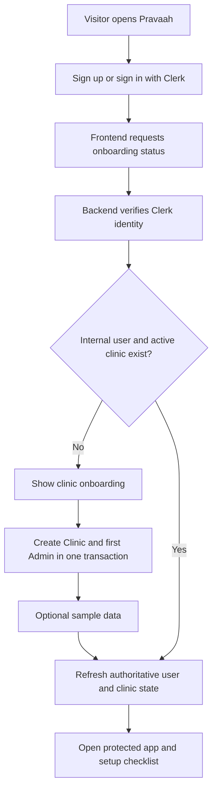
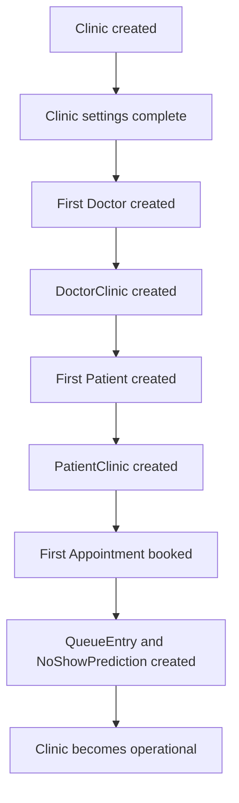
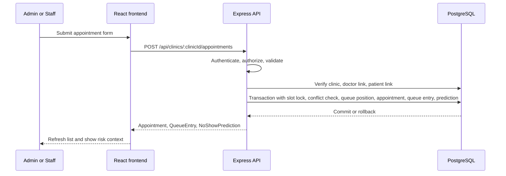
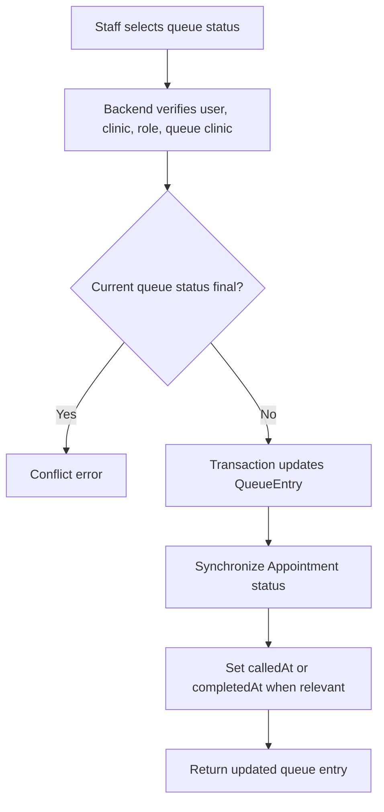

# Pravaah Product Requirements

## Document Control

| Field                       | Value                                                                                                                                                                                          |
| --------------------------- | ---------------------------------------------------------------------------------------------------------------------------------------------------------------------------------------------- |
| Product                     | Pravaah                                                                                                                                                                                        |
| Document purpose            | Authoritative product requirements, product scope, capability status, business rules, and traceability for the current repository implementation.                                              |
| Document version            | 1.0                                                                                                                                                                                            |
| Verification status         | Verified against repository implementation on 2026-08-07 for Issue #233 workflow atlas navigation and known implementation gaps.                                                               |
| Last verified date          | 2026-08-07                                                                                                                                                                                     |
| Repository or release scope | Current repository state for root package version `0.3.0`; `v0.3.0` is recorded as released after owner production verification and GO decision. Actual calendar release date is not provided. |
| Intended audience           | Project owner, contributors, reviewers, interviewers, maintainers, and AI coding assistants.                                                                                                   |
| Maintainer or owner         | Owner verification required for personal ownership, production release, and deployment claims.                                                                                                 |
| Change process              | Update this file in the same PR as product, API, role, workflow, database, or release-scope changes. Code remains implementation evidence until requirements are deliberately updated.         |

Related source-of-truth documents:

- [High-Level Design](HLD.md)
- [Low-Level Design](LLD.md)
- [Workflow Atlas](workflows/README.md)
- [Workflow Implementation Audit](workflows/implementation-audit.md)
- [Frontend LLD section](LLD.md#frontend-routing-state-and-interface-architecture)
- [Backend/database LLD section](LLD.md#backend-database-and-workflow-implementation)
- [Documentation Index](README.md)
- [Architecture Overview](architecture/ARCHITECTURE.md)
- [User Roles](product/USER_ROLES.md)
- [Database Design](architecture/DATABASE_DESIGN.md)
- [API Reference](architecture/API_REFERENCE.md)
- [Setup](guides/SETUP.md)
- [Deployment](guides/DEPLOYMENT.md)
- [AI Context](ai/AI_CONTEXT.md)
- [Interview Guide](interview/INTERVIEW_GUIDE.md)

Status taxonomy used in this document:

| Status                           | Meaning                                                                                                          |
| -------------------------------- | ---------------------------------------------------------------------------------------------------------------- |
| Implemented and deployed         | Repository evidence and deployment evidence both prove the capability is live in the current production release. |
| Implemented but not yet released | Code exists in the current repository, but release, deployment, or owner verification is still pending.          |
| Under development                | Implementation is incomplete or tied to an unfinished issue or branch.                                           |
| Planned                          | Intentionally future work, not implemented in the current repository.                                            |
| Explicitly out of scope          | Intentionally excluded from the current product boundary.                                                        |
| Deprecated or historical         | Useful historical context, not the current product definition.                                                   |
| Owner verification required      | The repository cannot prove the deployment, product-status, or personal-contribution claim.                      |

Do not change a capability status without checking implementation evidence and release evidence. Repository code can prove implementation; it cannot prove a live production deployment without URLs, deployed commit evidence, or owner-provided verification.

For exact product-action traces, use the [Workflow Atlas](workflows/README.md). The PRD states product intent and capability boundaries; the atlas records implementation evidence such as route files, components, middleware, Zod schemas, services, repositories, Prisma operations, transactions, concurrency protection, UI state handling, and known code/documentation mismatches.

## Executive Product Summary

Pravaah means "flow." Pravaah is an AI-assisted clinic flow management application for small and medium clinics. Its current product boundary is clinic-side operations for authenticated Admin and Staff users who manage clinic setup, doctors, patients, appointments, today's queue, dashboard activity, and deterministic no-show risk assistance.

One-line definition:

```txt
Pravaah helps clinic staff turn appointments, arrivals, queue order, and no-show risk context into one controlled clinic-day workflow.
```

Pravaah is not only an appointment-booking app. The appointment record is connected to doctor and patient clinic relationships, a queue entry, status synchronization, dashboard summaries, and explainable risk reasons. The product is designed to support human operational decisions; it does not automatically cancel appointments, diagnose patients, reorder queues without staff action, or replace clinic judgment.

Pravaah is not a hospital ERP, full electronic health-record system, diagnostic product, patient portal, doctor portal, trained AI prediction platform, or autonomous queue optimizer.

## Product Problem

Small and medium clinics often coordinate appointments and arrivals through notebooks, phone calls, spreadsheets, and messaging apps. These tools store fragments of the day but do not keep the operational flow coherent.

The core problem is clinic flow:

```txt
Disconnected records -> missed or late arrivals -> unclear waiting order -> wasted clinic time
```

The current product addresses:

- appointments that are hard to connect to patient and doctor records
- staff uncertainty about who has arrived, who is waiting, and who has been called
- missed appointments and no-shows that leave doctor slots unused
- late arrivals that disrupt the queue
- poor visibility into today's appointment, queue, cancellation, completion, and no-show state
- difficulty identifying appointments that need extra staff attention

## Product Vision And Principles

- Improve clinic flow before expanding into broader healthcare management.
- Keep operational decisions human-controlled.
- Use explainable assistance rather than opaque automation.
- Keep backend authorization authoritative.
- Scope clinic data server-side.
- Preserve workflow consistency between appointment and queue status.
- Collect only operational patient information needed by the current product.
- Prefer understandable interfaces over decorative dashboards.
- Design schema relationships for future growth without over-engineering current access.
- Keep planned features separate from implemented capabilities.
- Avoid unsupported AI, clinical, scale, or deployment claims.

## Glossary

| Term                  | Definition                                                                                                                                    |
| --------------------- | --------------------------------------------------------------------------------------------------------------------------------------------- |
| Pravaah               | Clinic flow management product focused on appointment, queue, and risk-assistance workflows.                                                  |
| Clinic                | Operational tenant boundary stored in `Clinic`; includes profile, contact, address, timezone, hours, slot duration, buffer, and active state. |
| Admin                 | Authenticated internal `User` with `role = ADMIN`; can access Admin-only clinic settings and normal clinic workflows.                         |
| Staff                 | Authenticated internal `User` with `role = STAFF`; can access daily doctor, patient, appointment, queue, and dashboard workflows.             |
| Doctor                | Provider record stored in `Doctor`; does not authenticate in the current product.                                                             |
| DoctorClinic          | Join record linking a doctor to a clinic; stores clinic-link status and future clinic-specific fields.                                        |
| Patient               | Patient record stored in `Patient`; does not authenticate in the current product.                                                             |
| PatientClinic         | Join record linking a patient to a clinic; stores clinic-specific history, notes, distance, and link status.                                  |
| Appointment           | Scheduled visit stored in `Appointment`; links clinic, doctor, patient, creator, time, status, and booking details.                           |
| QueueEntry            | Queue record for an appointment; stores position, queue status, and timing fields.                                                            |
| NoShowPrediction      | Stored deterministic risk score and reasons for an appointment.                                                                               |
| Risk score            | Integer score clamped from 0 to 100 by the starter rule set.                                                                                  |
| Risk level            | `LOW`, `MEDIUM`, or `HIGH` based on score thresholds.                                                                                         |
| Clinic context        | Current clinic resolved from the authenticated internal user and enforced by backend checks.                                                  |
| Authentication        | Proving identity through Clerk and Bearer tokens.                                                                                             |
| Authorization         | Pravaah backend decision about internal user, status, role, and clinic access.                                                                |
| Provisioning          | Creating a clinic and first Admin from a trusted Clerk identity.                                                                              |
| Onboarding            | First-run flow where a Clerk-authenticated user without an internal user can create a clinic.                                                 |
| Active record         | A record with an `isActive` or `ACTIVE` status that is eligible for normal operations.                                                        |
| Inactive record       | A soft-deactivated record retained for history but excluded from some operations.                                                             |
| Soft deactivation     | Preserving records while toggling active status instead of hard deletion.                                                                     |
| Appointment status    | `AppointmentStatus` enum value controlling appointment lifecycle.                                                                             |
| Queue status          | `QueueStatus` enum value controlling queue lifecycle.                                                                                         |
| Transaction           | Database unit where related writes commit together or roll back together.                                                                     |
| Race condition        | Two concurrent requests interfere with each other unless constrained by locks, uniqueness, or transactions.                                   |
| Advisory lock         | PostgreSQL lock used by the appointment and queue repositories to serialize specific slot or queue-position operations.                       |
| Deterministic scoring | Rule-based calculation that returns the same output for the same inputs.                                                                      |
| Deployment            | Live hosted frontend, backend, database, and Clerk configuration. Repository evidence alone does not prove deployment.                        |
| Release               | Verified product state after owner checks tests, builds, deployment, and screenshots.                                                         |

## Users And Personas

### Admin

Admin signs in through Clerk and is represented by an active internal `User` row. Current Admin capabilities include initial clinic provisioning, clinic profile and operating-setting updates, doctor management, patient management, appointment management, queue operations, dashboard review, sample data provisioning, and final human decisions around risk assistance.

Current restrictions: there is no implemented Staff invitation or user-management UI, no multi-clinic organization console, and no patient/doctor portal administration.

### Staff

Staff signs in through Clerk and is represented by an active internal `User` row. Staff can manage daily reception workflow, create and edit doctors where currently allowed, create and edit patients, book and filter appointments, update appointment status, manage queue status, reorder active queue entries, review risk assistance, and make human-controlled operational actions.

Current restrictions: Staff cannot access Admin-only clinic settings APIs and should not see Admin-only navigation for clinic settings.

### Doctor

Doctor is currently a record, not a logged-in user. A doctor can be linked to one or more clinics through `DoctorClinic`, can be selected for appointments when active and linked, and can appear in dashboard, appointment, and queue summaries. Doctors cannot sign in, manage a personal portal, or directly change appointments.

### Patient

Patient is currently a record, not a logged-in user. A patient can be linked to one or more clinics through `PatientClinic`; clinic-specific history can include appointment counts, no-show counts, late-arrival counts, last visit, notes, distance, and active link status. Patients cannot sign in, self-book, or manage a portal.

## Role And Capability Matrix

| Capability                         | Admin                       | Staff                       | Doctor                                        | Patient                                       | Implementation status            | Notes                                                                                          |
| ---------------------------------- | --------------------------- | --------------------------- | --------------------------------------------- | --------------------------------------------- | -------------------------------- | ---------------------------------------------------------------------------------------------- |
| Public page access                 | Yes                         | Yes                         | Public visitor only as unauthenticated person | Public visitor only as unauthenticated person | Implemented but not yet released | Public route exists at `/`.                                                                    |
| Clerk sign-in                      | Yes                         | Yes                         | No                                            | No                                            | Implemented but not yet released | Doctors and patients are records only.                                                         |
| Clinic creation through onboarding | Yes, first provisioned user | No                          | No                                            | No                                            | Implemented but not yet released | Uses trusted Clerk identity and creates first Admin.                                           |
| Standalone clinic creation         | Disabled                    | No                          | No                                            | No                                            | Implemented but not yet released | `POST /api/clinics` is protected but disabled.                                                 |
| Clinic settings view/update        | Yes                         | No                          | No                                            | No                                            | Implemented but not yet released | Backend Admin role is authority.                                                               |
| Doctor creation/editing            | Yes                         | Yes                         | No                                            | No                                            | Implemented but not yet released | Updates doctor profile/status, not link settings.                                              |
| Doctor deactivation/reactivation   | Yes                         | Yes                         | No                                            | No                                            | Implemented but not yet released | Implemented through `Doctor.isActive`; `DoctorClinic.isActive` update UI/API is not exposed.   |
| Patient creation/editing           | Yes                         | Yes                         | No                                            | No                                            | Implemented but not yet released | `PatientClinic` notes/distance can be updated.                                                 |
| Patient deactivation/reactivation  | Yes                         | Yes                         | No                                            | No                                            | Implemented but not yet released | Implemented through `Patient.isActive`; `PatientClinic.isActive` update UI/API is not exposed. |
| Appointment creation/viewing       | Yes                         | Yes                         | No                                            | No                                            | Implemented but not yet released | Requires active clinic, doctor link, and patient link.                                         |
| Appointment status changes         | Yes                         | Yes                         | No                                            | No                                            | Implemented but not yet released | Current code blocks changing final statuses but does not enforce a strict sequence.            |
| Appointment cancellation/no-show   | Yes                         | Yes                         | No                                            | No                                            | Implemented but not yet released | Status syncs queue where a queue entry exists.                                                 |
| Queue viewing/status updates       | Yes                         | Yes                         | No                                            | No                                            | Implemented but not yet released | Queue operations are human-controlled.                                                         |
| Queue reordering                   | Yes                         | Yes                         | No                                            | No                                            | Implemented but not yet released | Active queue IDs must be complete for one doctor and clinic-local date.                        |
| Risk viewing                       | Yes                         | Yes                         | No                                            | No                                            | Implemented but not yet released | Risk is deterministic and advisory.                                                            |
| Final decision authority           | Yes                         | Yes                         | No                                            | No                                            | Implemented but not yet released | Humans decide operational action.                                                              |
| Patient portal                     | No                          | No                          | No                                            | No                                            | Explicitly out of scope          | No implemented patient auth.                                                                   |
| Doctor portal                      | No                          | No                          | No                                            | No                                            | Explicitly out of scope          | No implemented doctor auth.                                                                    |
| Staff management UI                | No                          | No                          | No                                            | No                                            | Planned                          | Internal Staff rows can exist from seed/manual data, but no UI.                                |
| Live deployment access             | Owner verification required | Owner verification required | No                                            | No                                            | Owner verification required      | Repository has no verified live URLs.                                                          |

## Product Capability Status Summary

| Capability                | Description                                       | Current status                   | Primary users           | Repository evidence                                                                            | Important limitations                                                                            | Related doc                                                                         |
| ------------------------- | ------------------------------------------------- | -------------------------------- | ----------------------- | ---------------------------------------------------------------------------------------------- | ------------------------------------------------------------------------------------------------ | ----------------------------------------------------------------------------------- |
| Public landing            | Signed-out product entry route.                   | Implemented but not yet released | Visitor                 | `apps/web/src/features/public`, `apps/web/src/App.tsx`                                         | Runtime screenshot pending.                                                                      | [Deployment](guides/DEPLOYMENT.md)                                                  |
| Sign-in/sign-up           | Clerk UI routes for authentication.               | Implemented but not yet released | Admin, Staff, new Admin | `apps/web/src/features/auth`, `apps/web/src/main.tsx`                                          | Clerk production config requires owner verification.                                             | [User Roles](product/USER_ROLES.md)                                                 |
| Protected routes          | App shell and route guards.                       | Implemented but not yet released | Admin, Staff            | `ProtectedAppShell`, `dashboardRoutes.tsx`                                                     | Direct runtime verification pending.                                                             | [HLD](HLD.md)                                                                       |
| Onboarding status         | Identity-only status API.                         | Implemented but not yet released | New Admin               | `auth.routes.ts`, `auth.service.ts`                                                            | Normal APIs still reject missing internal user.                                                  | [API Reference](architecture/API_REFERENCE.md)                                      |
| Clinic provisioning       | Transactional clinic plus first Admin creation.   | Implemented but not yet released | New Admin               | `auth.repository.ts`, `auth.service.ts`                                                        | Live rollback verification pending.                                                              | [HLD](HLD.md)                                                                       |
| Sample data               | Optional fake clinic-scoped records.              | Implemented but not yet released | Admin                   | `clinic.service.ts`, `clinic.repository.ts`                                                    | Demo data only; do not use real patient data.                                                    | [Setup](guides/SETUP.md)                                                            |
| First-run setup           | Server-derived setup checklist.                   | Implemented but not yet released | Admin                   | `getClinicSetupStatus`, dashboard components                                                   | Non-blocking checklist.                                                                          | [Workflows](product/WORKFLOWS.md)                                                   |
| Clinic settings           | Admin clinic profile and operating settings.      | Implemented but not yet released | Admin                   | `clinics` module, `ClinicSettingsPage`                                                         | Slug and active state are read-only in current API.                                              | [API Reference](architecture/API_REFERENCE.md)                                      |
| Dashboard                 | Summary, high-risk list, activity feed.           | Implemented but not yet released | Admin, Staff            | `dashboard` module and feature                                                                 | Metrics are date and clinic scoped; runtime pending.                                             | [Testing](guides/TESTING.md)                                                        |
| Doctor management         | Create/list/edit doctor records.                  | Implemented but not yet released | Admin, Staff            | `doctors` module and feature                                                                   | No detail route; link status update not exposed.                                                 | [User Roles](product/USER_ROLES.md)                                                 |
| Patient management        | Create/list/edit patient records.                 | Implemented but not yet released | Admin, Staff            | `patients` module and feature                                                                  | Link status filtering has known product/API gap when link is inactive.                           | [Roadmap](scope/ROADMAP.md)                                                         |
| Appointment booking       | Creates appointment, queue entry, prediction.     | Implemented but not yet released | Admin, Staff            | `appointments` module                                                                          | Conflict is exact doctor/time, not duration-overlap.                                             | [API Reference](architecture/API_REFERENCE.md)                                      |
| Appointment filters       | Date, doctor, patient, status filtering.          | Implemented but not yet released | Admin, Staff            | `appointment.validation.ts`, API feature helpers                                               | No pagination.                                                                                   | [Testing](guides/TESTING.md)                                                        |
| Appointment detail        | Details shown inside list response/panels.        | Implemented but not yet released | Admin, Staff            | `AppointmentsPage`, list response                                                              | No dedicated detail endpoint or route.                                                           | [HLD](HLD.md)                                                                       |
| Appointment lifecycle     | Manual status updates and queue sync.             | Under development                | Admin, Staff            | `appointment.repository.ts`                                                                    | Final states protected; strict transition graph is a follow-up.                                  | [Roadmap](scope/ROADMAP.md)                                                         |
| Queue management          | List, status update, queue timestamps.            | Implemented but not yet released | Admin, Staff            | `queues` module                                                                                | No standalone arrival endpoint; queue entry is created during booking.                           | [HLD](HLD.md)                                                                       |
| Queue reordering          | Manual active queue reorder.                      | Implemented but not yet released | Admin, Staff            | `queue.service.ts`, `queue.repository.ts`, `QueuePage`                                         | Backend validates one-doctor active set for the clinic-local date; release verification pending. | [backend/database LLD section](LLD.md#backend-database-and-workflow-implementation) |
| No-show risk              | Deterministic stored risk score and reasons.      | Implemented but not yet released | Admin, Staff            | `prediction.service.ts`                                                                        | Not trained ML; counters can drift.                                                              | [HLD](HLD.md)                                                                       |
| Public fallback pages     | Not-found and guard fallback states.              | Implemented but not yet released | All                     | `NotFoundPage`, error boundaries, route guards                                                 | No dedicated unauthorized route.                                                                 | [HLD](HLD.md)                                                                       |
| Deployment                | Vercel frontend config, documented backend shape. | Owner verification required      | Owner                   | `apps/web/vercel.json`, deployment docs                                                        | No live URLs or deployed SHAs in repo.                                                           | [Deployment](guides/DEPLOYMENT.md)                                                  |
| Testing                   | Vitest and React Testing Library suites.          | Implemented but not yet released | Contributors            | `*.test.ts`, `*.test.tsx`                                                                      | Suites not run in this docs pass; no E2E suite.                                                  | [Testing](guides/TESTING.md)                                                        |
| Patient portal            | Patient self-service access.                      | Explicitly out of scope          | Future patient          | No routes/models for auth user                                                                 | Not current product.                                                                             | [Roadmap](scope/ROADMAP.md)                                                         |
| Doctor portal             | Doctor self-service access.                       | Explicitly out of scope          | Future doctor           | No routes/models for auth user                                                                 | Not current product.                                                                             | [Roadmap](scope/ROADMAP.md)                                                         |
| Notifications             | SMS/email/WhatsApp automation.                    | Planned                          | Admin, Staff, Patient   | No provider integration                                                                        | Future communication phase.                                                                      | [Roadmap](scope/ROADMAP.md)                                                         |
| Advanced machine learning | Trained prediction model.                         | Explicitly out of scope          | Future                  | Current deterministic service                                                                  | Requires dataset and validation.                                                                 | [HLD](HLD.md)                                                                       |
| Multi-clinic SaaS         | Membership model and org access.                  | Planned                          | Future Admin/Staff      | `DoctorClinic` and `PatientClinic` are future-ready; `User.clinicId` is current simplification | Needs `UserClinic` or `ClinicMember`.                                                            | [Database Design](architecture/DATABASE_DESIGN.md)                                  |

## Product Scope By Capability

### Authentication And User Access

Clerk handles identity in the browser and backend token verification. Pravaah handles authorization by resolving an active internal `User`, role, status, and clinic. Public routes include `/`, `/login/*`, `/sign-up/*`, `/onboarding`, `/onboarding/clinic`, and `*`; normal operational routes require a Clerk session and an active internal user.

Important rules: frontend route protection improves UX but is not security. Backend middleware and services are authoritative. A Clerk-authenticated person without an internal user may call onboarding-aware APIs only. Status: Implemented but not yet released.

### Clinic Onboarding

New Admin onboarding starts from public sign-up or direct onboarding. `GET /api/auth/onboarding-status` accepts a valid Clerk identity even when no internal user exists. `POST /api/auth/onboarding/clinic` derives trusted identity data server-side from Clerk, validates clinic fields, creates `Clinic` and first `User` in one transaction, sets the user to `ADMIN` and `ACTIVE`, and links the user to the clinic.

The client must not provide role, status, internal user ID, Clerk user ID, owner, or arbitrary clinic access. Completed retries return the existing completed account. Inconsistent internal users require recovery. Status: Implemented but not yet released.

### First-Run Clinic Setup

Setup state is derived from backend data: clinic settings completeness, at least one active doctor link, at least one active patient link, and at least one appointment. Admin can see first-run checklist presentation; Staff does not manage checklist completion. The checklist is non-blocking and server-derived, so refreshes and multiple devices can converge on current data. Status: Implemented but not yet released.

### Clinic Settings

Editable fields are name, phone, email, address fields, city, state, country, pincode, timezone, opening time, closing time, slot duration, and buffer minutes. Slug is returned but not editable by the current settings API. Active state exists in the model but is not exposed as a settings update field. Admin role is required. Status: Implemented but not yet released.

### Dashboard

Dashboard summary is scoped to clinic and selected clinic-local date. It summarizes appointment statuses, queue statuses, and no-show risk levels, and it backfills missing predictions for active appointments before summary/high-risk reads. Today's activity combines appointment-created/cancelled/no-show and queue joined/called/completed/cancelled/no-show events where data exists. Setup progress is served through onboarding status/current user flows, not a separate dashboard metric endpoint. Status: Implemented but not yet released.

### Doctor Management

Doctor creation validates required profile fields and creates `Doctor` plus `DoctorClinic` transactionally. Doctor list returns the doctor and link status. Doctor edit updates the global doctor profile and `Doctor.isActive`; current API does not update `DoctorClinic.isActive`, display name, or consultation fee. Search/filtering is frontend list-page behavior; there is no dedicated detail endpoint. Doctors remain historical records for appointments. Status: Implemented but not yet released.

### Patient Management

Patient creation validates required profile fields and creates `Patient` plus `PatientClinic` transactionally. Patient edit updates global patient fields and clinic-specific notes and distance. `Patient.isActive` is mutable; `PatientClinic.isActive` exists but current public edit API does not expose changing it. Patient list search and active filters exist, but the inactive availability definition must account for inactive clinic links as a follow-up. PatientClinic history is clinic-specific. Status: Implemented but not yet released, with active-filter gap under development.

### Appointment Management

Appointment creation requires clinic access, active clinic, active linked doctor, active linked patient, `scheduledAt`, duration, reason/notes when provided, booking source, and creator. It creates an appointment, queue entry, and prediction in one transaction. Current validation checks ISO datetime shape but backend does not enforce clinic hours or reject past dates as business rules. Conflict detection rejects active appointments for the same clinic, doctor, and exact scheduled time; it does not detect duration overlaps. Status updates are manual and synchronized to queue where applicable. Status: Implemented but not yet released, with lifecycle strictness planned.

### Appointment Lifecycle

| Status      | Meaning                      | Current allowed previous states                               | Current allowed next states                       | Queue effect                                                   | PatientClinic counter effect                    | Final | Reversible        |
| ----------- | ---------------------------- | ------------------------------------------------------------- | ------------------------------------------------- | -------------------------------------------------------------- | ----------------------------------------------- | ----- | ----------------- |
| `SCHEDULED` | Booked appointment.          | Creation or any non-final status by current broad update API. | Any enum value while current status is non-final. | No queue status change when set explicitly.                    | None.                                           | No    | Yes, until final. |
| `CONFIRMED` | Staff-confirmed appointment. | Any non-final status.                                         | Any enum value while non-final.                   | No queue status change.                                        | None.                                           | No    | Yes, until final. |
| `ARRIVED`   | Patient has arrived.         | Any non-final status.                                         | Any enum value while non-final.                   | Queue status becomes `ARRIVED`.                                | None.                                           | No    | Yes, until final. |
| `IN_QUEUE`  | Patient is waiting in queue. | Any non-final status.                                         | Any enum value while non-final.                   | Queue status becomes `WAITING`.                                | None.                                           | No    | Yes, until final. |
| `CALLED`    | Patient has been called.     | Any non-final status.                                         | Any enum value while non-final.                   | Queue status becomes `CALLED` and `calledAt` may be set.       | None.                                           | No    | Yes, until final. |
| `COMPLETED` | Visit completed.             | Any non-final status.                                         | None.                                             | Queue status becomes `COMPLETED` and `completedAt` may be set. | No implemented counter update on status change. | Yes   | No.               |
| `CANCELLED` | Appointment cancelled.       | Any non-final status.                                         | None.                                             | Queue status becomes `CANCELLED`.                              | None.                                           | Yes   | No.               |
| `NO_SHOW`   | Patient did not attend.      | Any non-final status.                                         | None.                                             | Queue status becomes `NO_SHOW`.                                | No implemented counter update on status change. | Yes   | No.               |

Service authority: `appointment.service.ts` and `appointment.repository.ts`. Current limitation: the code protects final states but does not enforce the theoretical sequence.

### Queue Management

Queue entries are created during appointment booking. Queue list is scoped by clinic and appointment clinic-local date. Position assignment is scoped by clinic, doctor, and clinic-local date. Active statuses are `ARRIVED`, `WAITING`, and `CALLED`; final statuses are `COMPLETED`, `CANCELLED`, and `NO_SHOW`. Queue status updates synchronize appointment status. Reordering excludes final entries, requires the complete active queue set for one doctor and clinic-local date, uses a clinic/doctor/date advisory lock, and uses a two-phase position update transaction. Status: Implemented but not yet released; owner test and browser verification remain pending.

### No-Show Risk Assistance

Risk assistance is deterministic, explainable, advisory, and stored. Inputs include patient no-show count, completed appointment count, clinic-specific late-arrival history, distance from clinic, booking lead time, and new/strong-attendance signals. Score range is 0 to 100. Thresholds are `LOW` below 30, `MEDIUM` from 30 to 59, and `HIGH` from 60 upward. Version exposed in responses is `starter-rule-v1`; generated time is derived from prediction creation time.

Risk does not cancel appointments, reorder queues, replace staff decisions, or predict with certainty. Dashboard can backfill missing predictions for active appointments. Status: Implemented but not yet released.

### Public And Fallback Experiences

The app has a public landing page, Clerk sign-in/sign-up pages, onboarding page, protected app shell, recovery states inside guards/pages, public not-found route, public error boundary, active clinic loading/error states, toast messages, loading states, empty states, and validation errors. There is no dedicated `/unauthorized` route. Status: Implemented but not yet released.

## Primary Product Journeys

### New Admin Onboarding



### First Clinic Setup



### Appointment Booking



### Queue Call And Completion



## Functional Requirements

| ID            | Capability              | Requirement                                                                                     | Primary actor | Preconditions and trigger                   | Expected and edge behavior                                         | Authorization rule                             | Status                           | Repository evidence                                  | Acceptance criterion                                |
| ------------- | ----------------------- | ----------------------------------------------------------------------------------------------- | ------------- | ------------------------------------------- | ------------------------------------------------------------------ | ---------------------------------------------- | -------------------------------- | ---------------------------------------------------- | --------------------------------------------------- |
| PR-AUTH-001   | Authentication          | Protected APIs must require a Bearer Clerk token.                                               | Admin, Staff  | User calls protected API.                   | Missing or invalid auth returns auth error.                        | Clerk token plus internal active user.         | Implemented but not yet released | `auth.middleware.ts`, `errorHandler.ts`              | Unauthorized requests do not reach business writes. |
| PR-AUTH-002   | Authorization           | Backend must resolve internal role/status before clinic operations.                             | Admin, Staff  | Valid Clerk token.                          | Missing/suspended user is denied except onboarding-aware APIs.     | `User.status = ACTIVE`; role required.         | Implemented but not yet released | `auth.service.ts`, `access.service.ts`               | Clerk alone cannot access clinic data.              |
| PR-AUTH-003   | Clinic access           | Clinic-scoped APIs must reject foreign clinic IDs.                                              | Admin, Staff  | Route has `clinicId`.                       | Access mismatch returns clinic access error.                       | `req.user.clinicId === clinicId`.              | Implemented but not yet released | `requireClinicAccess`, `access.service.ts`           | Cross-clinic path manipulation fails.               |
| PR-ONB-001    | Onboarding status       | New Clerk users must receive onboarding state without internal user.                            | New Admin     | Valid Clerk identity, no `User`.            | Returns `NOT_STARTED`; no operational data.                        | Identity-only middleware.                      | Implemented but not yet released | `auth.routes.ts`, `auth.service.ts`                  | User can reach onboarding safely.                   |
| PR-ONB-002    | Clinic provisioning     | Clinic and first Admin must be created atomically.                                              | New Admin     | Valid onboarding request.                   | Creates both or rolls back both.                                   | Trusted Clerk identity, server-assigned Admin. | Implemented but not yet released | `auth.repository.ts`                                 | No orphan clinic from failed provisioning.          |
| PR-ONB-003    | Duplicate onboarding    | Completed onboarding retries must not create duplicate clinics.                                 | Admin         | Existing completed account retries.         | Returns existing account and clinic.                               | Current Clerk identity wins.                   | Implemented but not yet released | `auth.service.ts`                                    | Retry is safe.                                      |
| PR-CLINIC-001 | Clinic settings         | Admin can read/update supported clinic settings.                                                | Admin         | Active clinic access.                       | Supported fields persist; invalid fields fail validation.          | Admin only.                                    | Implemented but not yet released | `clinic.routes.ts`, `clinic.validation.ts`           | Staff cannot update settings.                       |
| PR-CLINIC-002 | Sample data             | Admin can provision fake sample data once per clinic.                                           | Admin         | Active clinic, empty sample state.          | Creates clinic-scoped fake records or returns already provisioned. | Admin only.                                    | Implemented but not yet released | `clinic.service.ts`, `clinic.repository.ts`          | No cross-clinic sample references.                  |
| PR-DASH-001   | Dashboard summary       | Dashboard must summarize clinic/date appointment, queue, and risk counts.                       | Admin, Staff  | Active clinic.                              | Defaults date to clinic-local today; errors are surfaced.          | Admin/Staff clinic access.                     | Implemented but not yet released | `dashboard.service.ts`, `dashboard.repository.ts`    | Counts match scoped data.                           |
| PR-DOC-001    | Doctor creation         | Doctor creation must create Doctor and DoctorClinic together.                                   | Admin, Staff  | Valid clinic access and body.               | Both records commit or roll back.                                  | Admin/Staff clinic access.                     | Implemented but not yet released | `doctor.repository.ts`                               | Doctor appears in clinic list.                      |
| PR-DOC-002    | Doctor edit             | Doctor profile/status can be edited by clinic staff.                                            | Admin, Staff  | Doctor linked to clinic.                    | Profile updates persist; unlinked doctor fails.                    | Admin/Staff clinic access.                     | Implemented but not yet released | `doctor.service.ts`                                  | Edits remain clinic-authorized.                     |
| PR-PAT-001    | Patient creation        | Patient creation must create Patient and PatientClinic together.                                | Admin, Staff  | Valid clinic access and body.               | Both records commit or roll back.                                  | Admin/Staff clinic access.                     | Implemented but not yet released | `patient.repository.ts`                              | Patient appears in clinic list.                     |
| PR-PAT-002    | Patient edit            | Patient profile and supported clinic history can be edited.                                     | Admin, Staff  | Patient linked to clinic.                   | Profile, notes, distance update; unlinked patient fails.           | Admin/Staff clinic access.                     | Implemented but not yet released | `patient.service.ts`                                 | PatientClinic history stays clinic-specific.        |
| PR-PAT-003    | Availability filter     | Patient active filters must reflect profile and clinic-link availability.                       | Admin, Staff  | Patient list filtered active/inactive.      | Inactive clinic links should appear unavailable.                   | Admin/Staff clinic access.                     | Under development                | `PatientsPage.tsx`, `patient.repository.ts`          | Follow-up needed for link-aware inactive filter.    |
| PR-APT-001    | Appointment creation    | Appointment must require active clinic, doctor link, and patient link.                          | Admin, Staff  | Valid appointment form.                     | Invalid relationships return errors; no appointment created.       | Admin/Staff clinic access.                     | Implemented but not yet released | `appointment.service.ts`                             | Relationships are verified before write.            |
| PR-APT-002    | Appointment conflict    | Duplicate active doctor/time slots must be rejected.                                            | Admin, Staff  | Same clinic/doctor/scheduledAt active slot. | Returns conflict.                                                  | Admin/Staff clinic access.                     | Implemented but not yet released | `appointment.repository.ts`, migration partial index | Duplicate exact slot fails.                         |
| PR-APT-003    | Appointment transaction | Appointment, queue entry, and prediction must commit together.                                  | Admin, Staff  | Valid booking.                              | Failure rolls back related writes.                                 | Admin/Staff clinic access.                     | Implemented but not yet released | `appointment.repository.ts`                          | Response includes all three resources.              |
| PR-APT-004    | Appointment lifecycle   | Final appointment statuses must not be changed.                                                 | Admin, Staff  | Existing final status.                      | Conflict returned.                                                 | Admin/Staff clinic access.                     | Implemented but not yet released | `appointment.repository.ts`                          | Final state is protected.                           |
| PR-APT-005    | Strict transitions      | Appointment transitions should follow an explicit state graph.                                  | Admin, Staff  | Status update.                              | Reject invalid sequence transitions.                               | Admin/Staff clinic access.                     | Planned                          | v0.3 audit F-001                                     | Follow-up issue required.                           |
| PR-QUEUE-001  | Queue creation          | Appointment booking must create a queue entry.                                                  | Admin, Staff  | Valid booking.                              | QueueEntry created with next position.                             | Admin/Staff clinic access.                     | Implemented but not yet released | `queue.repository.ts`                                | Queue list can show date entry.                     |
| PR-QUEUE-002  | Queue status sync       | Queue status updates must synchronize appointment status.                                       | Admin, Staff  | Queue status patch.                         | Related appointment status changes in transaction.                 | Admin/Staff clinic access.                     | Implemented but not yet released | `queue.repository.ts`                                | Queue and appointment agree.                        |
| PR-QUEUE-003  | Queue reorder           | Active queue reorder must reject missing, final, mixed-doctor, or out-of-scope entries.         | Admin, Staff  | Reorder request.                            | Valid one-doctor reorder sets positions; invalid set fails.        | Admin/Staff clinic access.                     | Implemented but not yet released | `queue.service.ts`, `queue.repository.ts`            | Owner verification pending.                         |
| PR-RISK-001   | Risk scoring            | Risk must be deterministic and explainable.                                                     | Admin, Staff  | Appointment creation/backfill.              | Score, level, reasons, actions returned.                           | Clinic-scoped data only.                       | Implemented but not yet released | `prediction.service.ts`                              | No trained ML claims.                               |
| PR-PUBLIC-001 | Public routes           | Signed-out users can see public entry and auth routes.                                          | Visitor       | Open public route.                          | No clinic data is fetched from landing page.                       | Public boundary.                               | Implemented but not yet released | `App.tsx`, `PublicLandingPage.tsx`                   | Public route renders without internal user.         |
| PR-UX-001     | UI states               | Pages must present loading, empty, error, success, and disabled-submit states where applicable. | Admin, Staff  | Async workflow.                             | Users receive clear feedback.                                      | N/A                                            | Implemented but not yet released | Feature pages and tests                              | Manual browser verification pending.                |

## Non-Functional Requirements

### Security

- Clerk tokens must be verified on the backend.
- Clerk publishable keys may be public; Clerk secret keys and `DATABASE_URL` must stay backend-only.
- Internal role, status, and clinic access come from database records, not request bodies.
- Clinic-scoped resources must be checked by middleware or services.
- Zod validation must reject malformed params, query, and body values.
- CORS must be configured from known frontend origins.
- Seed and sample data must be fake.
- Error responses should use stable codes without exposing secrets.
- Current logging is basic server-side logging; production monitoring is future work.

### Reliability

- Related writes for onboarding, doctor creation, patient creation, appointment booking, status sync, sample data, and reorder must use transactions where implemented.
- Final appointment and queue states should not be casually changed.
- History should be preserved through active flags rather than hard deletion.
- Idempotency exists for completed onboarding retries and sample data provisioning.
- Counter drift is a known risk because appointment/queue final status updates do not currently update all `PatientClinic` counters.

### Concurrency

- Appointment exact-slot conflicts use an advisory lock and database partial unique index.
- Queue position assignment uses an advisory lock scoped to clinic, doctor, and date.
- Queue reorder uses a two-phase transaction to avoid duplicate-position conflicts during reorder.
- Onboarding relies on unique constraints and post-conflict current-identity re-read.
- Remaining risks include duration-overlap scheduling, broad lifecycle transitions, and doctor-scope reorder validation.

### Performance

- Queries are clinic-scoped and often date-scoped.
- Appointment, queue, patient, doctor, and prediction indexes support current list and dashboard queries.
- Pagination is not implemented.
- Search is basic and suitable for the current MVP scale.
- No benchmark, uptime, or request-rate claims are verified.

### Usability And Accessibility

- Current UI includes loading, empty, error, success, toast, disabled-submit, and role-aware navigation patterns.
- Form labels and validation messages are present in the component set.
- Dialog focus behavior must remain trapped while pending confirmation; this is a known UI quality requirement from review feedback.
- No formal accessibility certification is claimed.

### Maintainability

- Monorepo workspaces keep frontend and backend together.
- Backend follows route/controller/service/repository modules.
- Prisma schema is the database source of truth.
- Zod schemas define request shape.
- Frontend features, API helpers, providers, and shared UI components remain feature-oriented.
- Docs hierarchy must start with this PRD and the HLD.

### Privacy And Data Minimization

- Pravaah stores operational patient profile and clinic-specific history, not full medical records.
- The product excludes diagnosis, prescriptions, insurance, and clinical treatment records.
- Seed, sample, screenshots, tests, and docs must not contain real patient data.

## Business Rules

| ID     | Rule                                                                                                                | Status                           | Evidence                         |
| ------ | ------------------------------------------------------------------------------------------------------------------- | -------------------------------- | -------------------------------- |
| BR-001 | Only Admin and Staff are authenticated Pravaah operational users.                                                   | Implemented but not yet released | `UserRole`, routes, role docs    |
| BR-002 | Doctors and Patients are records, not login users.                                                                  | Implemented but not yet released | Prisma models, frontend routes   |
| BR-003 | Clerk authenticates identity; Pravaah authorizes app access.                                                        | Implemented but not yet released | auth middleware/services         |
| BR-004 | Backend authorization is final; frontend hiding is not security.                                                    | Implemented but not yet released | route middleware                 |
| BR-005 | Clinic operations are scoped to the authenticated user's clinic.                                                    | Implemented but not yet released | `access.service.ts`              |
| BR-006 | Doctor appointment use requires active Doctor and active DoctorClinic link.                                         | Implemented but not yet released | `appointment.service.ts`         |
| BR-007 | Patient appointment use requires active Patient and active PatientClinic link.                                      | Implemented but not yet released | `appointment.service.ts`         |
| BR-008 | Appointment exact doctor/time conflicts must be rejected for active statuses.                                       | Implemented but not yet released | repository and migration         |
| BR-009 | Queue operations are manual and human-controlled.                                                                   | Implemented but not yet released | queue UI/API                     |
| BR-010 | Final appointment and queue states cannot be changed by current code.                                               | Implemented but not yet released | repositories                     |
| BR-011 | Queue reorder must exclude final entries and use all active entries for one doctor on the scoped clinic-local date. | Implemented but not yet released | queue service and repository     |
| BR-012 | Risk assistance must remain explainable and advisory.                                                               | Implemented but not yet released | prediction service               |
| BR-013 | Risk must not perform automatic cancellation or queue reordering.                                                   | Implemented but not yet released | no automation routes             |
| BR-014 | Historical operational records should not be hard-deleted casually.                                                 | Planned                          | active flags exist; no delete UI |
| BR-015 | Clinic-specific patient history must not be presented as universal history.                                         | Implemented but not yet released | `PatientClinic` model            |

## Product States And Edge Cases

| State or edge case                        | Current behavior                                                                     | Status                           |
| ----------------------------------------- | ------------------------------------------------------------------------------------ | -------------------------------- |
| User unauthenticated                      | Public routes available; protected routes redirect to login.                         | Implemented but not yet released |
| Clerk-authenticated without internal User | Onboarding status returns `NOT_STARTED`; protected APIs reject.                      | Implemented but not yet released |
| Internal User without clinic              | Recovery or missing clinic context states.                                           | Implemented but not yet released |
| Suspended/non-active user                 | Protected access denied or recovery required.                                        | Implemented but not yet released |
| Unauthorized clinic                       | Backend rejects clinic access mismatch.                                              | Implemented but not yet released |
| Empty clinic                              | Setup checklist guides first doctor, patient, appointment.                           | Implemented but not yet released |
| No doctors/no active doctors              | Booking cannot select valid doctor; backend rejects invalid link.                    | Implemented but not yet released |
| No patients/no active patients            | Booking cannot select valid patient; backend rejects invalid link.                   | Implemented but not yet released |
| Appointment conflict                      | Exact active doctor/time conflict returns conflict.                                  | Implemented but not yet released |
| Appointment final state                   | Status update conflict.                                                              | Implemented but not yet released |
| Empty queue                               | Queue page can show empty state.                                                     | Implemented but not yet released |
| Active queue                              | Status update and reorder controls available.                                        | Implemented but not yet released |
| Queue final state                         | Final entries cannot be updated or reordered.                                        | Implemented but not yet released |
| Prediction unavailable                    | Dashboard can backfill active appointments; responses may include null where absent. | Implemented but not yet released |
| Network failure                           | API client maps to structured frontend error.                                        | Implemented but not yet released |
| Validation failure                        | Backend returns `VALIDATION_ERROR` with details.                                     | Implemented but not yet released |
| Transaction failure                       | Expected errors roll back transaction.                                               | Implemented but not yet released |
| Deployment failure                        | Owner must verify provider logs and health checks.                                   | Owner verification required      |

## Success Measures

- A new contributor understands Pravaah within the first documentation pass.
- A new Admin can provision a clinic through the self-service flow after release verification.
- Admin can complete first-run setup with doctor, patient, and appointment data.
- Staff can manage daily appointment and queue workflow.
- Appointment booking rejects invalid doctor/patient clinic relationships and exact active slot conflicts.
- Queue and appointment status stay synchronized for implemented transitions.
- Risk reasons are understandable and advisory.
- No automatic operational decisions occur from risk scoring.
- Documentation links to implementation paths.
- Interview explanations are truthful.
- Future AI assistants can remain inside the project boundary.

## Dependencies

| Dependency               | Type                | Use                                                                                          | Status                           |
| ------------------------ | ------------------- | -------------------------------------------------------------------------------------------- | -------------------------------- |
| Clerk                    | Runtime             | Browser identity and backend token verification.                                             | Implemented but not yet released |
| PostgreSQL               | Runtime             | Relational operational database.                                                             | Implemented but not yet released |
| Neon PostgreSQL          | Deployment option   | Hosted PostgreSQL option mentioned in docs; exact live provider requires owner verification. | Owner verification required      |
| Prisma                   | Runtime/development | ORM, schema, migrations, generated client.                                                   | Implemented but not yet released |
| React, Vite, TypeScript  | Runtime/development | Frontend application.                                                                        | Implemented but not yet released |
| Express, TypeScript      | Runtime/development | Backend API.                                                                                 | Implemented but not yet released |
| npm workspaces           | Development         | Monorepo scripts.                                                                            | Implemented but not yet released |
| Vercel-style static host | Deployment          | Frontend deployment shape; `vercel.json` exists.                                             | Owner verification required      |
| Node backend host        | Deployment          | Backend deployment shape documented.                                                         | Owner verification required      |
| Environment variables    | Runtime/deployment  | API URL, Clerk keys, database URL, CORS origin.                                              | Implemented but not yet released |

## Assumptions

- Current authenticated users have one active clinic relationship through `User.clinicId`.
- `DoctorClinic` and `PatientClinic` are future-ready join tables even though current user access is single-clinic.
- Clinic timezone controls operational date interpretation.
- Prediction quality is limited by stored history and deterministic rules.
- Current product is clinic-side.
- Provider deployment behavior depends on external owner configuration not stored in the repository.

## Risks

| Risk                                                | Current mitigation                                                                           | Remaining gap                                                      |
| --------------------------------------------------- | -------------------------------------------------------------------------------------------- | ------------------------------------------------------------------ |
| User-clinic simplification limits SaaS expansion.   | `User.clinicId` is simple and enforced.                                                      | Needs `UserClinic` or `ClinicMember`.                              |
| Appointment conflicts beyond exact same start time. | Advisory lock and partial unique index for exact slot.                                       | Duration-overlap conflict not implemented.                         |
| Queue position race.                                | Advisory lock and transaction for assignment.                                                | Reorder doctor-scope validation gap.                               |
| Duplicate onboarding.                               | Unique constraints and idempotent replay; owner production verification recorded for v0.3.0. | Broader concurrency stress testing remains future work.            |
| Counter drift.                                      | Appointment counts used directly in scoring for no-show/completed.                           | Late-arrival and some PatientClinic counters are not auto-updated. |
| Risk-score overclaiming.                            | Docs and UI should call it deterministic/advisory.                                           | Must avoid marketing drift.                                        |
| Observability gaps.                                 | Health endpoint and basic logging.                                                           | No monitoring, tracing, audit log, or alerts.                      |
| Documentation drift.                                | PRD/HLD hierarchy.                                                                           | Future PRs must update docs.                                       |
| Timezone errors.                                    | Clinic-local date utilities and SQL ranges.                                                  | Manual verification and edge-case tests needed.                    |
| Deployment mismatch.                                | Env examples, deployment docs, and owner-verified v0.3.0 URLs/SHAs.                          | Future provider config changes require owner verification.         |

## Open Questions

- Should future multi-clinic access use `UserClinic`, `ClinicMember`, or another membership model?
- What doctor scheduling and availability model should constrain bookings?
- Should appointment status transitions become a strict transition table?
- Should queue reorder be doctor-scoped in API input and validation?
- What is the reactivation policy for `DoctorClinic` and `PatientClinic` links?
- Which notification providers, if any, should be integrated?
- When is there enough safe historical data to consider trained ML?
- What audit logging is required for appointment and queue changes?
- What production monitoring and release process should be adopted?

## Non-Goals

- Patient login or patient portal
- Doctor login or doctor portal
- Billing, payments, inventory, prescriptions, insurance, diagnosis records, or full medical records
- Hospital ERP workflows
- Trained ML risk model
- Weather, traffic, or GPS tracking
- Automatic cancellation
- Automatic queue reordering
- Automatic patient deprioritization
- WhatsApp, SMS, email, or voice automation
- Mobile application
- Advanced multi-branch SaaS administration
- Production customer, revenue, availability, or scale claims

## Product Traceability Matrix

| Requirement ID | Capability                  | Status                           | Frontend route/component           | Backend module or endpoint             | Data model                                      | Test evidence                       | Related documentation        | Known gap                                    |
| -------------- | --------------------------- | -------------------------------- | ---------------------------------- | -------------------------------------- | ----------------------------------------------- | ----------------------------------- | ---------------------------- | -------------------------------------------- |
| PR-AUTH-001    | Authentication              | Implemented but not yet released | `main.tsx`, `ApiAuthProvider`      | `auth.middleware.ts`                   | `User`                                          | auth middleware tests               | HLD auth                     | Runtime token verification pending           |
| PR-AUTH-002    | Authorization               | Implemented but not yet released | `ProtectedAppShell`                | `access.service.ts`                    | `User`, `Clinic`                                | access tests                        | User Roles                   | Multi-clinic model planned                   |
| PR-ONB-001     | Onboarding status           | Implemented but not yet released | `ClinicOnboardingPage`             | `GET /api/auth/onboarding-status`      | `User`, `Clinic`                                | onboarding tests                    | API Reference                | Runtime Clerk verification pending           |
| PR-ONB-002     | Clinic provisioning         | Implemented but not yet released | onboarding feature                 | `POST /api/auth/onboarding/clinic`     | `Clinic`, `User`                                | onboarding repository/service tests | HLD transactions             | Owner release verification pending           |
| PR-CLINIC-001  | Clinic settings             | Implemented but not yet released | `/clinic-settings`                 | `clinics` module                       | `Clinic`                                        | clinic tests                        | Database Design              | No active-state edit                         |
| PR-DASH-001    | Dashboard                   | Implemented but not yet released | `/dashboard`                       | `dashboard` module                     | `Appointment`, `QueueEntry`, `NoShowPrediction` | dashboard tests                     | Workflows                    | Runtime visual verification pending          |
| PR-DOC-001     | Doctor creation             | Implemented but not yet released | `/doctors/new`                     | `POST /api/clinics/:clinicId/doctors`  | `Doctor`, `DoctorClinic`                        | doctor validation tests             | HLD API                      | No detail route                              |
| PR-PAT-001     | Patient creation            | Implemented but not yet released | `/patients/new`                    | `POST /api/clinics/:clinicId/patients` | `Patient`, `PatientClinic`                      | patient-related feature tests       | HLD data                     | No detail route                              |
| PR-PAT-003     | Patient availability filter | Under development                | `/patients`                        | `GET /api/clinics/:clinicId/patients`  | `Patient`, `PatientClinic`                      | existing patients page tests        | Audit                        | Link-aware inactive filtering follow-up      |
| PR-APT-001     | Appointment booking         | Implemented but not yet released | `/appointments`                    | appointments module                    | `Appointment`, `QueueEntry`, `NoShowPrediction` | appointment tests                   | API Reference                | No clinic-hours/past-date business rejection |
| PR-APT-004     | Appointment lifecycle       | Under development                | `/appointments`                    | status endpoint                        | `Appointment`, `QueueEntry`                     | appointment status tests            | Audit                        | Strict transition graph planned              |
| PR-QUEUE-001   | Queue management            | Implemented but not yet released | `/queue`                           | queues module                          | `QueueEntry`, `Appointment`                     | queue tests                         | HLD queue                    | No standalone arrival endpoint               |
| PR-QUEUE-003   | Queue reorder               | Implemented but not yet released | `/queue`                           | reorder endpoint                       | `QueueEntry`                                    | queue reorder tests                 | LLD backend/database section | Owner verification pending                   |
| PR-RISK-001    | No-show risk                | Implemented but not yet released | risk badges/panels                 | predictions service                    | `NoShowPrediction`                              | prediction tests                    | HLD risk                     | Not trained ML                               |
| PR-PUBLIC-001  | Public routes               | Implemented but not yet released | `/`, `/login/*`, `/sign-up/*`, `*` | public frontend only plus auth APIs    | N/A                                             | app route tests                     | Interview Guide              | Deployment verification pending              |
