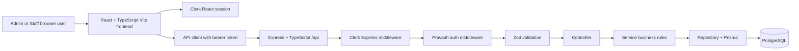
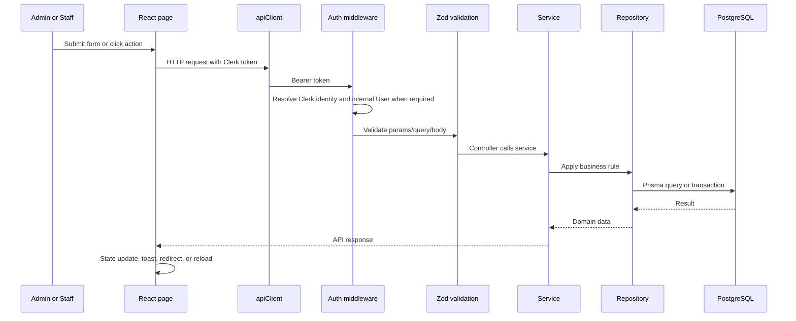
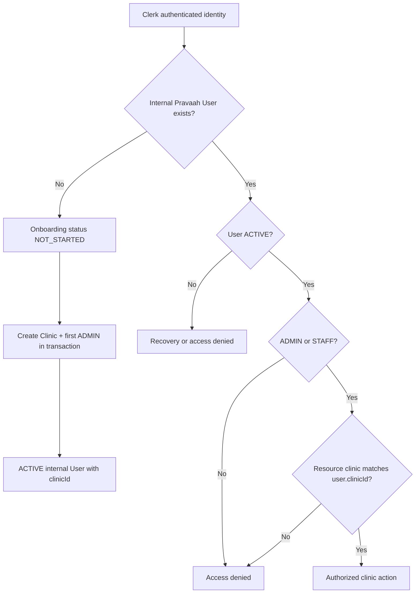
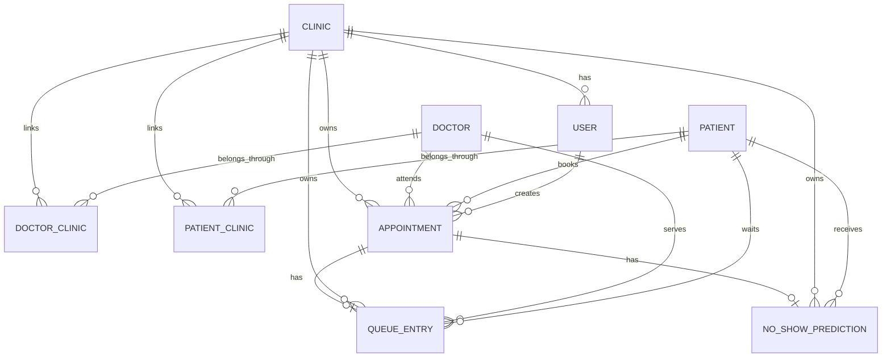
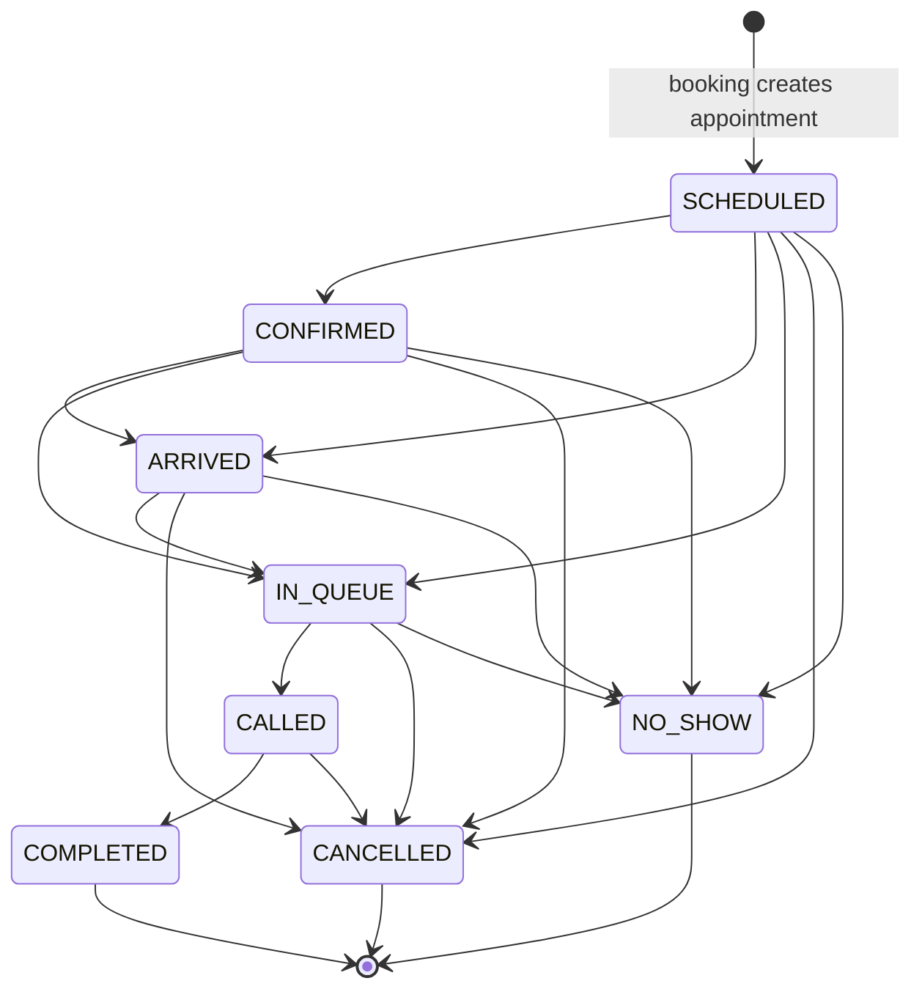
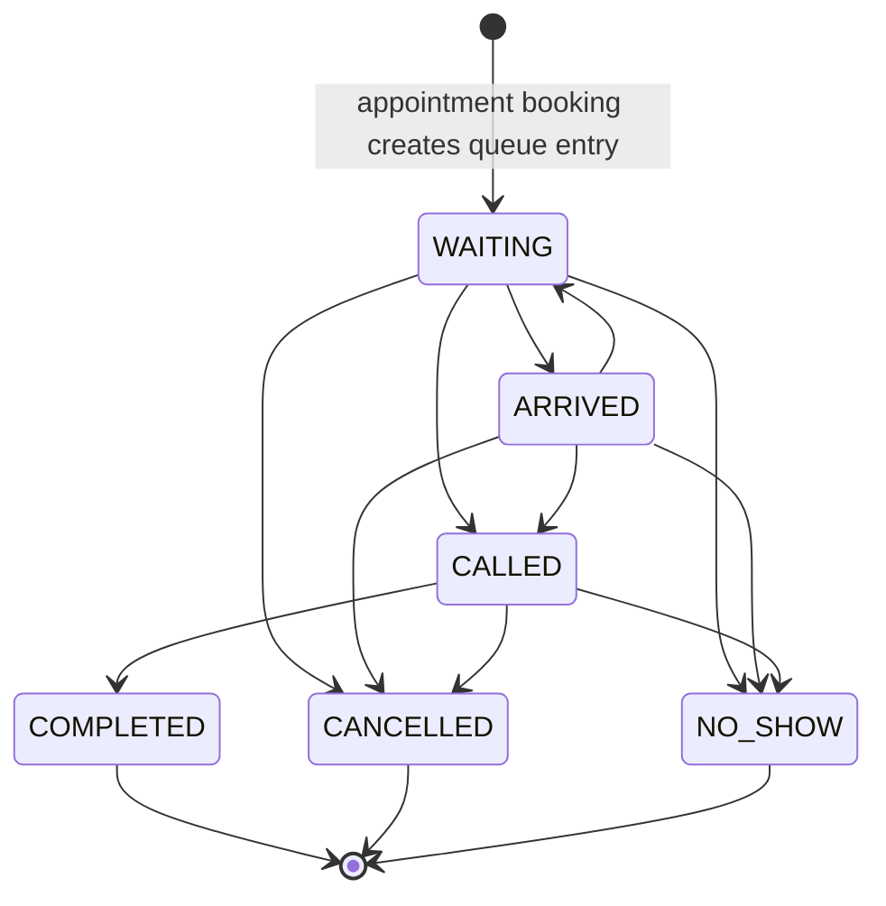
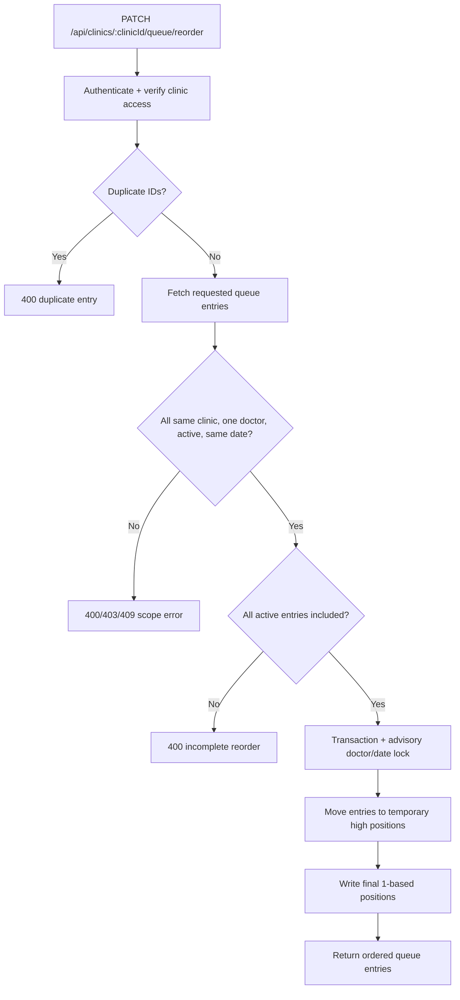
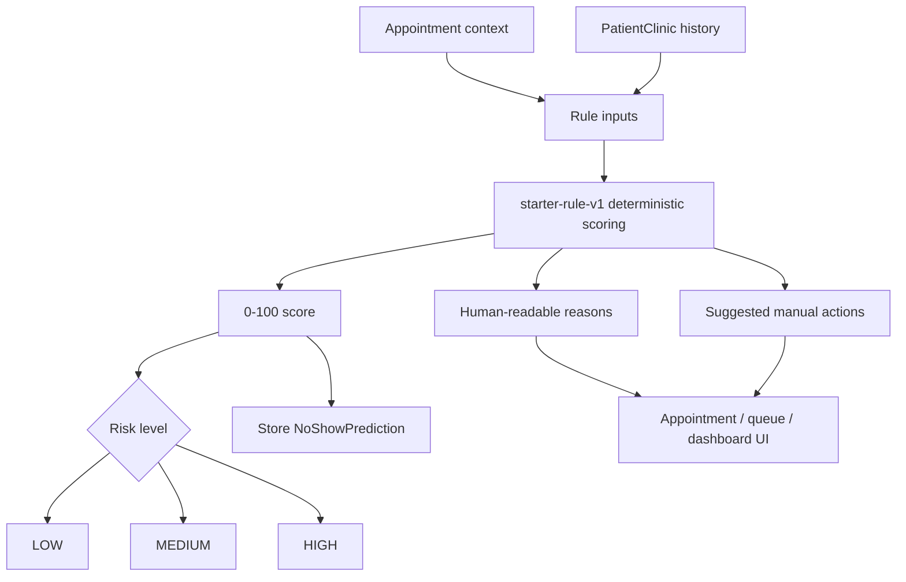
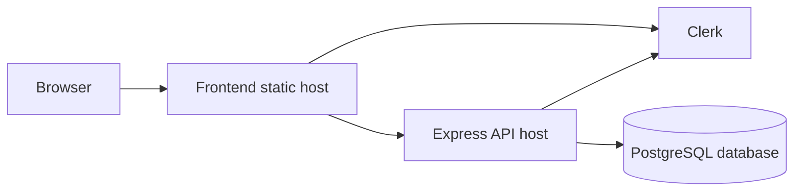
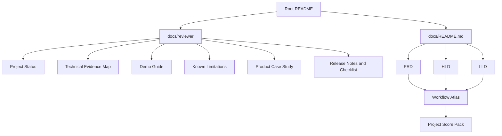

# Reviewer Diagrams

These diagrams summarize implementation evidence for reviewers. Use the [Workflow Atlas](../workflows/README.md) for exact traces.

## System Architecture

## Request Lifecycle

## Authentication And Authorization

## ER Relationships

## Appointment Lifecycle

Note: frontend actions guide the natural path. Backend enforcement currently blocks changes away from final states but does not enforce this full transition matrix for every state pair.

## Queue Lifecycle

Terminal queue entries cannot be updated or reordered.

## Queue Reorder

## No-Show Risk

## Deployment Architecture

Repository evidence: the frontend has [Vercel SPA rewrite config](../../apps/web/vercel.json); backend deployment is documented for a Node host such as Render; PostgreSQL and Clerk are required by env examples. Production URLs and deployed SHAs are not committed.

## Documentation Navigation

