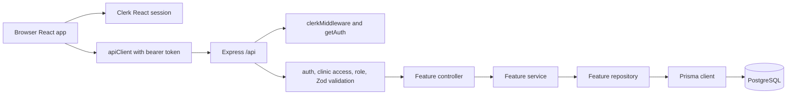
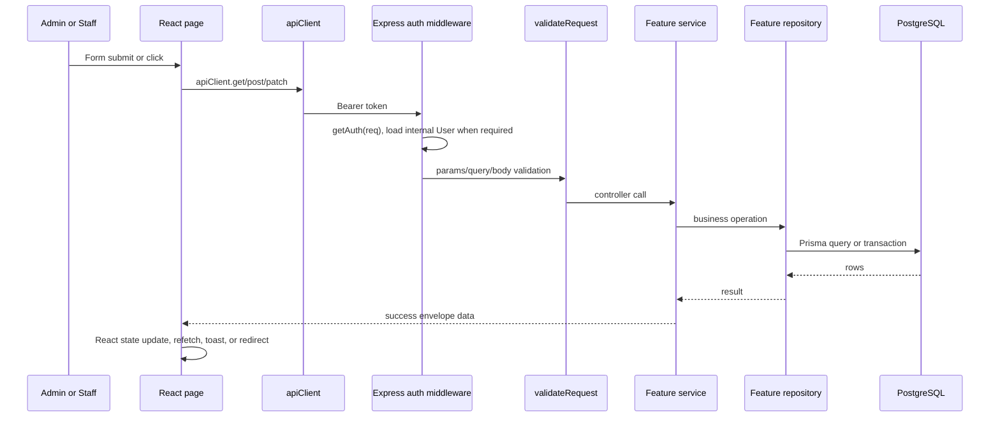

# Pravaah Workflow Atlas

This atlas is the implementation-grounded map for Project Pravaah workflows. It starts from product actions and traces them through the current React frontend, Express API, middleware, services, repositories, Prisma operations, and database models.

The codebase is the primary evidence. PRD, HLD, LLD, release notes, and older workflow notes describe intent and context, but this atlas records what the repository implements now.

## How To Read This Atlas

Each workflow document uses exact file paths and symbol names instead of invented architectural labels. A trace item such as:

```text
apps/web/src/features/appointments/AppointmentsPage.tsx -> handleSubmit()
```

means the named symbol exists in the repository and participates in that workflow. If a conceptual layer does not exist, the trace says so.

Status labels:

| Status                       | Meaning                                                                                  |
| ---------------------------- | ---------------------------------------------------------------------------------------- |
| `IMPLEMENTED_AND_DEPLOYED`   | Implemented and deployment evidence is recorded in this repository.                      |
| `IMPLEMENTED_NOT_RELEASED`   | Implemented in source, but release/deployment verification remains pending.              |
| `PARTIALLY_IMPLEMENTED`      | Some user-visible or backend behavior exists, but important expected pieces are missing. |
| `PLANNED`                    | Documented as future work and not implemented.                                           |
| `DOCUMENTED_NOT_IMPLEMENTED` | Existing docs imply behavior that code does not implement.                               |
| `NEEDS_VERIFICATION`         | Code or documentation exists, but runtime/release evidence is not recorded.              |

Current release status: the repository records `v0.3.0` as released after owner production verification and GO decision. Production frontend/backend URLs and deployed SHAs are recorded in [Release Identity](../releases/RELEASE_IDENTITY.md). The actual calendar release date and GitHub Release URL are not provided.

## Workflow Summary

| Workflow                                                    | Status                     | Frontend entry                                              | Main backend module                        | Main models                                                                                | Detailed trace                                                                                                                             |
| ----------------------------------------------------------- | -------------------------- | ----------------------------------------------------------- | ------------------------------------------ | ------------------------------------------------------------------------------------------ | ------------------------------------------------------------------------------------------------------------------------------------------ |
| Public routes, Clerk auth pages, route guards               | `IMPLEMENTED_AND_DEPLOYED` | `/`, `/login/*`, `/sign-up/*`, `ProtectedAppShell`          | `auth`                                     | `User`, `Clinic`                                                                           | [Public Routes And Fallbacks](public-routes-and-fallbacks.md), [Authentication And User Resolution](authentication-and-user-resolution.md) |
| Authentication, internal user resolution, clinic access     | `IMPLEMENTED_AND_DEPLOYED` | `ApiAuthProvider`, `ActiveClinicProvider`, protected routes | `auth`                                     | `User`, `Clinic`                                                                           | [Authentication And User Resolution](authentication-and-user-resolution.md)                                                                |
| Self-service clinic onboarding                              | `IMPLEMENTED_AND_DEPLOYED` | `/onboarding/clinic`                                        | `auth`, `clinics`                          | `Clinic`, `User`                                                                           | [Onboarding And Clinic Provisioning](onboarding-and-clinic-provisioning.md)                                                                |
| Clinic settings and sample data                             | `IMPLEMENTED_AND_DEPLOYED` | `/clinic-settings`, onboarding sample-data panel            | `clinics`                                  | `Clinic`, plus sample `Doctor`, `Patient`, `Appointment`, `QueueEntry`, `NoShowPrediction` | [Clinic Setup](clinic-setup.md)                                                                                                            |
| Doctor management                                           | `IMPLEMENTED_AND_DEPLOYED` | `/doctors`, `/doctors/new`                                  | `doctors`                                  | `Doctor`, `DoctorClinic`, `Clinic`                                                         | [Doctor Management](doctor-management.md)                                                                                                  |
| Patient management                                          | `IMPLEMENTED_AND_DEPLOYED` | `/patients`, `/patients/new`                                | `patients`                                 | `Patient`, `PatientClinic`, `Clinic`                                                       | [Patient Management](patient-management.md)                                                                                                |
| Appointment booking and listing                             | `IMPLEMENTED_AND_DEPLOYED` | `/appointments`                                             | `appointments`, `predictions`, `queues`    | `Appointment`, `QueueEntry`, `NoShowPrediction`, `DoctorClinic`, `PatientClinic`           | [Appointment Management](appointment-management.md)                                                                                        |
| Appointment lifecycle                                       | `IMPLEMENTED_AND_DEPLOYED` | `/appointments` status actions                              | `appointments`, `queues`                   | `Appointment`, `QueueEntry`                                                                | [Appointment Management](appointment-management.md#appointment-lifecycle)                                                                  |
| Queue listing, status, reorder                              | `IMPLEMENTED_AND_DEPLOYED` | `/queue`                                                    | `queues`                                   | `QueueEntry`, `Appointment`                                                                | [Queue Management](queue-management.md)                                                                                                    |
| Explainable no-show assistance                              | `IMPLEMENTED_AND_DEPLOYED` | appointment, queue, dashboard risk displays                 | `predictions`, `appointments`, `dashboard` | `NoShowPrediction`, `Appointment`, `PatientClinic`                                         | [No-Show Risk Assistance](no-show-risk-assistance.md)                                                                                      |
| Dashboard and first-run setup state                         | `IMPLEMENTED_AND_DEPLOYED` | `/dashboard`                                                | `dashboard`, `auth`                        | `Appointment`, `QueueEntry`, `NoShowPrediction`, `DoctorClinic`, `PatientClinic`, `Clinic` | [Dashboard And Operational Data](dashboard-and-operational-data.md)                                                                        |
| Cross-cutting validation, errors, transactions, concurrency | `IMPLEMENTED_AND_DEPLOYED` | shared API client and page state                            | all feature modules                        | all major models                                                                           | [Cross-Workflow State And Infrastructure](cross-workflow-state-transitions.md)                                                             |

## Architecture Overview



## Request Lifecycle



## Primary References

- [README](../../README.md)
- [Documentation Index](../README.md)
- [PRD](../PRD.md)
- [HLD](../HLD.md)
- [LLD](../LLD.md)
- [Architecture](../architecture/ARCHITECTURE.md)
- [API Structure](../architecture/API_STRUCTURE.md)
- [API Reference](../architecture/API_REFERENCE.md)
- [Database Design](../architecture/DATABASE_DESIGN.md)
- [Auth And Security](../architecture/AUTH_AND_SECURITY.md)
- [User Roles](../product/USER_ROLES.md)
- [Existing product workflow summary](../product/WORKFLOWS.md)
- [Implementation Audit](implementation-audit.md)

## Major Known Gaps

- No repository evidence records current production frontend/backend URLs or deployed commit SHAs.
- No patient login, doctor login, patient portal, doctor portal, billing, prescriptions, notifications, or trained ML model.
- No frontend query/cache library is used; server state is managed with React state and explicit reloads.
- Appointment status transitions are constrained mainly by final-state guards, not a strict state-machine matrix on the backend.
- Doctor update proves clinic linkage but updates the shared `Doctor` row, which matters if future multi-clinic doctor sharing becomes real.
- Patient history counters in `PatientClinic` are read for risk scoring but not automatically incremented by appointment or queue status updates in current code.
- Browser E2E coverage is not present.
