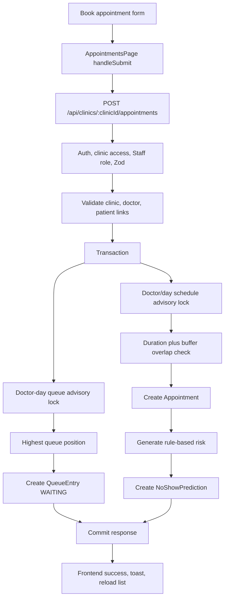

# Appointment Management

## Workflow Summary

| Field                 | Evidence                                                                                                                                                                                                                 |
| --------------------- | ------------------------------------------------------------------------------------------------------------------------------------------------------------------------------------------------------------------------ |
| Workflow              | Book, list, filter, reschedule, and update appointment status                                                                                                                                                            |
| Product status        | Implemented                                                                                                                                                                                                              |
| Release status        | `IMPLEMENTED_NOT_RELEASED`                                                                                                                                                                                               |
| Actor                 | Active internal `ADMIN` or `STAFF`                                                                                                                                                                                       |
| Entry route           | `/appointments`                                                                                                                                                                                                          |
| Frontend files        | `apps/web/src/features/appointments/AppointmentsPage.tsx`, `AppointmentBookingForm.tsx`, `appointmentApi.ts`                                                                                                             |
| Main frontend symbols | `AppointmentsPage`, `loadAppointments`, `loadAppointmentReferences`, slot loading effects, `handleSubmit`, `handleStatusUpdate`, `handleConfirmReschedule`, `RescheduleAppointmentDialog`, `AppointmentBookingForm`, appointment API helpers |
| API endpoint          | `GET /api/clinics/:clinicId/appointments/available-slots`, `POST /api/clinics/:clinicId/appointments`, `GET /api/clinics/:clinicId/appointments`, `GET /api/appointments/:appointmentId/reschedule-slots`, `PATCH /api/appointments/:appointmentId/reschedule`, `PATCH /api/appointments/:appointmentId/status` |
| Middleware            | Create/list use `authenticateRequest`, `validateRequest`, `requireClinicAccess`, `requireClinicStaffRole`; status route uses `authenticateRequest`, validation, `requireClinicStaffRole` and service-level clinic access |
| Authentication        | Clerk token plus active internal user required                                                                                                                                                                           |
| Authorization         | Admin and Staff both allowed                                                                                                                                                                                             |
| Clinic scoping        | Route `clinicId` on create/list; appointment status resolves clinic through `accessService.verifyAppointmentClinicAccess`                                                                                                |
| Validation            | `appointment.validation.ts -> availableAppointmentSlotsQuerySchema`, `createAppointmentSchema`, `listAppointmentsQuerySchema`, `rescheduleAppointmentSlotsQuerySchema`, `rescheduleAppointmentSchema`, `updateAppointmentStatusSchema` |
| Controller            | `appointment.controller.ts -> create/list/reschedule/status controllers`                                                                                                                                                 |
| Service               | `appointment.service.ts -> createAppointment`, `listAppointments`, `listRescheduleSlots`, `rescheduleAppointment`, `updateAppointmentStatus`                                                                             |
| Repository            | `appointment.repository.ts`, `queue.repository.ts`, `prediction.service.ts`                                                                                                                                              |
| Database models       | `Clinic`, `Doctor`, `DoctorClinic`, `Patient`, `PatientClinic`, `Appointment`, `QueueEntry`, `NoShowPrediction`, `User`                                                                                                  |
| Prisma operations     | `findUnique`, `findFirst`, `count`, `appointment.create`, `queueEntry.create`, `noShowPrediction.create`, status `updateMany`, detail `findFirst`                                                                        |
| Transaction           | Booking and rescheduling use `appointmentRepository.runInTransaction`; status update uses `prisma.$transaction`                                                                                                          |
| Concurrency control   | Booking and rescheduling take clinic/doctor/date advisory locks for scheduling and queue scope. Status sync uses guarded `updateMany` against final statuses                                                             |
| State changes         | Appointment row, queue entry row, no-show prediction row, status synchronization with queue; rescheduling updates only existing `Appointment.scheduledAt` and sometimes existing `QueueEntry.position`                   |
| Side effects          | Booking always creates a `QueueEntry` and a `NoShowPrediction` in current code                                                                                                                                           |
| Errors                | `APPOINTMENT_SLOT_UNAVAILABLE`, `APPOINTMENT_SLOT_CONFLICT`, `DOCTOR_NOT_LINKED_TO_CLINIC`, `PATIENT_NOT_LINKED_TO_CLINIC`, `APPOINTMENT_STATUS_FINAL`, `STATUS_SYNC_CONFLICT`, `QUEUE_ENTRY_NOT_FOUND`                  |
| Tests                 | Appointment service/controller/validation tests; `AppointmentsPage` has no dedicated test file in current tree                                                                                                           |
| Known gaps            | Booking now enforces weekly availability, clinic hours, slot duration, duration overlap, and buffer conflicts. Past-date booking remains a business-rule gap. Rescheduling does not recalculate no-show prediction; generalized prediction refresh is deferred |

## Appointment Booking Trace

```text
User opens /appointments
    ↓
AppointmentsPage -> useActiveClinic()
    ↓
loadAppointmentReferences()
    ↓
listDoctors(clinicId) and listPatients(clinicId, {})
    ↓
frontend filters active doctors and patients
    ↓
AppointmentBookingForm renders doctor, patient, date, duration, server-generated slot, reason, notes
    ↓
User selects doctor, appointment date, and duration
    ↓
appointmentApi.listAvailableAppointmentSlots(clinicId, { doctorId, date, durationMinutes })
    ↓
GET /api/clinics/:clinicId/appointments/available-slots
    ↓
backend computes slots from Clinic hours, DoctorAvailabilityPeriod rows, existing appointments, duration, and buffer
    ↓
User clicks "Book appointment"
    ↓
AppointmentBookingForm -> handleSubmit(event) -> onSubmit()
    ↓
AppointmentsPage -> handleSubmit()
    ↓
validateAppointmentForm()
    ↓
toCreateAppointmentRequest()
    ↓
appointmentApi.createAppointment(clinicId, payload)
    ↓
POST /api/clinics/:clinicId/appointments
    ↓
authenticateRequest
    ↓
validateRequest({ params: clinicIdParamsSchema, body: createAppointmentSchema })
    ↓
requireClinicAccess
    ↓
requireClinicStaffRole
    ↓
appointment.controller.ts -> createAppointmentController()
    ↓
appointment.service.ts -> createAppointment(clinicId, req.user.id, input)
    ↓
validateAppointmentClinicOwnership()
    ↓
appointmentRepository.findClinicById(clinicId)
    ↓
appointmentRepository.findDoctorById(doctorId)
    ↓
appointmentRepository.findPatientById(patientId)
    ↓
appointmentRepository.findActiveDoctorClinicLink(clinicId, doctorId)
    ↓
appointmentRepository.findActivePatientClinicLink(clinicId, patientId)
    ↓
assert requested scheduledAt is one of the generated clinic-local slots
    ↓
countPatientAppointmentsByStatus(NO_SHOW) and countPatientAppointmentsByStatus(COMPLETED)
    ↓
appointmentRepository.runInTransaction()
    ↓
appointmentRepository.acquireDoctorScheduleLock(tx, clinicId, doctorId, clinicLocalDate)
    ↓
appointmentRepository.findOverlappingDoctorAppointment(tx, clinicId, doctorId, scheduledAt, durationMinutes, bufferMinutes, active statuses)
    ↓
queueRepository.findHighestQueuePosition(tx, clinicId, doctorId, scheduledAt, clinicTimezone)
    ↓
queueService.calculateNextQueuePosition(highestPosition)
    ↓
appointmentRepository.createAppointment(tx, clinicId, createdByUserId, input)
    ↓
prediction.service.ts -> predictNoShowRisk(...)
    ↓
queueRepository.createQueueEntry(tx, clinicId, appointment.id, doctorId, patientId, nextPosition)
    ↓
appointmentRepository.createNoShowPrediction(tx, clinicId, appointment.id, patientId, prediction)
    ↓
201 { appointment, queueEntry, noShowPrediction }
    ↓
AppointmentsPage clears form, shows success toast, reloads listAppointments()
```

## Booking Inputs

Frontend request type: `appointmentApi.ts -> CreateAppointmentRequest`.

| Field             | Source                                                           | Backend validation                                               |
| ----------------- | ---------------------------------------------------------------- | ---------------------------------------------------------------- |
| `doctorId`        | Doctor select populated by `listDoctors`                         | UUID                                                             |
| `patientId`       | Patient select populated by `listPatients`                       | UUID                                                             |
| `appointmentDate` | Date input used for slot discovery                               | Query `YYYY-MM-DD` for available-slot endpoint                   |
| `scheduledAt`     | Server-generated available slot ISO datetime                     | Zod `datetime`; service verifies it still matches a generated slot |
| `durationMinutes` | number input string converted to number                          | positive integer, default 15                                     |
| `reason`          | optional string                                                  | optional string                                                  |
| `notes`           | optional string                                                  | optional string                                                  |
| `bookingSource`   | frontend hard-codes `BookingSource.RECEPTION`                    | enum `RECEPTION`, `PHONE`, `WEB`, `WALK_IN`, default `RECEPTION` |

## Business Checks Implemented

Implemented:

- Clinic exists and is active.
- Doctor exists.
- Patient exists.
- Active `DoctorClinic` link exists for requested clinic and doctor.
- Active `PatientClinic` link exists for requested clinic and patient.
- Doctor weekly availability is read from `DoctorAvailabilityPeriod` through the active `DoctorClinic` link.
- Requested time must be a generated clinic-local slot inside `Clinic.openingTime`/`closingTime`, doctor availability, and `Clinic.slotDurationMinutes`.
- Existing active doctor appointments that overlap the requested duration plus `Clinic.bufferMinutes` cause `APPOINTMENT_SLOT_CONFLICT`.
- Appointment, queue entry, and no-show prediction are written in one transaction.
- Queue position is assigned per clinic, doctor, and clinic-local appointment date.
- No-show risk is deterministic and generated at booking time.

Not implemented in current service:

- No date-specific doctor exceptions, holidays, or leave schedule.
- No past-date rejection as a business rule.
- No explicit active/inactive rejection for `Patient.isActive` in the backend ownership check. Doctor scheduling requires both `Doctor.isActive` and an active `DoctorClinic` link.

## Appointment Rescheduling

Rescheduling changes when the same appointment will happen. It does not create a replacement appointment, does not reset lifecycle status, does not recreate the queue entry, and does not recalculate or duplicate the no-show prediction.

Eligible appointment statuses are centralized in `appointment.lifecycle.ts -> reschedulableAppointmentStatuses`:

```text
SCHEDULED
CONFIRMED
```

Rejected statuses are:

```text
ARRIVED
IN_QUEUE
CALLED
COMPLETED
CANCELLED
NO_SHOW
```

### Reschedule Slot Trace

```text
AppointmentsPage -> Reschedule action
    ↓
RescheduleAppointmentDialog displays patient, doctor, current time, and duration as read-only context
    ↓
User selects a destination clinic-local date
    ↓
appointmentApi.listAppointmentRescheduleSlots(appointmentId, date)
    ↓
GET /api/appointments/:appointmentId/reschedule-slots?date=YYYY-MM-DD
    ↓
authenticateRequest
    ↓
validateRequest({ params: appointmentIdParamsSchema, query: rescheduleAppointmentSlotsQuerySchema })
    ↓
requireClinicStaffRole
    ↓
accessService.verifyAppointmentClinicAccess(user, appointmentId)
    ↓
appointment.service.ts -> listRescheduleSlots()
    ↓
verify appointment is SCHEDULED or CONFIRMED
    ↓
derive clinicId, doctorId, durationMinutes, and current appointment ID from persisted appointment
    ↓
reuse canonical slot generation from clinic hours, doctor weekly availability, slot duration, duration, buffer, timezone, and scheduling conflict statuses
    ↓
load blocking appointments with excludeAppointmentId = current appointment ID
    ↓
filter the exact current scheduledAt from returned choices
    ↓
return data.availability with currentScheduledAt and destination slots
```

The client cannot supply `doctorId`, `durationMinutes`, `clinicId`, or an arbitrary `excludeAppointmentId` for reschedule-slot discovery. Self-exclusion is internal to the appointment-specific workflow only; other appointments still block capacity.

### Reschedule Mutation Trace

```text
User selects a returned destination slot
    ↓
Dialog shows From and To confirmation
    ↓
appointmentApi.rescheduleAppointment(appointmentId, { scheduledAt, currentScheduledAt })
    ↓
PATCH /api/appointments/:appointmentId/reschedule
    ↓
authenticateRequest
    ↓
validateRequest({ params: appointmentIdParamsSchema, body: rescheduleAppointmentSchema })
    ↓
requireClinicStaffRole
    ↓
accessService.verifyAppointmentClinicAccess(user, appointmentId)
    ↓
service loads current appointment and verifies SCHEDULED or CONFIRMED
    ↓
persisted scheduledAt must match the user-confirmed currentScheduledAt
    ↓
same timestamp returns current appointment as a no-op
    ↓
transaction starts
    ↓
acquire source/destination clinicId + doctorId + clinic-local-date advisory locks in sorted order
    ↓
re-read appointment and linked queue entry
    ↓
recheck reschedulable status and pre-visit queue status
    ↓
recheck current scheduledAt still equals currentScheduledAt
    ↓
re-read clinic scheduling config and doctor weekly availability
    ↓
revalidate requested slot against the canonical generated slot grid
    ↓
check active doctor overlaps with current appointment excluded
    ↓
guarded update of existing Appointment.scheduledAt
    ↓
if clinic-local date changed, assign existing QueueEntry the next destination queue position
    ↓
return updated appointment using normal appointment response shape
```

Lifecycle status is preserved:

```text
SCHEDULED -> SCHEDULED
CONFIRMED -> CONFIRMED
```

The mutation does not call the appointment lifecycle transition API. It preserves doctor, patient, duration, creator, booking source, reason, notes, `createdAt`, queue entry identity, queue status, `queuedAt`, `calledAt`, `completedAt`, and the existing no-show prediction relationship.

Queue scope follows the linked appointment's clinic-local scheduled date. Same-day rescheduling preserves the queue position. Cross-day rescheduling preserves the same `QueueEntry` row but gives it the next valid position in the destination doctor/date queue. Source queue positions are not renumbered.

## Appointment Listing Trace

```text
AppointmentsPage -> loadAppointments()
    ↓
appointmentApi.listAppointments(clinicId, filters)
    ↓
GET /api/clinics/:clinicId/appointments?date=&doctorId=&patientId=&status=
    ↓
validateRequest({ params, query: listAppointmentsQuerySchema })
    ↓
appointment.service.ts -> listAppointments(clinicId, filters)
    ↓
clinic existence and active check
    ↓
optional doctor and Patient clinic-link checks for filters
    ↓
appointment.repository.ts -> findAppointmentsByClinicId(clinicId, filters, clinic.timezone)
    ↓
SQL date range using `${date}::date::timestamp AT TIME ZONE ${clinicTimezone}`
    ↓
prisma.appointment.findMany({ include: doctor, patient, createdBy, queueEntry, noShowPrediction })
    ↓
service maps stored prediction to response with suggestedActions and modelVersion
    ↓
AppointmentsPage stores appointmentListState
```

## Appointment Lifecycle

Prisma enum values:

```text
SCHEDULED
CONFIRMED
ARRIVED
IN_QUEUE
CALLED
COMPLETED
CANCELLED
NO_SHOW
```

Frontend action options in `AppointmentsPage -> statusActionsByCurrentStatus`:

| From                                | UI offers                                                  |
| ----------------------------------- | ---------------------------------------------------------- |
| `SCHEDULED`                         | `CONFIRMED`, `ARRIVED`, `IN_QUEUE`, `CANCELLED`, `NO_SHOW` |
| `CONFIRMED`                         | `ARRIVED`, `IN_QUEUE`, `CANCELLED`, `NO_SHOW`              |
| `ARRIVED`                           | `IN_QUEUE`, `CALLED`, `CANCELLED`, `NO_SHOW`               |
| `IN_QUEUE`                          | `CALLED`, `COMPLETED`, `CANCELLED`, `NO_SHOW`              |
| `CALLED`                            | `COMPLETED`, `CANCELLED`, `NO_SHOW`                        |
| `COMPLETED`, `CANCELLED`, `NO_SHOW` | none                                                       |

Backend status behavior:

| Rule                                                                 | Evidence                                                                         |
| -------------------------------------------------------------------- | -------------------------------------------------------------------------------- |
| Final statuses cannot change to a different status                   | `appointment.lifecycle.ts -> finalAppointmentStatuses` and guarded `updateMany`  |
| Non-final appointments must follow the approved transition policy    | `appointment.lifecycle.ts -> appointmentStatusTransitions`                       |
| Same-status updates are accepted as idempotent retries               | `appointment.lifecycle.ts -> isAppointmentStatusTransitionAllowed`               |
| `SCHEDULED` and `CONFIRMED` do not map to a queue status             | `appointmentStatusToQueueStatus` has no entries for these states                 |
| `ARRIVED` maps to queue `ARRIVED`                                    | `appointmentStatusToQueueStatus`                                                 |
| `IN_QUEUE` maps to queue `WAITING`                                   | `appointmentStatusToQueueStatus`                                                 |
| `CALLED` maps to queue `CALLED` and sets `calledAt` if null          | repository transaction                                                           |
| `COMPLETED` maps to queue `COMPLETED` and sets `completedAt` if null | repository transaction                                                           |
| `CANCELLED` maps to queue `CANCELLED`                                | repository transaction                                                           |
| `NO_SHOW` maps to queue `NO_SHOW`                                    | repository transaction                                                           |

### Status Update Trace

```text
User clicks a status action in /appointments
    ↓
AppointmentsPage -> handleStatusUpdate(appointment, nextStatus)
    ↓
appointmentApi.updateAppointmentStatus(appointment.id, nextStatus)
    ↓
PATCH /api/appointments/:appointmentId/status
    ↓
authenticateRequest
    ↓
validateRequest({ params: appointmentIdParamsSchema, body: updateAppointmentStatusSchema })
    ↓
requireClinicStaffRole
    ↓
appointment.controller.ts -> updateAppointmentStatusController()
    ↓
appointment.service.ts -> updateAppointmentStatus(req.user, appointmentId, status)
    ↓
accessService.verifyAppointmentClinicAccess(user, appointmentId)
    ↓
accessRepository.findAppointmentClinicById(appointmentId)
    ↓
accessService.verifyClinicAccess(user, appointment.clinicId)
    ↓
appointment.repository.ts -> updateAppointmentStatus(appointmentId, clinicId, status)
    ↓
prisma.$transaction
    ↓
tx.appointment.findFirst({ id, clinicId, status, queueEntry })
    ↓
reject missing appointment, final status conflict, invalid transition, or missing queue entry for queue-mapped status
    ↓
tx.appointment.updateMany({ transition-aware current-status guard })
    ↓
optional tx.queueEntry.updateMany({ final-status guard })
    ↓
optional calledAt/completedAt updates
    ↓
tx.appointment.findFirst({ include: appointmentDetailsInclude })
    ↓
Frontend replaces or removes item depending on current filter and shows toast
```

## Queue Entry Creation

In current implementation, `QueueEntry` is created during appointment booking for every appointment created through `POST /api/clinics/:clinicId/appointments`. It is not created by an arrival status transition.

Initial queue entry fields:

| Field           | Value                                                |
| --------------- | ---------------------------------------------------- |
| `clinicId`      | request clinic                                       |
| `appointmentId` | newly created appointment ID                         |
| `doctorId`      | input doctor                                         |
| `patientId`     | input patient                                        |
| `position`      | highest position for clinic/doctor/local date plus 1 |
| `status`        | `WAITING`                                            |
| `queuedAt`      | database default `now()`                             |

## Appointment Creation Diagram



## How To Explain This Workflow

When Staff books an appointment, Pravaah treats the booking as the start of the operational queue plan. The backend generates selectable slots from clinic settings, the doctor's recurring weekly availability, existing active appointments, duration, and buffer rules. Final booking validation reuses that scheduling policy, locks the doctor clinic-local day, writes the appointment, queue entry, and no-show prediction in one transaction, and returns all three to the frontend. Status changes later keep the appointment and queue entry synchronized where a queue status exists.
