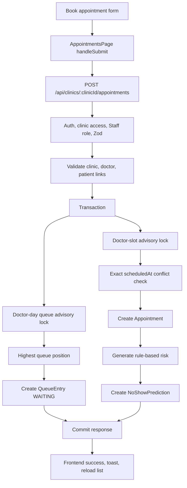

# Appointment Management

## Workflow Summary

| Field                 | Evidence                                                                                                                                                                                                                 |
| --------------------- | ------------------------------------------------------------------------------------------------------------------------------------------------------------------------------------------------------------------------ |
| Workflow              | Book, list, filter, and update appointment status                                                                                                                                                                        |
| Product status        | Implemented                                                                                                                                                                                                              |
| Release status        | `IMPLEMENTED_NOT_RELEASED`                                                                                                                                                                                               |
| Actor                 | Active internal `ADMIN` or `STAFF`                                                                                                                                                                                       |
| Entry route           | `/appointments`                                                                                                                                                                                                          |
| Frontend files        | `apps/web/src/features/appointments/AppointmentsPage.tsx`, `AppointmentBookingForm.tsx`, `appointmentApi.ts`                                                                                                             |
| Main frontend symbols | `AppointmentsPage`, `loadAppointments`, `loadAppointmentReferences`, `handleSubmit`, `handleStatusUpdate`, `AppointmentBookingForm`, `createAppointment`, `listAppointments`, `updateAppointmentStatus`                  |
| API endpoint          | `POST /api/clinics/:clinicId/appointments`, `GET /api/clinics/:clinicId/appointments`, `PATCH /api/appointments/:appointmentId/status`                                                                                   |
| Middleware            | Create/list use `authenticateRequest`, `validateRequest`, `requireClinicAccess`, `requireClinicStaffRole`; status route uses `authenticateRequest`, validation, `requireClinicStaffRole` and service-level clinic access |
| Authentication        | Clerk token plus active internal user required                                                                                                                                                                           |
| Authorization         | Admin and Staff both allowed                                                                                                                                                                                             |
| Clinic scoping        | Route `clinicId` on create/list; appointment status resolves clinic through `accessService.verifyAppointmentClinicAccess`                                                                                                |
| Validation            | `appointment.validation.ts -> createAppointmentSchema`, `listAppointmentsQuerySchema`, `updateAppointmentStatusSchema`                                                                                                   |
| Controller            | `appointment.controller.ts -> createAppointmentController`, `listAppointmentsController`, `updateAppointmentStatusController`                                                                                            |
| Service               | `appointment.service.ts -> createAppointment`, `listAppointments`, `updateAppointmentStatus`                                                                                                                             |
| Repository            | `appointment.repository.ts`, `queue.repository.ts`, `prediction.service.ts`                                                                                                                                              |
| Database models       | `Clinic`, `Doctor`, `DoctorClinic`, `Patient`, `PatientClinic`, `Appointment`, `QueueEntry`, `NoShowPrediction`, `User`                                                                                                  |
| Prisma operations     | `findUnique`, `findFirst`, `count`, `appointment.create`, `queueEntry.create`, `noShowPrediction.create`, status `updateMany`, detail `findFirst`                                                                        |
| Transaction           | Booking uses `appointmentRepository.runInTransaction`; status update uses `prisma.$transaction`                                                                                                                          |
| Concurrency control   | Booking takes advisory transaction locks for exact doctor slot and doctor/day queue position. Status sync uses guarded `updateMany` against final statuses                                                               |
| State changes         | Appointment row, queue entry row, no-show prediction row, status synchronization with queue                                                                                                                              |
| Side effects          | Booking always creates a `QueueEntry` and a `NoShowPrediction` in current code                                                                                                                                           |
| Errors                | `APPOINTMENT_SLOT_CONFLICT`, `DOCTOR_NOT_LINKED_TO_CLINIC`, `PATIENT_NOT_LINKED_TO_CLINIC`, `APPOINTMENT_STATUS_FINAL`, `STATUS_SYNC_CONFLICT`, `QUEUE_ENTRY_NOT_FOUND`                                                  |
| Tests                 | Appointment service/controller/validation tests; `AppointmentsPage` has no dedicated test file in current tree                                                                                                           |
| Known gaps            | No operating-hours or buffer-duration conflict validation is implemented in appointment service. Backend does not enforce a full transition matrix beyond final-status protections                                       |

## Appointment Booking Trace

```text
User opens /appointments
    ↓
AppointmentsPage -> useActiveClinic()
    ↓
loadAppointmentReferences()
    ↓
listDoctors(clinicId) and listPatients(clinicId, {})
    ↓
frontend filters active doctors and patients
    ↓
AppointmentBookingForm renders doctor, patient, datetime, duration, reason, notes
    ↓
User clicks "Book appointment"
    ↓
AppointmentBookingForm -> handleSubmit(event) -> onSubmit()
    ↓
AppointmentsPage -> handleSubmit()
    ↓
validateAppointmentForm()
    ↓
toCreateAppointmentRequest()
    ↓
appointmentApi.createAppointment(clinicId, payload)
    ↓
POST /api/clinics/:clinicId/appointments
    ↓
authenticateRequest
    ↓
validateRequest({ params: clinicIdParamsSchema, body: createAppointmentSchema })
    ↓
requireClinicAccess
    ↓
requireClinicStaffRole
    ↓
appointment.controller.ts -> createAppointmentController()
    ↓
appointment.service.ts -> createAppointment(clinicId, req.user.id, input)
    ↓
validateAppointmentClinicOwnership()
    ↓
appointmentRepository.findClinicById(clinicId)
    ↓
appointmentRepository.findDoctorById(doctorId)
    ↓
appointmentRepository.findPatientById(patientId)
    ↓
appointmentRepository.findActiveDoctorClinicLink(clinicId, doctorId)
    ↓
appointmentRepository.findActivePatientClinicLink(clinicId, patientId)
    ↓
countPatientAppointmentsByStatus(NO_SHOW) and countPatientAppointmentsByStatus(COMPLETED)
    ↓
appointmentRepository.runInTransaction()
    ↓
appointmentRepository.acquireAppointmentSlotLock(tx, clinicId, doctorId, scheduledAt)
    ↓
appointmentRepository.findDoctorAppointmentAtTime(tx, clinicId, doctorId, scheduledAt, active statuses)
    ↓
queueRepository.findHighestQueuePosition(tx, clinicId, doctorId, scheduledAt, clinicTimezone)
    ↓
queueService.calculateNextQueuePosition(highestPosition)
    ↓
appointmentRepository.createAppointment(tx, clinicId, createdByUserId, input)
    ↓
prediction.service.ts -> predictNoShowRisk(...)
    ↓
queueRepository.createQueueEntry(tx, clinicId, appointment.id, doctorId, patientId, nextPosition)
    ↓
appointmentRepository.createNoShowPrediction(tx, clinicId, appointment.id, patientId, prediction)
    ↓
201 { appointment, queueEntry, noShowPrediction }
    ↓
AppointmentsPage clears form, shows success toast, reloads listAppointments()
```

## Booking Inputs

Frontend request type: `appointmentApi.ts -> CreateAppointmentRequest`.

| Field             | Source                                                           | Backend validation                                               |
| ----------------- | ---------------------------------------------------------------- | ---------------------------------------------------------------- |
| `doctorId`        | Doctor select populated by `listDoctors`                         | UUID                                                             |
| `patientId`       | Patient select populated by `listPatients`                       | UUID                                                             |
| `scheduledAt`     | `datetime-local`, converted with `new Date(value).toISOString()` | Zod `datetime`                                                   |
| `durationMinutes` | number input string converted to number                          | positive integer, default 15                                     |
| `reason`          | optional string                                                  | optional string                                                  |
| `notes`           | optional string                                                  | optional string                                                  |
| `bookingSource`   | frontend hard-codes `BookingSource.RECEPTION`                    | enum `RECEPTION`, `PHONE`, `WEB`, `WALK_IN`, default `RECEPTION` |

## Business Checks Implemented

Implemented:

- Clinic exists and is active.
- Doctor exists.
- Patient exists.
- Active `DoctorClinic` link exists for requested clinic and doctor.
- Active `PatientClinic` link exists for requested clinic and patient.
- Existing doctor appointment at the exact same `scheduledAt` with active status causes `APPOINTMENT_SLOT_CONFLICT`.
- Appointment, queue entry, and no-show prediction are written in one transaction.
- Queue position is assigned per clinic, doctor, and clinic-local appointment date.
- No-show risk is deterministic and generated at booking time.

Not implemented in current service:

- No check that scheduled time is inside `Clinic.openingTime` and `closingTime`.
- No duration overlap conflict detection. The conflict check is exact same `scheduledAt`.
- No `Clinic.bufferMinutes` enforcement during booking.
- No explicit active/inactive rejection for `Doctor.isActive` or `Patient.isActive` in the backend ownership check. It checks active link rows.

## Appointment Listing Trace

```text
AppointmentsPage -> loadAppointments()
    ↓
appointmentApi.listAppointments(clinicId, filters)
    ↓
GET /api/clinics/:clinicId/appointments?date=&doctorId=&patientId=&status=
    ↓
validateRequest({ params, query: listAppointmentsQuerySchema })
    ↓
appointment.service.ts -> listAppointments(clinicId, filters)
    ↓
clinic existence and active check
    ↓
optional doctor and Patient clinic-link checks for filters
    ↓
appointment.repository.ts -> findAppointmentsByClinicId(clinicId, filters, clinic.timezone)
    ↓
SQL date range using `${date}::date::timestamp AT TIME ZONE ${clinicTimezone}`
    ↓
prisma.appointment.findMany({ include: doctor, patient, createdBy, queueEntry, noShowPrediction })
    ↓
service maps stored prediction to response with suggestedActions and modelVersion
    ↓
AppointmentsPage stores appointmentListState
```

## Appointment Lifecycle

Prisma enum values:

```text
SCHEDULED
CONFIRMED
ARRIVED
IN_QUEUE
CALLED
COMPLETED
CANCELLED
NO_SHOW
```

Frontend action options in `AppointmentsPage -> statusActionsByCurrentStatus`:

| From                                | UI offers                                                  |
| ----------------------------------- | ---------------------------------------------------------- |
| `SCHEDULED`                         | `CONFIRMED`, `ARRIVED`, `IN_QUEUE`, `CANCELLED`, `NO_SHOW` |
| `CONFIRMED`                         | `ARRIVED`, `IN_QUEUE`, `CANCELLED`, `NO_SHOW`              |
| `ARRIVED`                           | `IN_QUEUE`, `CALLED`, `CANCELLED`, `NO_SHOW`               |
| `IN_QUEUE`                          | `CALLED`, `COMPLETED`, `CANCELLED`, `NO_SHOW`              |
| `CALLED`                            | `COMPLETED`, `CANCELLED`, `NO_SHOW`                        |
| `COMPLETED`, `CANCELLED`, `NO_SHOW` | none                                                       |

Backend status behavior:

| Rule                                                                 | Evidence                                                                         |
| -------------------------------------------------------------------- | -------------------------------------------------------------------------------- |
| Final statuses cannot change to a different status                   | `appointment.repository.ts -> finalAppointmentStatuses` and guarded `updateMany` |
| Non-final appointments can be set to any enum value accepted by Zod  | `updateAppointmentStatusSchema` accepts all enum values                          |
| `SCHEDULED` and `CONFIRMED` do not map to a queue status             | `appointmentStatusToQueueStatus` has no entries for these states                 |
| `ARRIVED` maps to queue `ARRIVED`                                    | `appointmentStatusToQueueStatus`                                                 |
| `IN_QUEUE` maps to queue `WAITING`                                   | `appointmentStatusToQueueStatus`                                                 |
| `CALLED` maps to queue `CALLED` and sets `calledAt` if null          | repository transaction                                                           |
| `COMPLETED` maps to queue `COMPLETED` and sets `completedAt` if null | repository transaction                                                           |
| `CANCELLED` maps to queue `CANCELLED`                                | repository transaction                                                           |
| `NO_SHOW` maps to queue `NO_SHOW`                                    | repository transaction                                                           |

### Status Update Trace

```text
User clicks a status action in /appointments
    ↓
AppointmentsPage -> handleStatusUpdate(appointment, nextStatus)
    ↓
appointmentApi.updateAppointmentStatus(appointment.id, nextStatus)
    ↓
PATCH /api/appointments/:appointmentId/status
    ↓
authenticateRequest
    ↓
validateRequest({ params: appointmentIdParamsSchema, body: updateAppointmentStatusSchema })
    ↓
requireClinicStaffRole
    ↓
appointment.controller.ts -> updateAppointmentStatusController()
    ↓
appointment.service.ts -> updateAppointmentStatus(req.user, appointmentId, status)
    ↓
accessService.verifyAppointmentClinicAccess(user, appointmentId)
    ↓
accessRepository.findAppointmentClinicById(appointmentId)
    ↓
accessService.verifyClinicAccess(user, appointment.clinicId)
    ↓
appointment.repository.ts -> updateAppointmentStatus(appointmentId, clinicId, status)
    ↓
prisma.$transaction
    ↓
tx.appointment.findFirst({ id, clinicId, status, queueEntry })
    ↓
reject missing appointment, final status conflict, or missing queue entry for queue-mapped status
    ↓
tx.appointment.updateMany({ final-status guard })
    ↓
optional tx.queueEntry.updateMany({ final-status guard })
    ↓
optional calledAt/completedAt updates
    ↓
tx.appointment.findFirst({ include: appointmentDetailsInclude })
    ↓
Frontend replaces or removes item depending on current filter and shows toast
```

## Queue Entry Creation

In current implementation, `QueueEntry` is created during appointment booking for every appointment created through `POST /api/clinics/:clinicId/appointments`. It is not created by an arrival status transition.

Initial queue entry fields:

| Field           | Value                                                |
| --------------- | ---------------------------------------------------- |
| `clinicId`      | request clinic                                       |
| `appointmentId` | newly created appointment ID                         |
| `doctorId`      | input doctor                                         |
| `patientId`     | input patient                                        |
| `position`      | highest position for clinic/doctor/local date plus 1 |
| `status`        | `WAITING`                                            |
| `queuedAt`      | database default `now()`                             |

## Appointment Creation Diagram



## How To Explain This Workflow

When Staff books an appointment, Pravaah treats the booking as the start of the operational queue plan. The backend verifies clinic ownership links, locks the exact doctor slot and doctor/day queue scope, writes the appointment, queue entry, and no-show prediction in one transaction, and returns all three to the frontend. Status changes later keep the appointment and queue entry synchronized where a queue status exists.
