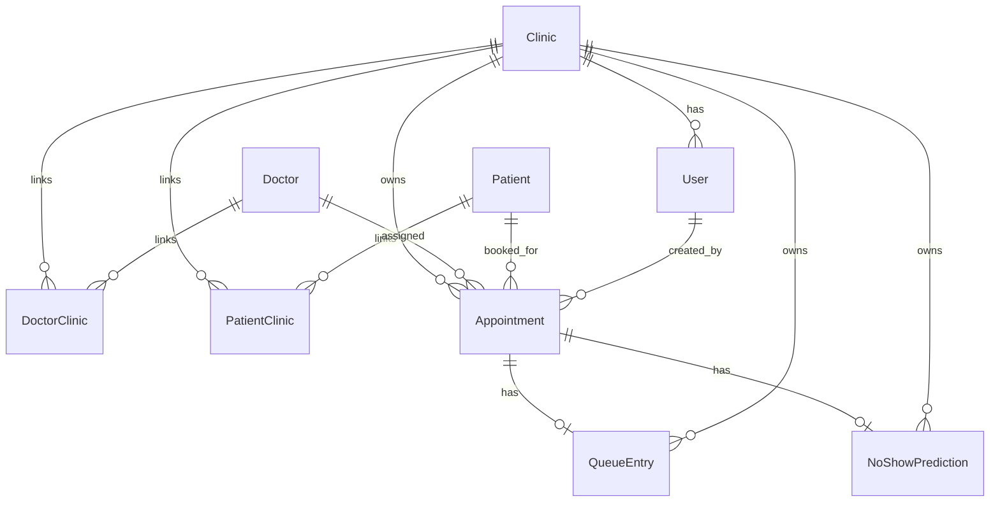

# Cross-Workflow State And Infrastructure

## API Shape

Success responses follow:

```json
{
    "success": true,
    "message": "Human readable message",
    "data": {}
}
```

Errors follow:

```json
{
    "success": false,
    "error": {
        "code": "ERROR_CODE",
        "message": "Human readable message"
    }
}
```

Frontend evidence:

- `apps/web/src/lib/apiClient.ts -> isApiErrorResponse`
- `ApiClientError`
- feature pages convert API errors into field errors, error panels, and toasts.

Backend evidence:

- controllers return `success: true`
- `apps/server/src/middleware/errorHandler.ts -> errorHandler`
- `apps/server/src/utils/AppError.ts`

## Validation Inventory

| Module          | Schemas                                                                                                   |
| --------------- | --------------------------------------------------------------------------------------------------------- |
| Auth/onboarding | `auth.validation.ts -> onboardingClinicSchema`                                                            |
| Clinics         | `createClinicSchema`, `updateClinicSchema`, `clinicIdParamsSchema`, `provisionSampleDataBodySchema`       |
| Doctors         | `createDoctorSchema`, `updateDoctorSchema`, `clinicIdParamsSchema`, `doctorClinicParamsSchema`            |
| Patients        | `createPatientSchema`, `updatePatientSchema`, `listPatientsQuerySchema`, params schemas                   |
| Appointments    | `createAppointmentSchema`, `listAppointmentsQuerySchema`, `updateAppointmentStatusSchema`, params schemas |
| Queue           | `listQueueQuerySchema`, `updateQueueStatusBodySchema`, `reorderQueueBodySchema`, params schemas           |
| Dashboard       | `dashboardSummaryQuerySchema`, `highRiskAppointmentsQuerySchema`, `dashboardClinicIdParamsSchema`         |

`validateRequest` parses params first, then query, then body. Parsed query is assigned to `res.locals.validatedQuery`; parsed params/body replace `req.params` and `req.body`.

## Transaction Inventory

| Workflow                  | Transaction | Exact location                                                                                          | Reason                                                                                        |
| ------------------------- | ----------- | ------------------------------------------------------------------------------------------------------- | --------------------------------------------------------------------------------------------- |
| Clinic onboarding         | Yes         | `auth.repository.ts -> createClinicWithAdmin`                                                           | Create `Clinic` and first `ADMIN` `User` together                                             |
| Sample data               | Yes         | `clinic.repository.ts -> provisionSampleData`                                                           | Create fictional doctors, patients, appointments, queue entries, and predictions consistently |
| Doctor create             | Yes         | `doctor.repository.ts -> createDoctorWithClinicLink`                                                    | Avoid `Doctor` without `DoctorClinic` link                                                    |
| Patient create            | Yes         | `patient.repository.ts -> createPatientWithClinicLink`                                                  | Avoid `Patient` without `PatientClinic` link                                                  |
| Patient update            | Yes         | `patient.repository.ts -> updatePatientWithClinicDetails`                                               | Update shared patient fields and clinic-specific fields together                              |
| Appointment create        | Yes         | `appointment.repository.ts -> runInTransaction` called by `appointment.service.ts -> createAppointment` | Create appointment, queue entry, and prediction together                                      |
| Appointment status update | Yes         | `appointment.repository.ts -> updateAppointmentStatus`                                                  | Synchronize appointment and queue status/timestamps                                           |
| Queue status update       | Yes         | `queue.repository.ts -> updateQueueEntryStatus`                                                         | Synchronize queue and appointment status/timestamps                                           |
| Queue reorder             | Yes         | `queue.repository.ts -> reorderQueueEntries`                                                            | Recheck active set and rewrite positions atomically                                           |

## Concurrency Inventory

| Workflow                            | Risk                                      | Protection                                                                          | Evidence                                                                |
| ----------------------------------- | ----------------------------------------- | ----------------------------------------------------------------------------------- | ----------------------------------------------------------------------- |
| Clinic onboarding                   | Duplicate slug or duplicate identity      | DB unique constraints plus service re-read/replay/conflict handling                 | `auth.service.ts -> uniqueConstraintCategory`, `createClinicOnboarding` |
| Sample data                         | Duplicate sample provisioning             | Best-effort advisory lock plus sample record count check                            | `clinic.repository.ts -> tryAcquireSampleDataProvisioningLock`          |
| Appointment booking exact same slot | Two bookings for same doctor/time         | `pg_advisory_xact_lock` over clinic/doctor/scheduledAt and post-lock conflict check | `appointment.repository.ts -> acquireAppointmentSlotLock`               |
| Appointment booking queue position  | Two bookings get same doctor/day position | queue-scope advisory lock inside `findHighestQueuePosition`                         | `queue.repository.ts -> findHighestQueuePosition`                       |
| Appointment/queue status sync       | Status changes while updating             | guarded `updateMany` rejects final-status races                                     | appointment and queue repositories                                      |
| Queue reorder                       | Queue changes while moving                | advisory lock per clinic/doctor/date and inside-transaction active-set verification | `queue.repository.ts -> acquireQueueScopeLock`, `reorderQueueEntries`   |
| Dashboard prediction backfill       | Two reads create same prediction          | `NoShowPrediction.appointmentId @unique` and `createMany({ skipDuplicates: true })` | Prisma schema and `dashboard.repository.ts`                             |

## Clinic Isolation Patterns

- Operational routes include `/:clinicId` except appointment status update.
- `requireClinicAccess` checks internal `User.clinicId` against route `clinicId`.
- `accessRepository.findClinicById` rejects inactive clinics.
- Appointment status update first loads `Appointment.clinicId` and then verifies clinic access.
- Doctor and patient update services verify `DoctorClinic` or `PatientClinic` link before update.
- Queue update checks loaded `QueueEntry.clinicId` equals route clinic ID.
- Queue reorder rejects entries from another clinic and requires all active entries for one doctor/date.

## Frontend State Model

Current frontend state is built from:

- React local state with `useState`.
- API loading in `useEffect` and `useCallback`.
- `AbortController` cleanup for many page loads.
- Contexts: `ActiveClinicReactContext`, Toast context, Clerk context.
- No React Query, SWR, Redux, Zustand, or other server-state cache library.
- Refetch/invalidation is manual: pages call `load...()` or `refresh...()` after mutations.

## Date And Time Handling

- Clinic timezone lives on `Clinic.timezone`.
- Backend date filters compute clinic-local day ranges with raw SQL `AT TIME ZONE`.
- Appointment booking frontend converts `datetime-local` to ISO with `new Date(values.scheduledAt).toISOString()`.
- Queue and dashboard "today" use frontend local date for queue requests and backend clinic-local date for dashboard defaults.
- `Clinic.openingTime`, `closingTime`, `slotDurationMinutes`, and `bufferMinutes` exist, but appointment creation does not enforce operating hours or buffer conflicts in current code.

## Database Relationships



## Soft Deletion And Activation

There is no hard-delete workflow in current UI/API.

Activation/status fields:

- `Clinic.isActive`
- `User.status`
- `Doctor.isActive`
- `DoctorClinic.isActive`
- `Patient.isActive`
- `PatientClinic.isActive`
- `Appointment.status`
- `QueueEntry.status`

Doctor and patient UI toggles update `Doctor.isActive` and `Patient.isActive`. Link-level active flags are read but not toggled by current UI.

## Deployment Boundaries

Configured/evidenced repository shape:

```text
Browser
  -> Vercel React SPA (apps/web/vercel.json rewrite)
  -> Express backend /api
  -> Prisma
  -> PostgreSQL
  -> Clerk for authentication
```

Docs mention Vercel, Render, Neon, and Clerk as the intended deployment shape. The repository does not contain verified live deployment URLs or deployed commit SHAs.
