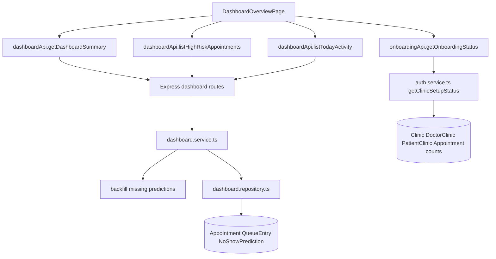

# Dashboard And Operational Data

## Workflow Summary

| Field                 | Evidence                                                                                                                                                                                                |
| --------------------- | ------------------------------------------------------------------------------------------------------------------------------------------------------------------------------------------------------- |
| Workflow              | Dashboard summary cards, high-risk appointments, activity feed, first-run setup checklist                                                                                                               |
| Product status        | Implemented                                                                                                                                                                                             |
| Release status        | `IMPLEMENTED_NOT_RELEASED`                                                                                                                                                                              |
| Actor                 | Active internal `ADMIN` or `STAFF`; checklist is visible to dashboard users                                                                                                                             |
| Entry route           | `/dashboard`                                                                                                                                                                                            |
| Frontend files        | `apps/web/src/features/dashboard/DashboardOverviewPage.tsx`, `dashboardApi.ts`, `apps/web/src/features/onboarding/components/FirstRunSetupChecklist.tsx`, `onboardingApi.ts`                            |
| Main frontend symbols | `DashboardOverviewPage`, `loadDashboard`, `refreshDashboard`, `getDashboardSummary`, `listHighRiskAppointments`, `listTodayActivity`, `getOnboardingStatus`, `FirstRunSetupChecklist`                   |
| API endpoint          | `GET /api/clinics/:clinicId/dashboard/summary`, `GET /api/clinics/:clinicId/dashboard/high-risk-appointments`, `GET /api/clinics/:clinicId/dashboard/today-activity`, `GET /api/auth/onboarding-status` |
| Middleware            | Dashboard routes use `authenticateRequest`, `validateRequest`, `requireClinicAccess`, `requireClinicStaffRole`; setup status uses `authenticateClerkIdentity`                                           |
| Authentication        | Clerk token required                                                                                                                                                                                    |
| Authorization         | Dashboard requires active Admin/Staff and clinic access                                                                                                                                                 |
| Clinic scoping        | Route clinic ID and `accessService.verifyClinicAccess`                                                                                                                                                  |
| Validation            | `dashboard.validation.ts`; onboarding status has no params/body                                                                                                                                         |
| Controller            | `dashboard.controller.ts`, `auth.controller.ts -> getOnboardingStatusController`                                                                                                                        |
| Service               | `dashboard.service.ts`, `auth.service.ts -> getOnboardingStatus`                                                                                                                                        |
| Repository            | `dashboard.repository.ts`, `auth.repository.ts -> getClinicSetupStatus`                                                                                                                                 |
| Database models       | `Appointment`, `QueueEntry`, `NoShowPrediction`, `Doctor`, `Patient`, `DoctorClinic`, `PatientClinic`, `Clinic`                                                                                         |
| Prisma operations     | `groupBy`, `findMany`, `createMany(skipDuplicates)`, count queries                                                                                                                                      |
| Transaction           | Dashboard reads are not wrapped in a transaction; prediction backfill uses `createMany`                                                                                                                 |
| Concurrency control   | Prediction backfill relies on unique `appointmentId` and `skipDuplicates`                                                                                                                               |
| State changes         | Dashboard state; possible `NoShowPrediction` backfill rows                                                                                                                                              |
| Errors                | Feature page error states; backend AppError from auth/access/validation                                                                                                                                 |
| Tests                 | `dashboard.service.test.ts`, controller/validation/repository tests, `DashboardOverviewPage.test.tsx`, setup checklist tests                                                                            |
| Known gaps            | Dashboard "today" is server clinic-local date; frontend calls without date query                                                                                                                        |

## Dashboard Load Trace

```text
User opens /dashboard
    ↓
DashboardOverviewPage -> useActiveClinic()
    ↓
loadDashboard()
    ↓
Promise.all([
  getDashboardSummary(clinicId),
  listHighRiskAppointments(clinicId),
  listTodayActivity(clinicId)
])
    ↓
GET /api/clinics/:clinicId/dashboard/summary
GET /api/clinics/:clinicId/dashboard/high-risk-appointments
GET /api/clinics/:clinicId/dashboard/today-activity
    ↓
authenticateRequest -> validateRequest -> requireClinicAccess -> requireClinicStaffRole
    ↓
dashboard.controller.ts -> relevant controller
    ↓
dashboard.service.ts -> getDashboardSummary / getHighRiskAppointments / getTodayActivity
    ↓
accessService.verifyClinicAccess(user, clinicId)
    ↓
repository groupBy/findMany operations using clinic-local date ranges
    ↓
DashboardOverviewPage stores dashboardState and renders cards, high-risk list, activity feed
```

## Metric Evidence

| UI value               | Backend calculation                                                                                                   |
| ---------------------- | --------------------------------------------------------------------------------------------------------------------- |
| Today's appointments   | `dashboardRepository.countAppointmentsByStatus` groups `Appointment.status` for selected clinic-local date            |
| Waiting queue          | `dashboardRepository.countQueueEntriesByStatus` groups `QueueEntry.status`; frontend card uses `queueSummary.waiting` |
| Completed visits       | appointment `COMPLETED` count plus helper from queue `COMPLETED` count                                                |
| Cancelled / no-show    | frontend sums appointment `cancelled + noShow`                                                                        |
| No-show risk summary   | `dashboardRepository.countNoShowPredictionsByRiskLevel` for active appointments on date                               |
| High-risk appointments | `findHighRiskAppointmentCandidates` where prediction risk is `HIGH` and appointment status is active                  |
| Today activity         | `findAppointmentActivityCandidates` plus `findQueueActivityCandidates`, mapped by status/timestamp rules in service   |

## Activity Types

Implemented activity item types:

- `APPOINTMENT_BOOKED`
- `APPOINTMENT_CANCELLED`
- `APPOINTMENT_NO_SHOW`
- `QUEUE_JOINED`
- `PATIENT_CALLED`
- `VISIT_COMPLETED`
- `QUEUE_CANCELLED`
- `QUEUE_NO_SHOW`

## Setup Checklist Trace

```text
DashboardOverviewPage
    ↓
getOnboardingStatus()
    ↓
GET /api/auth/onboarding-status
    ↓
auth.service.ts -> getOnboardingStatus()
    ↓
if onboarding complete: authRepository.getClinicSetupStatus(user.clinicId)
    ↓
Promise.all clinic fields, active doctor count, active patient count, appointment count
    ↓
DashboardOverviewPage stores setupChecklistState
    ↓
FirstRunSetupChecklist derives four checklist items
```

## Dashboard Data Flow Diagram



## How To Explain This Workflow

The dashboard is not hard-coded. The frontend makes three dashboard API calls and one setup-status call. The backend computes counts from appointments, queue entries, and predictions for the clinic's local day, backfills missing risk rows for active appointments where needed, and returns shaped summary data for the dashboard UI.
