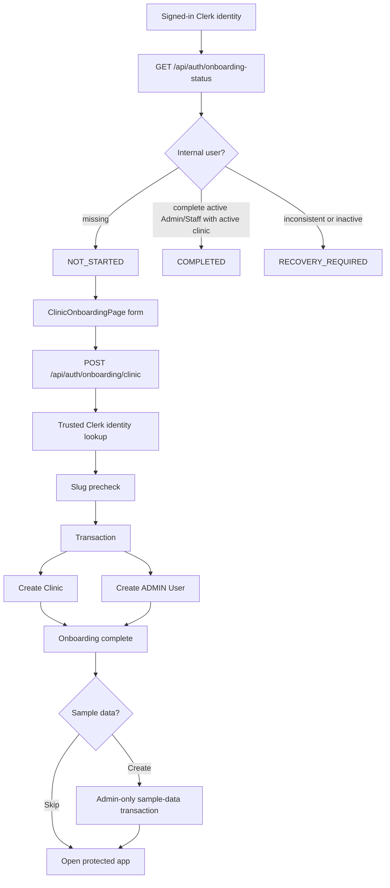

# Onboarding And Clinic Provisioning

## Workflow Summary

| Field                 | Evidence                                                                                                                                                                           |
| --------------------- | ---------------------------------------------------------------------------------------------------------------------------------------------------------------------------------- |
| Workflow              | First Clerk-authenticated user creates a clinic and becomes its first internal Admin                                                                                               |
| Product status        | Implemented                                                                                                                                                                        |
| Release status        | `IMPLEMENTED_NOT_RELEASED`                                                                                                                                                         |
| Actor                 | Signed-in Clerk identity with no complete internal Pravaah account                                                                                                                 |
| Entry route           | `/onboarding/clinic`; `/onboarding` redirects there                                                                                                                                |
| Frontend files        | `apps/web/src/App.tsx`, `apps/web/src/app/ProtectedAppShell.tsx`, `apps/web/src/features/onboarding/ClinicOnboardingPage.tsx`, `apps/web/src/features/onboarding/onboardingApi.ts` |
| Main frontend symbols | `ClinicOnboardingPage`, `loadOnboardingStatus`, `handleSubmit`, `handleAddSampleData`, `handleSkipSampleData`, `createClinicOnboarding`, `provisionSampleData`                     |
| API endpoint          | `GET /api/auth/onboarding-status`, `POST /api/auth/onboarding/clinic`, optional `POST /api/clinics/:clinicId/sample-data`                                                          |
| Middleware            | `authenticateClerkIdentity`; sample data uses `authenticateRequest`, `requireClinicAccess`, `requireAdminRole`                                                                     |
| Authentication        | Clerk session required for onboarding status and clinic provisioning                                                                                                               |
| Authorization         | No client-chosen role; backend creates `User.role = ADMIN` and `User.status = ACTIVE`                                                                                              |
| Clinic scoping        | New clinic is created by backend; sample data requires the new Admin's clinic access                                                                                               |
| Validation            | `auth.validation.ts -> onboardingClinicSchema`; same schema as `clinics/clinic.validation.ts -> createClinicSchema`                                                                |
| Controller            | `auth.controller.ts -> getOnboardingStatusController`, `createClinicOnboardingController`; `clinic.controller.ts -> provisionSampleDataController`                                 |
| Service               | `auth.service.ts -> getOnboardingStatus`, `createClinicOnboarding`; `clinic.service.ts -> provisionSampleData`                                                                     |
| Repository            | `auth.repository.ts -> createClinicWithAdmin`; `clinic.repository.ts -> provisionSampleData`                                                                                       |
| Database models       | `Clinic`, `User`; optional sample data writes `Doctor`, `DoctorClinic`, `Patient`, `PatientClinic`, `Appointment`, `QueueEntry`, `NoShowPrediction`                                |
| Prisma operations     | `user.findUnique`, `clinic.findUnique`, `clinic.create`, `user.create`, sample-data bulk create loops                                                                              |
| Transaction           | `authRepository.createClinicWithAdmin` wraps clinic and Admin creation in one `prisma.$transaction`; sample data also uses one transaction                                         |
| Concurrency control   | Onboarding handles slug/identity unique errors with re-read/replay logic; sample data attempts advisory lock `pg_advisory_xact_lock(hashtext(clinicId), hashtext('sample-data'))`  |
| State changes         | New `Clinic`, new active `ADMIN` `User`, optional sample data                                                                                                                      |
| Side effects          | Optional sample data creates fictional doctors, patients, appointments, queue entries, and no-show predictions                                                                     |
| Errors                | `CLINIC_SLUG_ALREADY_EXISTS`, `CLINIC_PROVISIONING_CONFLICT`, `INTERNAL_USER_ALREADY_EXISTS`, `CLINIC_PROVISIONING_FAILED`, sample `INVALID_CLINIC_TIMEZONE`                       |
| Tests                 | `ClinicOnboardingPage.test.tsx`, `FirstRunSetupChecklist.test.tsx`, auth service/repository/controller tests, clinic repository/service/controller/validation tests                |
| Known gaps            | No Staff invite/user-management workflow; onboarding creates only the first Admin                                                                                                  |

## End-To-End Trace

```text
Visitor signs up through /sign-up/* or opens /onboarding/clinic while signed in
    ↓
apps/web/src/features/onboarding/ClinicOnboardingPage.tsx -> useAuth()
    ↓
loadOnboardingStatus()
    ↓
apps/web/src/features/onboarding/onboardingApi.ts -> getOnboardingStatus()
    ↓
GET /api/auth/onboarding-status
    ↓
apps/server/src/modules/auth/auth.routes.ts -> authenticateClerkIdentity
    ↓
apps/server/src/modules/auth/auth.controller.ts -> getOnboardingStatusController()
    ↓
apps/server/src/modules/auth/auth.service.ts -> getOnboardingStatus(clerkUserId)
    ↓
apps/server/src/modules/auth/auth.repository.ts -> findOnboardingUserByClerkUserId()
    ↓
if missing User: NOT_STARTED and CREATE_CLINIC
    ↓
ClinicOnboardingPage renders form
    ↓
ClinicOnboardingPage -> handleSubmit()
    ↓
frontend validateClinicOnboardingForm()
    ↓
toCreateClinicOnboardingRequest()
    ↓
createClinicOnboarding(payload)
    ↓
POST /api/auth/onboarding/clinic
    ↓
authenticateClerkIdentity
    ↓
validateOnboardingClinicRequest -> onboardingClinicSchema
    ↓
createClinicOnboardingController()
    ↓
authService.createClinicOnboarding(clerkUserId, clinicInput)
    ↓
authRepository.findOnboardingUserByClerkUserId(clerkUserId)
    ↓
clerkIdentityService.getTrustedUserIdentity(clerkUserId)
    ↓
authRepository.findClinicBySlug(clinicInput.slug)
    ↓
authRepository.createClinicWithAdmin(...)
    ↓
prisma.$transaction
    ↓
tx.clinic.create(...)
    ↓
tx.user.create({ role: ADMIN, status: ACTIVE, clinicId: clinic.id })
    ↓
201 { onboarding COMPLETED, user, clinic, setup }
    ↓
frontend shows sample-data decision panel
    ↓
skip: navigate to protected application
or add sample data: POST /api/clinics/:clinicId/sample-data
```

## Security Notes

- `POST /api/auth/onboarding/clinic` is not anonymous. It requires a valid Clerk session through `authenticateClerkIdentity`.
- It does not require an existing internal `User`, by design.
- The client does not send role, status, `createdByUserId`, internal user ID, or clinic ownership.
- The backend reads trusted identity from Clerk through `clerkIdentityService.getTrustedUserIdentity`.
- The backend assigns `ADMIN`, `ACTIVE`, and `clinicId` inside `authRepository.createClinicWithAdmin`.
- Standalone `POST /api/clinics` exists in routing but `clinic.controller.ts -> createClinicController` always returns `STANDALONE_CLINIC_CREATION_DISABLED`.

## Idempotency And Conflict Behavior

| Case                                              | Implementation                                                                        |
| ------------------------------------------------- | ------------------------------------------------------------------------------------- |
| Completed internal user replays onboarding        | `authService.createClinicOnboarding` returns `ALREADY_COMPLETED` with status `200`    |
| Existing internal user is incomplete/inconsistent | `CLINIC_PROVISIONING_CONFLICT`                                                        |
| Slug exists before transaction                    | `CLINIC_SLUG_ALREADY_EXISTS`, unless current identity completed during re-read        |
| Unique constraint after attempted write           | service re-reads current identity, then returns safe replay or slug/identity conflict |
| Transaction step fails                            | Prisma transaction rolls back clinic and user creation                                |

## Sample Data Trace

```text
ClinicOnboardingPage -> handleAddSampleData()
    ↓
provisionSampleData(clinic.id)
    ↓
POST /api/clinics/:clinicId/sample-data
    ↓
authenticateRequest
    ↓
validateRequest({ params: clinicIdParamsSchema, body: provisionSampleDataBodySchema })
    ↓
requireClinicAccess
    ↓
requireAdminRole
    ↓
clinic.controller.ts -> provisionSampleDataController()
    ↓
clinic.service.ts -> provisionSampleData({ clinicId, user })
    ↓
clinic.repository.ts -> provisionSampleData(...)
    ↓
prisma.$transaction
    ↓
load clinic timezone and slot duration
    ↓
tryAcquireSampleDataProvisioningLock()
    ↓
count existing sample records
    ↓
create sample doctors and DoctorClinic links
    ↓
create sample patients and PatientClinic histories
    ↓
create sample appointments, no-show predictions, and today's queue entries
    ↓
return CREATED or ALREADY_PROVISIONED summary
```

Sample data is fictional and marked by `SAMPLE_DATA_NOTE_MARKER` in appointment/patient notes. It is optional and Admin-only.

## First-Run Setup State

After onboarding completion, `authRepository.getClinicSetupStatus(clinicId)` computes:

- `clinicSettingsComplete` from `Clinic` fields: `name`, `slug`, `country`, `timezone`, `openingTime`, `closingTime`, `slotDurationMinutes`, and `bufferMinutes`.
- `hasDoctor` from active `DoctorClinic` links whose `Doctor.isActive` is true.
- `hasPatient` from active `PatientClinic` links whose `Patient.isActive` is true.
- `hasAppointment` from any `Appointment` count for the clinic.

Frontend display:

- `DashboardOverviewPage` fetches onboarding status again and passes `setup` to `FirstRunSetupChecklist`.
- `FirstRunSetupChecklist` derives checklist rows client-side and uses local `isCollapsed` state only to dismiss a completed checklist.

## Onboarding Diagram



## How To Explain This Workflow

The first user is not allowed to self-assign authority from the browser. The browser sends clinic profile fields only. The backend verifies the Clerk identity, gets trusted identity data, creates the clinic and the first active Admin in one transaction, and only then lets the protected application open. Optional sample data is a separate Admin-only workflow after the Admin exists.
