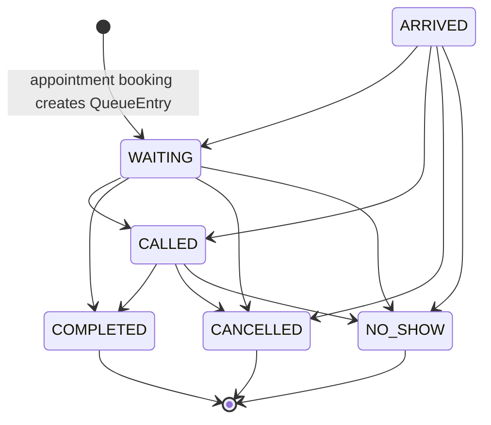

# Queue Management

## Workflow Summary

| Field                 | Evidence                                                                                                                                                                                 |
| --------------------- | ---------------------------------------------------------------------------------------------------------------------------------------------------------------------------------------- |
| Workflow              | List today's queue, update queue status, manually reorder active entries                                                                                                                 |
| Product status        | Implemented                                                                                                                                                                              |
| Release status        | `IMPLEMENTED_NOT_RELEASED`                                                                                                                                                               |
| Actor                 | Active internal `ADMIN` or `STAFF`                                                                                                                                                       |
| Entry route           | `/queue`                                                                                                                                                                                 |
| Frontend files        | `apps/web/src/features/queues/QueuePage.tsx`, `queueApi.ts`                                                                                                                              |
| Main frontend symbols | `QueuePage`, `loadQueue`, `refreshQueue`, `handleStatusUpdate`, `handleQueueMove`, `listTodayQueue`, `updateQueueStatus`, `reorderQueue`                                                 |
| API endpoint          | `GET /api/clinics/:clinicId/queue?date=YYYY-MM-DD`, `PATCH /api/clinics/:clinicId/queue/:queueEntryId/status`, `PATCH /api/clinics/:clinicId/queue/reorder`                              |
| Middleware            | `authenticateRequest`, `validateRequest`, `requireClinicAccess`, `requireClinicStaffRole`                                                                                                |
| Authentication        | Clerk token plus active internal user required                                                                                                                                           |
| Authorization         | Admin and Staff both allowed                                                                                                                                                             |
| Clinic scoping        | Route `clinicId` plus service checks queue entry clinic on status/reorder                                                                                                                |
| Validation            | `queue.validation.ts -> listQueueQuerySchema`, `updateQueueStatusBodySchema`, `reorderQueueBodySchema`                                                                                   |
| Controller            | `queue.controller.ts -> listQueueByClinicDateController`, `updateQueueStatusController`, `reorderQueueController`                                                                        |
| Service               | `queue.service.ts -> listQueueByClinicDate`, `updateQueueStatus`, `reorderQueue`                                                                                                         |
| Repository            | `queue.repository.ts -> findQueueByClinicDate`, `updateQueueEntryStatus`, `reorderQueueEntries`                                                                                          |
| Database models       | `QueueEntry`, `Appointment`, `Doctor`, `Patient`, `NoShowPrediction`, `Clinic`                                                                                                           |
| Prisma operations     | queue `findMany`, `findUnique`, guarded `updateMany`, reorder position updates, raw date-range SQL                                                                                       |
| Transaction           | Status update and reorder each run in `prisma.$transaction`                                                                                                                              |
| Concurrency control   | Reorder uses PostgreSQL advisory transaction lock per clinic/doctor/date and verifies active set inside transaction                                                                      |
| State changes         | Queue status, appointment status sync, `calledAt`, `completedAt`, queue positions                                                                                                        |
| Errors                | `QUEUE_ENTRY_NOT_FOUND`, `QUEUE_ENTRY_CLINIC_MISMATCH`, `QUEUE_ENTRY_FINAL_STATUS`, `QUEUE_STATUS_TRANSITION_INVALID`, `QUEUE_SCOPE_MISMATCH`, `QUEUE_REORDER_INCOMPLETE`, `QUEUE_REORDER_CONFLICT`, `APPOINTMENT_STATUS_TRANSITION_INVALID`, `STATUS_SYNC_CONFLICT` |
| Tests                 | `queue.service.test.ts`, `QueuePage.test.tsx`                                                                                                                                            |
| Known gaps            | UI is fixed to today's local browser date; backend supports a `date` query/body but frontend does not expose arbitrary date selection                                                    |

## Queue Listing Trace

```text
User opens /queue
    ↓
QueuePage -> useActiveClinic()
    ↓
todayDate = getTodayDateInputValue()
    ↓
loadQueue()
    ↓
queueApi.listTodayQueue(clinicId, todayDate)
    ↓
GET /api/clinics/:clinicId/queue?date=YYYY-MM-DD
    ↓
authenticateRequest -> validateRequest(params, query)
    ↓
requireClinicAccess -> requireClinicStaffRole
    ↓
queue.controller.ts -> listQueueByClinicDateController()
    ↓
queue.service.ts -> listQueueByClinicDate(req.user, clinicId, date)
    ↓
accessService.verifyClinicAccess(user, clinicId)
    ↓
queue.repository.ts -> findQueueByClinicDate(clinicId, date, clinic.timezone)
    ↓
raw SQL computes clinic-local date range
    ↓
prisma.queueEntry.findMany({ clinicId, appointment.scheduledAt in range, include: appointment, doctor, patient })
    ↓
toNoShowPredictionResponse maps appointment.noShowPrediction into queue response
    ↓
QueuePage stores queueListState and renders filters/status/move controls
```

## Queue Status Trace

```text
User clicks a queue status action
    ↓
QueuePage -> handleStatusUpdate(queueEntry, nextStatus)
    ↓
queueApi.updateQueueStatus(clinicId, queueEntry.id, nextStatus)
    ↓
PATCH /api/clinics/:clinicId/queue/:queueEntryId/status
    ↓
authenticateRequest -> validateRequest(params, body)
    ↓
requireClinicAccess -> requireClinicStaffRole
    ↓
queue.controller.ts -> updateQueueStatusController()
    ↓
queue.service.ts -> updateQueueStatus(req.user, clinicId, queueEntryId, status)
    ↓
accessService.verifyClinicAccess(user, clinicId)
    ↓
queueRepository.findQueueEntryById(queueEntryId)
    ↓
return immediately for same-status retry requests
    ↓
reject missing, cross-clinic, final, or lifecycle-invalid queue transitions
    ↓
map QueueStatus to AppointmentStatus
    ↓
queueRepository.updateQueueEntryStatus(...)
    ↓
prisma.$transaction
    ↓
tx.queueEntry.findFirst({ id, appointmentId, clinicId, status, appointment.status })
    ↓
reject stale queue or appointment state that differs from the state validated by service logic
    ↓
reject appointment sync states that violate the appointment lifecycle policy
    ↓
tx.queueEntry.updateMany({ exact current-status guard })
    ↓
optional calledAt/completedAt timestamp update
    ↓
tx.appointment.updateMany({ exact current-status guard })
    ↓
if synchronized appointment status is ARRIVED, IN_QUEUE, or CALLED and arrivedAt is null:
    record first arrival snapshot and increment PatientClinic.totalLateArrivals only if late
    ↓
tx.queueEntry.findUniqueOrThrow({ include: queueEntryDetailsInclude })
    ↓
QueuePage shows toast and refreshes queue
```

Queue to appointment status mapping:

| Queue status | Appointment status |
| ------------ | ------------------ |
| `ARRIVED`    | `ARRIVED`          |
| `WAITING`    | `IN_QUEUE`         |
| `CALLED`     | `CALLED`           |
| `COMPLETED`  | `COMPLETED`        |
| `CANCELLED`  | `CANCELLED`        |
| `NO_SHOW`    | `NO_SHOW`          |

Canonical queue transition policy:

| Current status | Allowed next statuses |
| -------------- | --------------------- |
| `WAITING`      | `ARRIVED`, `CALLED`, `COMPLETED`, `CANCELLED`, `NO_SHOW` |
| `ARRIVED`      | `WAITING`, `CALLED`, `CANCELLED`, `NO_SHOW` |
| `CALLED`       | `COMPLETED`, `CANCELLED`, `NO_SHOW` |
| `COMPLETED`    | None |
| `CANCELLED`    | None |
| `NO_SHOW`      | None |

Same-status requests are treated as idempotent no-op retries: the existing queue entry is returned without rewriting queue status, appointment status, `calledAt`, or `completedAt`. This prevents a duplicate `WAITING -> WAITING` request for a booking-created queue entry from silently advancing an appointment from `SCHEDULED` to `IN_QUEUE`.

`QueueEntry` rows are created during booking, so `WAITING` alone is not physical-arrival evidence. Queue-driven status changes record arrival only through the synchronized appointment state. `ARRIVED`, `IN_QUEUE`, and `CALLED` are presence-establishing appointment statuses; `CANCELLED`, `NO_SHOW`, and `COMPLETED` do not create a first-arrival timestamp by themselves. The first write to `Appointment.arrivedAt` is guarded and the late-arrival aggregate increment happens only for the transaction that wins that first-arrival write.

Final queue statuses: `COMPLETED`, `CANCELLED`, `NO_SHOW`. Final entries cannot move to a different status and cannot be reordered by backend service logic. Queue status updates also cannot synchronize the linked appointment through a transition rejected by the appointment lifecycle policy.

## Queue Reordering Trace

```text
User clicks move up or move down on /queue
    ↓
QueuePage -> handleQueueMove(queueEntry, offset)
    ↓
getActiveQueueEntries(confirmedQueueEntries)
    ↓
getQueueEntriesForDoctorScope(..., queueEntry.doctor.id)
    ↓
moveQueueEntryId(activeQueueEntryIds, queueEntry.id, offset)
    ↓
queueApi.reorderQueue(clinicId, { date: todayDate, queueEntryIds: nextQueueEntryIds })
    ↓
PATCH /api/clinics/:clinicId/queue/reorder
    ↓
authenticateRequest -> validateRequest(params, body)
    ↓
requireClinicAccess -> requireClinicStaffRole
    ↓
queue.controller.ts -> reorderQueueController()
    ↓
queue.service.ts -> reorderQueue(req.user, clinicId, date, queueEntryIds)
    ↓
verify clinic access
    ↓
reject duplicate IDs
    ↓
queueRepository.findQueueEntriesByIds(queueEntryIds)
    ↓
reject missing, cross-clinic, final-status, or multi-doctor request
    ↓
queueRepository.findActiveQueueByClinicDoctorDate(...)
    ↓
reject incomplete request or entries outside active doctor/date queue
    ↓
queueRepository.reorderQueueEntries(...)
    ↓
prisma.$transaction
    ↓
acquireQueueScopeLock(tx, clinicId, doctorId, date)
    ↓
re-read active queue entries inside transaction
    ↓
verify active set still exactly matches request
    ↓
first pass: update positions to 1_000_000 + index
    ↓
second pass: update positions to index + 1
    ↓
return reordered active entries
    ↓
QueuePage merges reordered active entries into confirmed list and shows toast
```

## Reorder Invariants

| Invariant                                               | Evidence                                                                            |
| ------------------------------------------------------- | ----------------------------------------------------------------------------------- |
| Request IDs must be unique                              | Zod refine and service `new Set` check                                              |
| Entries must exist                                      | `findQueueEntriesByIds` length check                                                |
| Entries must belong to route clinic                     | service clinic mismatch check                                                       |
| Entries must be non-final                               | service final status check                                                          |
| Entries must all belong to one doctor                   | service `requestedDoctorIds` check                                                  |
| Request must include all active entries for doctor/date | service and repository checks                                                       |
| Concurrency protection                                  | `acquireQueueScopeLock` uses `pg_advisory_xact_lock` inside transaction             |
| Position rewrite avoids transient duplicates            | first pass writes high temporary positions, second pass writes normalized positions |

## Appointment Rescheduling Interaction

Appointment rescheduling preserves the existing `QueueEntry`; it does not delete and recreate queue rows. Queue membership is derived from the linked appointment's clinic-local `scheduledAt` date, so a cross-date reschedule moves the same row into the destination doctor/date operational scope.

Same-day appointment rescheduling keeps the current queue position so manual ordering remains intact. Cross-date appointment rescheduling acquires the affected clinic/doctor/date advisory locks in deterministic order, keeps `status`, `queuedAt`, `calledAt`, and `completedAt` unchanged, and assigns the existing row the next valid destination position. Source date positions are not automatically renumbered.

## Queue Lifecycle Diagram



The queue status graph is centralized in `queue.lifecycle.ts` and enforced by the backend before persistence. The synchronized appointment update is still guarded by the appointment lifecycle policy, so a queue action cannot persist an invalid appointment transition.

## How To Explain This Workflow

The queue is created when appointments are booked. Staff can then change queue status through the enforced queue lifecycle or manually reorder active entries. Queue status updates synchronize the linked appointment inside the same transaction, subject to appointment lifecycle rules. Reorder is conservative: it only works within one doctor/date queue, requires the complete active set, locks that scope, rechecks it, and rewrites positions atomically.
